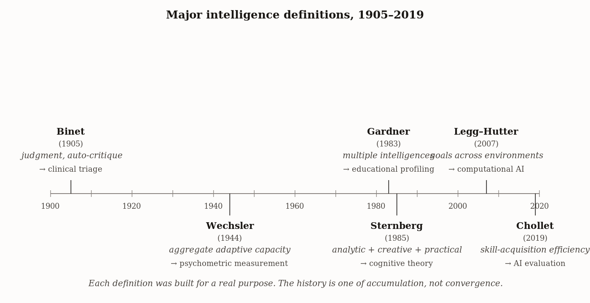
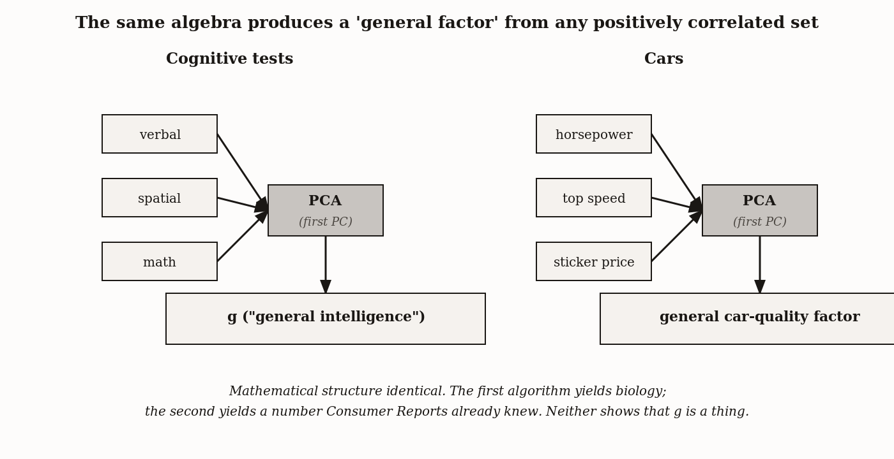

# Chapter 1 — The Definition Problem
*Twenty-Four Theorists, Twenty-Four Definitions*

---

Here is a strange fact to begin with. In 1986, two dozen serious researchers — people who had spent careers studying intelligence, measuring it, theorizing about it — were each asked to write down what they meant by the word. Not to summarize the literature. Not to review the debate. Just to state, plainly, what the thing was.

They produced twenty-four definitions. Not twenty-four phrasings of the same idea. Twenty-four definitions that did not fully fit together and in some cases barely seemed to address the same subject.

Now hold that next to this. Eight years later, fifty-two researchers signed an open letter in the *Wall Street Journal* titled *Mainstream Science on Intelligence*. It offered twenty-five numbered statements as scientific consensus. Intelligence is a general mental capability. It can be measured accurately. It predicts outcomes across life domains. The letter was confident. It was signed by serious people. It was meant to settle the argument.

Two documents. Both careful. Both endorsed by overlapping communities. One describing irreducible disagreement; the other describing settled consensus.

I want you to sit with that for a moment before we go anywhere else. Not because it means the researchers were confused, and not because it means intelligence is not real. It means something more interesting than either of those things. It means that the word *intelligence* has been doing different jobs for different people, and that each job is legitimate, and that the work of this book is to decide which job we need it to do and then use it consistently for that job — not to pretend the other jobs do not exist.

That is a different enterprise than you might have expected. Most books on intelligence begin by announcing a definition and then applying it. I want to earn the definition first by showing you what the alternatives cost.

---

The cleanest way to see what is at stake is to watch a single example pass through several definitions and see what changes.

Take a border collie named Chaser. She was studied by John Pilley and Alliston Reid, who spent three years teaching her the names of objects — not categories, proper names, one toy per word. By the end she knew 1,022. When shown a new object she had never seen before, placed among familiar ones, and asked to fetch "Darwin" — a toy she had never heard of — she retrieved the new one by exclusion. Whatever "Darwin" was, it was not any of the things she already knew. So it must be that.

Is that intelligent?

| Definition | Key criterion | Verdict on Chaser | Reason |
|---|---|---|---|
| Binet (1905) | Judgment, initiative, *auto-critique* | Uncertain | She adapts and shows initiative, but auto-critique — examining her own reasoning — is hard to attribute to a dog fetching by elimination. |
| Wechsler (1944) | Aggregate purposeful action and effective adaptation | Included | She acts purposefully, deals effectively with novel arrangements, and shows referential mapping under varying conditions. |
| Gardner (1983) | Multiple distinct intelligences; linguistic faculty | Included (linguistic) | She has referential mapping over 1,022 names and a syntax-like structure over nouns, satisfying linguistic intelligence's behavioral criteria. |
| Legg–Hutter (2007) | Goal achievement across environments | Included, without qualification | She achieves the retrieval goal across varying object sets and arrangements; the open question is *how* intelligent and *in what shape*, not whether. |

Run it through Alfred Binet's definition from 1905: judgment, good sense, initiative, the faculty of adapting oneself to circumstances, and above all *auto-critique*, the capacity to examine and correct one's own thinking. Chaser adapts. She exercises something like initiative. But auto-critique — a self that examines its own reasoning process — is harder to attribute to a dog fetching by elimination. Under Binet, the verdict is uncertain at best.

Run it through David Wechsler's 1944 definition: the aggregate or global capacity of the individual to act purposefully, to think rationally, and to deal effectively with her environment. Chaser deals effectively. She thinks — in some functional sense — about reference. She acts purposefully. Wechsler's definition does not exclude her, and might welcome her.

Run it through Howard Gardner's framework: eight biopsychological potentials, each neurally and developmentally distinct. Does Chaser have linguistic intelligence? She has referential mapping. She has something that functions like syntax over nouns. Gardner himself would not rule her out, though the border cases were not his interest.

Now run it through the definition this book uses. Shane Legg and Marcus Hutter surveyed over seventy serious definitions and distilled their common content into a sentence: intelligence is an agent's ability to achieve goals in a wide range of environments. Chaser's goal, broadly, is retrieval of the correct referent. The environment varies — new objects, new names, different arrangements. She achieves the goal across those variations. Under Legg and Hutter, she is intelligent, without qualification, with the interesting question being how intelligent and in what shape.

The example is not supposed to tell you which definition is right. It is supposed to show you that the definitions are genuinely different sieves, and that the answer to "is Chaser intelligent?" is not waiting to be discovered — it depends entirely on which sieve you hold up.

---

I want to go through the major definitions more carefully now, because each was built for a real purpose, and each reveals something the others miss.

Binet was not theorizing in the abstract. He was working in Paris on a practical problem: which children needed extra educational support? His definition of intelligence as practical judgment — action-based, situational, always partly a matter of examining and revising one's own thinking — was built for that clinic. He was also, notably, hostile to the idea that intelligence was a fixed property of the child. He proposed what he called *mental orthopedics*, exercises to strengthen the capacities he was measuring, because he believed they could be strengthened. Within a decade that belief had been largely erased from the culture. Lewis Terman brought the test to Stanford, the IQ movement turned the score into a permanent fact about the person, and Binet's nuance was swallowed by the machinery he had inadvertently set in motion.

Wechsler, whose scales would become the most widely used in clinical practice, made a different move. His word was *aggregate*. Intelligence is not any one ability but the effect produced when cognitive faculties, personality, and motivation combine in a real person dealing with a real world. That is a generous, whole-agent view. It resists the impulse to reduce the person to a score on a single test. But it also implicitly assumes that the *environment* the person is dealing effectively with is something like the human social and technical world — which means the definition has a human-shaped hole in its center, invisible until you try to apply it to a wasp or a slime mold.

Robert Sternberg's triarchic theory added something neither Binet nor Wechsler had fully captured: *shaping*. Intelligent agents do not merely adapt to environments; they modify them. That is not a small move. Beavers build dams. Earthworms turn soil and change its chemistry. Humans reshape entire landscapes and then adapt to the reshaped version. The observation connects directly to niche construction theory in evolutionary biology — the environment that shapes an organism is partly a product of what that organism and its ancestors have done to the world. Sternberg drew a line from school performance to tool use to the making of culture and saw them as expressions of the same underlying thing.

Howard Gardner, in *Frames of Mind*, made the most radical break. His claim was not that there is one intelligence measured badly but that there are multiple intelligences measured not at all — linguistic, logical-mathematical, spatial, musical, bodily-kinesthetic, interpersonal, intrapersonal, naturalist, each neurally and developmentally distinct, each visible most clearly in those unusual cases where one is superhuman and the others unremarkable. The musical savant. The chess prodigy who is otherwise helpless. Gardner's framework has been embraced in educational settings and resisted sharply in psychometrics, where those seven or eight intelligences turn out to be substantially positively correlated with each other — which critics say is evidence for the very general factor Gardner was trying to displace. Gardner would reply that the correlation reflects shared developmental environment more than shared biological substrate. The argument continues.



*Figure 1 — Major intelligence definitions, 1905–2019.*


The most recent candidate in the survey comes from François Chollet, working from within AI research. His argument is that what current AI systems lack — and what the field has been systematically failing to test — is not knowledge but *skill-acquisition efficiency*: how quickly and broadly an agent learns to handle a task it has not seen before. A large language model trained on enough text achieves high scores on enough standardized tests to be genuinely impressive. But the model has, in a sense, already seen everything. Give it a new visual reasoning puzzle with three examples and ask it to infer the rule — the way a human can from almost nothing — and it fails in a way that is revealing. The failure is not about how much the system knows. It is about whether the knowing transfers to learning.

Each of these definitions captures something real. Each leaves something out. And here is the important thing: most heated arguments about whether AI is "really" intelligent, or whether animals are "genuinely" thinking, collapse the moment you ask which definition each side is using. They are usually not disagreeing about the facts. They are using different sieves and not noticing.

---

Before I commit to one, I want to name two critiques that cut across all of them.

The statistician Cosma Shalizi made an argument in an essay called *g, a Statistical Myth* that should give any careful reader of intelligence research real pause. Spearman's *g* — the general factor that emerges from principal component analysis on a battery of cognitive tests — is sometimes treated as a discovered property of the mind, a real underlying capacity that the tests are revealing. Shalizi's point is technical but the conclusion is plain: any set of positively correlated variables, regardless of what they measure, will produce a first principal component that loads positively on all of them. The mathematics forces it.

Take horsepower, top speed, and sticker price of cars. Run a principal component analysis. A "general car-quality factor" pops out. Nobody believes there is a single thing called car-quality underneath those numbers. The algebra creates the appearance of it regardless. Shalizi's claim is that the same is true of *g* — not that the tests are useless, not that the correlations are fabricated, but that interpreting *g* as a unified biological entity runs far ahead of what the data actually demonstrates.

Defenders of *g* respond that the convergence across populations and test types is too strong to be merely algebraic, and that biological correlates — heritability, neural correlates, predictive validity — have been found and replicated. The argument is not resolved. What matters for us is that one of the most prestigious empirical results in intelligence research is contested at the level of its basic interpretation, by serious people who agree on every number. That should make us modest.



*Figure 2 — Shalizi's PCA argument — a 'general factor' falls out of any positively correlated set.*


The primatologist Frans de Waal made a different cut, and his target was the entire enterprise of comparative cognition. His argument, developed at length in *Are We Smart Enough to Know How Smart Animals Are?*, is that the history of testing animal intelligence is largely the history of designing tests around a human's perceptual and behavioral world — what the biologist Jakob von Uexküll called, in 1909, the *Umwelt* — and then concluding from the animal's failure that the animal lacks the capacity.

Chimpanzees were judged unable to use tools until researchers spent time watching them in the wild. Octopuses were judged cognitively limited because they were tested in dim laboratory conditions at the wrong temperature. Dogs were evaluated on whether they would imitate humans by watching humans rather than other dogs. In each case, the organism failed on the experimenter's terms. In each case, the conclusion drawn was absence of capacity rather than failure of experimental design.

De Waal's point is not that animals are always smarter than we thought. Sometimes they are; sometimes they are not. The point is that you cannot know until you build the test inside the organism's own *Umwelt* — and that the methodological correction has been happening slowly, in lab after lab, as researchers discover that the animal they thought was failing was solving a different problem than the one they had posed.

Both critiques apply to everything in the survey above. Shalizi cuts at the data infrastructure on which psychometric definitions rest. De Waal cuts at the assumption that there is a neutral place from which to evaluate intelligence at all.

---

So here is the situation. We have a family of related definitions, each built for a real purpose, none settling the question. We have two serious critiques that apply across the whole family. We have a century of researchers who have not converged.

And we need to pick one. Because this book is going to compare a nematode, a slime mold, a honeybee, a crow, a dog, and a large language model on the same question. And you cannot do that comparison without deciding in advance what you are comparing.

Here is the thing about that choice that is easy to miss: a definition is not a label. It is a sieve. Whichever you pick determines what falls through and what stays — and refusing to pick simply allows whichever definition floats into view at any given moment to do the work invisibly.

If you use Binet's *judgment*, a nematode is not intelligent. Nematodes do not exercise judgment; they follow chemical gradients via a fixed neural circuit of considerable elegance, but that is not what Binet meant.

If you use Wechsler's *aggregate adaptive capacity*, the nematode starts to slip through. It habituates. It learns associatively. It modulates behavior based on experience. Wechsler did not have worms in mind, but his definition does not close the door.

If you use Legg and Hutter, everything is on the table. The nematode is intelligent in a modest and specific way. The chess engine is highly intelligent in one environment and absent everywhere else. A bacterium navigating a chemical gradient is intelligent in the narrow sense in which it earns its living. And a large language model's intelligence becomes an empirically open question rather than a matter settled by the choice of vocabulary.

| Organism | Binet | Wechsler | Gardner | Legg–Hutter | Chollet |
|---|---|---|---|---|---|
| Nematode | Excluded (no judgment) | Uncertain (modest adaptive capacity) | Excluded (no nameable intelligences) | Included (modest, narrow goals) | Excluded (essentially no skill-acquisition) |
| Chess engine | Excluded (no auto-critique) | Excluded (no broader purpose) | Excluded (single domain) | Included (high in one environment) | Excluded (cannot learn checkers from scratch) |
| Bacterium | Excluded (reflexive) | Excluded (no aggregate) | Excluded | Included (gradient-following is goal-pursuit) | Excluded |
| Border collie | Uncertain (limited auto-critique) | Included (whole-agent) | Included (linguistic, interpersonal) | Included (broad behavioral repertoire) | Uncertain (modest novel-task efficiency) |
| Large language model | Excluded (template-matched judgment) | Uncertain (purposeful action absent) | Uncertain (linguistic strong, embodied weak) | Included in text environments; absent in physical | Low (high-data, low transfer-from-priors) |

The Legg and Hutter definition, in full, is this:

> *Intelligence measures an agent's ability to achieve goals in a wide range of environments.*

Their formal version is a measure $\Upsilon$ over agents, expressed as a sum over all computable environments weighted by $2^{-K(\mu)}$ — where $K(\mu)$ is the Kolmogorov complexity of the environment, and the weighting means simpler environments count more. It is Occam's Razor formalized: an agent is intelligent to the degree that it does well across the structure of environments, not just the hard ones. The sum is incomputable in practice — you cannot evaluate it across infinitely many environments — but the principle is testable comparatively, and that is all we need.

I am adopting it not because I think it is the final truth. I am adopting it because it is substrate-neutral — it does not mention neurons, language, or carbon-based chemistry — which means it can be applied without modification to every organism in this book. It is graded, not binary, so a nematode and a human are both in the conversation and the interesting question is the shape of their intelligence, not whether they qualify. And it is operational: given a candidate agent and a candidate environment, you can run an experiment.

The cost is real and worth naming. The definition flattens affect. It treats agents as goal-pursuers when many real animals are also moods, memories, attachments, social positions — whole inner worlds that a reward signal cannot easily capture. It will struggle most in the chapters on emotion, on social intelligence, and on creativity. In those chapters I will reach for other tools — Sternberg when the organism is reshaping the environment that is reshaping it; Chollet when the question is whether a language model is learning or retrieving; de Waal when the experimental design has been built around the wrong *Umwelt*. A working instrument is allowed to be imperfect. It is not allowed to be hidden.

---

Two things need to be on the table before the comparative work begins.

First: under different definitions, the same organism receives different verdicts, and both verdicts are informative. A slime mold solving a maze is not intelligent under Binet's *auto-critique*, but it is intelligent in a specific and modest way under Legg and Hutter. Holding both verdicts in mind without letting one cancel the other is the move this book keeps making. The claim is not that we have agreed on what intelligence is. The claim is that by being explicit about which instrument we are using, we can say something coherent and consistent.

Second: the question mark in the title is the thesis. Not a hedge. Not a marketing flourish. A genuine epistemological position. The study of intelligence has not arrived at its destination. It is in the middle of something, as evolutionary biology was in the middle of something in 1859 when it had variation and selection but not yet a mechanism for inheritance, as physics was in the middle of something in 1905 when it had special relativity but not yet general relativity or quantum mechanics. The right response to being in the middle of something is not to pretend you are not.

The next chapter walks further back than most discussions of intelligence dare to go — to bacteria, slime molds, and plants — and asks whether anything a brainless organism does deserves the word. The answer depends entirely on the sieve we just chose. By the end of that chapter you should feel the choice was real and that it was worth making.

The worm in the petri dish is waiting.

---

## Exercises

### Warm-Up

1. In your own words, explain what it means to say that a definition is a "sieve." Give one example from the chapter of a definition and name one organism it includes and one it excludes — not because of any empirical disagreement, but purely because of the boundary the definition draws.

2. Shalizi argues that finding a *g* factor in cognitive tests does not prove there is a single underlying mental ability. Explain his argument using the car analogy from the chapter. What would a defender of *g* say in response, and on what kind of evidence would that defense rest?

### Application

3. Consider a honeybee that navigates back to a food source after a single visit, communicates its location to other bees via the waggle dance, and adjusts its route when obstacles are introduced. Apply three of the major definitions from the chapter — Binet, Wechsler, and Legg-Hutter — and for each, state whether the bee qualifies as intelligent, which aspect of its behavior is most relevant to that verdict, and what the definition cannot see.

4. François Chollet's definition focuses on skill-acquisition efficiency rather than task mastery. A chess engine beats every human player but cannot learn to play checkers from scratch without retraining. A crow, having never encountered a novel puzzle box, solves it in minutes after a few failed attempts. Under Chollet's framework, which is more intelligent? Defend your answer, then identify what his framework cannot capture about the chess engine's achievement.

### Synthesis

5. De Waal argues that comparative cognition research systematically underestimates animal intelligence because tests are built around the experimenter's *Umwelt*. How does this critique apply specifically to AI evaluation? Describe one current benchmark for AI intelligence and argue whether it suffers from an analogous *Umwelt* problem — that is, whether it is built around assumptions about cognition that a sufficiently different kind of mind would fail not from incapacity but from misalignment of the test with its perceptual world.

6. The chapter argues that "refusing to choose a definition is not neutrality — it is leaving the choice unspecified." Give a concrete example of an argument about AI or animal intelligence that you have encountered (in public discourse, in readings, or in this chapter) in which two sides appear to be disagreeing about facts but are actually using different definitions. Reconstruct the two definitions and show how they generate the apparent disagreement.

### Challenge

7. The chapter commits to Legg-Hutter on grounds of substrate-neutrality, gradedness, and operationality, but acknowledges it flattens affect. Construct the strongest possible case that affect — mood, attachment, the felt quality of experience — is not merely a cost to acknowledge but a constitutive part of intelligence, such that any definition that excludes it is not just incomplete but wrong about what intelligence is. Then explain under what conditions you would find that argument decisive rather than merely interesting.

8. The chapter closes with the claim that "the question mark in the title is the thesis" — that intelligence may be a family resemblance rather than a natural kind. This is presented as an epistemological position, not a rhetorical hedge. Is it a claim that can in principle be settled by empirical evidence, or is it a conceptual claim that sits upstream of any possible experiment? If the latter, does that make it less scientific? Defend your answer by reference to at least one other concept in the history of science that faced an analogous question about whether it was a natural kind.

---

*What would change the working instrument: a demonstration that some other definition does the comparative work this book needs — across bacteria, bees, fish, dogs, and language models — better than Legg and Hutter's, without requiring assumptions about consciousness, language, or neural substrate. Chollet's skill-acquisition efficiency is the most interesting near-rival. If comparative cognition research continues to converge on learning rate across novel tasks as the cleanest cross-species measure, the instrument may need revision.*

*Still puzzling: I do not understand why the field has not converged. Twenty-four theorists in 1986. Fifty-two signing a confident statement in 1994. A cautious task force the same year. Seventy-plus definitions surveyed in 2007. The persistence of the disagreement suggests either that the researchers are interested in genuinely different things, all of them real, or that the term picks out a family resemblance rather than a natural kind. I lean toward the second reading. I am not yet sure.*

---

### LLM Exercise — Chapter 1: The Definition Problem

**Project:** Skeptic's Notebook on Frontier AI
**What you're building this chapter:** The opening verdict matrix — a single frontier system evaluated under four competing definitions of intelligence, generating four different placements that anchor the rest of the notebook.
**Tool:** Claude Project (set up the system prompt once; run this as the first message)

**The Prompt:**

```
I am building a "Skeptic's Notebook on Frontier AI" — a chapter-by-chapter cognitive report
on a frontier model. My target system under test is [INSERT model: GPT-4 / Claude Opus /
Gemini / etc.].

This is Entry 1. Apply four definitions of intelligence to my target system, in turn, and
produce a verdict matrix:

1. Binet (1905) — judgment, good sense, initiative, auto-critique
2. Wechsler (1944) — aggregate purposeful action and effective adaptation
3. Legg & Hutter (2007) — ability to achieve goals across a wide range of environments
4. Chollet (2019) — skill-acquisition efficiency given prior structure

For each definition: state the verdict (intelligent / not intelligent / equivocal), name
the specific criterion that drove the verdict, and identify the strongest counter-argument.

Then produce a single paragraph explaining why the four verdicts disagree — what each sieve
includes that the others miss when applied to this kind of system.

Format: a four-row table (definition / verdict / driving criterion / counter-argument),
followed by the integration paragraph. End with: "Open questions for later chapters" — three
specific tests this entry suggests should be run in subsequent chapters.

Be willing to say "the verdict depends on which sub-criterion you prioritize" rather than
forcing a single answer where the evidence does not support one.
```

**What this produces:** A four-row verdict matrix and a one-paragraph integration. Saved as Entry 1 of the running notebook. The "Open questions for later chapters" line becomes a forward reference — those questions are exactly what subsequent entries will test.

**How to adapt this prompt:**
- *For your own project:* Replace the four definitions with the four you find most contestable; add Sternberg's three-factor account if you want a fifth row.
- *For ChatGPT / Gemini:* Works as-is. The prompt is model-agnostic except for the "target system under test" line — set it to whichever system you're actually evaluating, which may or may not be the system you're prompting.
- *For Claude Code:* Not applicable for this chapter — no code yet.
- *For a Claude Project:* This is the recommended path. Paste the system prompt at the top of this document into Claude Project setup once, then send this prompt as your first message.

**Connection to previous chapters:** None — this is Entry 1.

**Preview of next chapter:** Chapter 2 will test whether your target system has anything analogous to the bacterium's chemotaxis — temporal-derivative computation on a gradient, no stored map required. The simplest possible cognitive operation, applied to a system that should not have it.

---

## 🕰️ AI Wayback Machine

The ideas in this chapter didn't appear from nowhere. **Lotfi Zadeh** was building a mathematical theory of vague concepts — *fuzzy sets*, where membership is a matter of degree rather than a yes/no fact — decades before "what counts as intelligence?" became a live question in AI. Here's a prompt to find out more — and then make it better.

*Lotfi A. Zadeh, c. 1965. AI-generated portrait based on a public domain photograph (Wikimedia Commons).*


**Run this:**

```
Who was Lotfi Zadeh, and how does his work on fuzzy set theory connect to the problem of defining intelligence as a graded rather than binary property? Keep it to three paragraphs. End with the single most surprising thing about his career or ideas.
```

→ Search **"Lotfi A. Zadeh"** on Wikipedia after you run this. See what the model got right, got wrong, or left out.

**Now make the prompt better.** Try one of these:

- Ask it to explain "degree of membership" in plain language, using the example of *whether a slime mold counts as intelligent*
- Ask it to compare Zadeh's framing to Wittgenstein's "family resemblance" idea from this chapter
- Add a constraint: "Answer as if you're writing a footnote in a textbook on the definition of intelligence"

What changes? What gets better? What gets worse?
