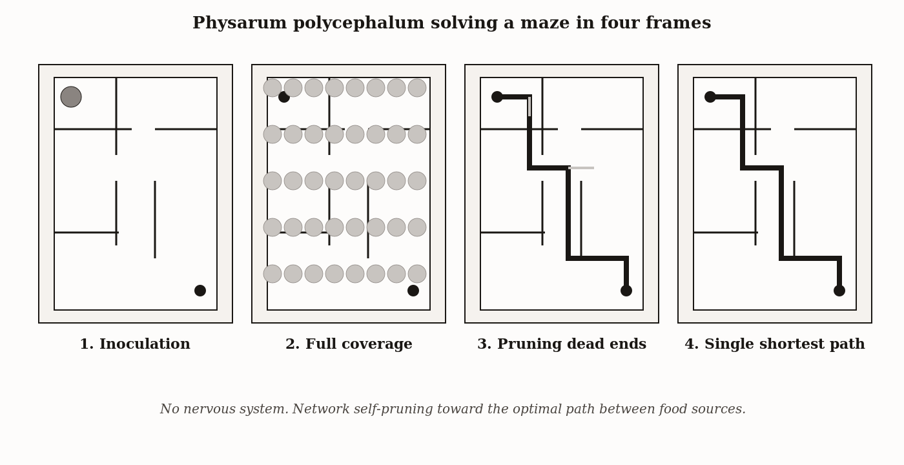
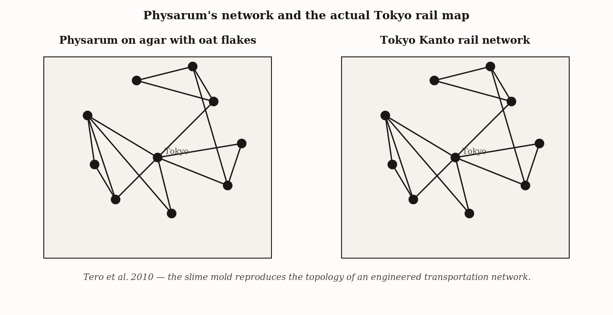
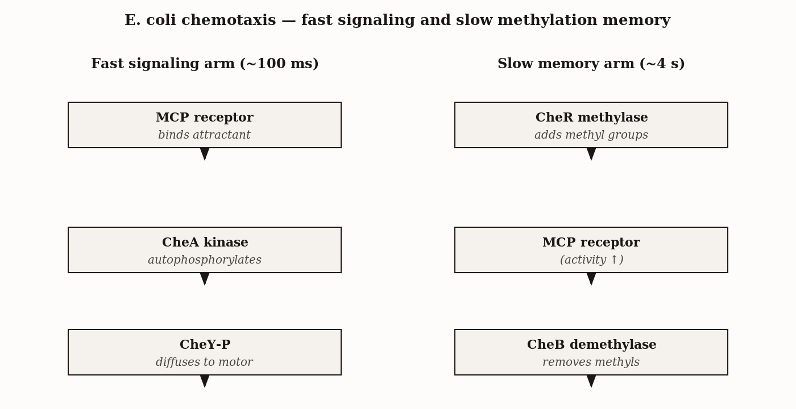
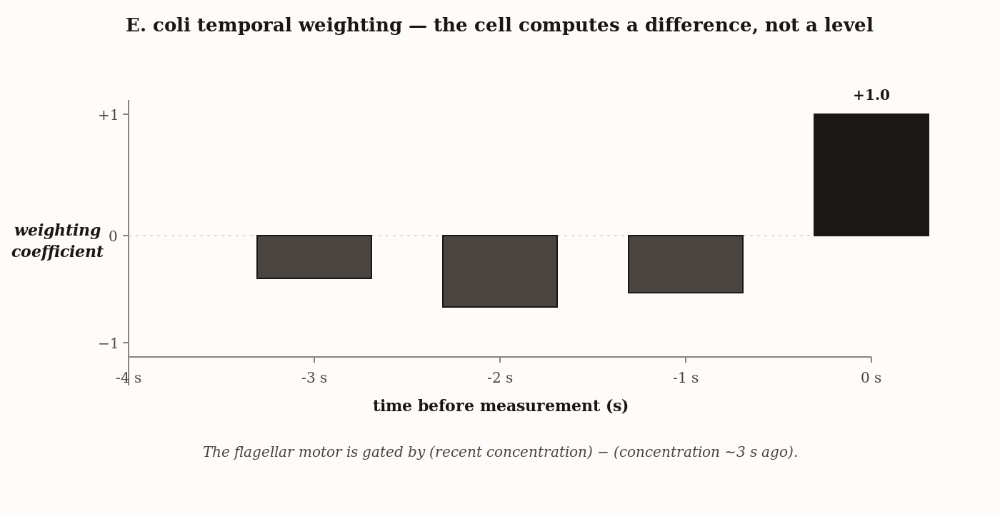
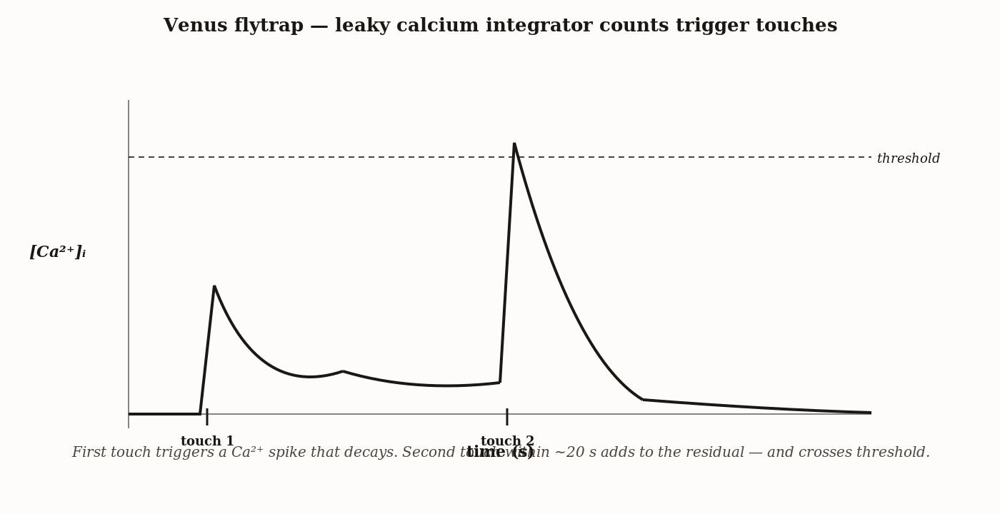

# Chapter 2 — Before Brains
*The oldest decision on Earth is still running, and it uses no neurons.*

---

You are about to meet the world's oldest intelligence, and probably its most underrated.

It doesn't look like much. It is yellow, roughly the size of a dinner plate, and it has no mouth, no eyes, no neurons, and no brain. It is a single cell — one continuous, pulsing bag of cytoplasm with millions of nuclei sloshing through a network of self-built tubes. In the year 2000, a physicist named Toshiyuki Nakagaki placed a piece of this organism at the entrance of a plastic maze, set food at the exit, and waited. Within hours, the organism had explored every passage, every dead end, every wrong turn. Then it began to withdraw. Branch by branch, the exploratory tubes thinned and disappeared. When the experiment was over, the organism — *Physarum polycephalum*, a slime mold — had concentrated its entire body into a single thick tube tracing the *shortest possible path* between the food sources.

No plan. No map. No nervous system. Just a cell, and a problem solved.



*Figure 1 — Physarum solves a maze in four frames — coverage, then pruning to the shortest path.*


A decade later, Atsushi Tero and colleagues repeated a version of the experiment at a continental scale. They placed oat flakes at the geographic positions of the cities surrounding Tokyo and let *Physarum* connect them. The network the mold built — in its single-organism, brainless way — matched the actual Tokyo rail system in efficiency, cost, and fault tolerance. Human engineers had spent a century designing that system. The mold reproduced its essential structure in a few days.



*Figure 2 — Physarum's network and the actual Tokyo Kanto rail map.*


If that doesn't make you question your assumptions about what intelligence requires, I'm not sure what will.

---

Here is the question I want to start with: what is the minimum thing a decision requires?

Not a brain. Not a nervous system. Those came later, and the first systems that made decisions predate them by billions of years. I want to know what the *floor* looks like — the smallest thing that qualifies as genuine choice rather than mere mechanism. Because if we don't understand the floor, we can't understand what everything built on top of it actually added.

A reflex is not a decision. Your knee jerks when the doctor taps it. A Venus flytrap snaps when its trigger hairs are touched. These are physical mechanisms: input in, output out, fixed. The input determines the output every single time, regardless of history. There is no comparison happening. There is no past being weighed against a present.

A decision varies. The same stimulus can produce different responses depending on what has happened before. That is the distinction that matters. And it turns out that making a decision — a real one, not a metaphorical one — requires exactly four things.

First: sensing. Some access to the world. Without it, there is nothing to decide about.

Second: memory. The ability to compare now to a moment ago. This is more important than it sounds. A system that only knows the present cannot detect whether things are getting better or worse. It is frozen at a single instant, like a photograph. Memory is what turns a snapshot into a movie — and only a movie tells you which direction you're traveling.

Third: integration. The ability to weigh multiple signals together over time. Not just "what is the concentration of sugar right now," but "what has been happening to the concentration of sugar over the last few seconds, and what does that trend mean?"

Fourth: variable response. The output has to be able to change. A system that always does the same thing regardless of input is not deciding — it is executing. Variation is what allows decisions to be adaptive.

| Ingredient | What it provides | What is missing without it | Biological example in this chapter |
|---|---|---|---|
| Sensing | Detection of relevant environmental signal | The agent cannot tell what state it is in | *E. coli* membrane chemoreceptors; Venus flytrap trigger hairs |
| Memory | A trace of recent state for comparison | The agent cannot detect change over time | CheR/CheB methylation trace; cytoplasmic flow patterns in *Physarum* |
| Integration | Combination of present and remembered state | The agent cannot decide; it can only react | *Physarum* network self-pruning; flytrap calcium summation |
| Variable response | Output that differs as a function of integration | The agent's behavior is fixed and signal-independent | Run-vs-tumble switching; trap closure thresholding |

I want to give these four ingredients a name for what they collectively compute: **valence**. Borrowed from chemistry, where it describes combining power, valence here means the approach-or-avoid property of a stimulus. Food has positive valence. Toxin has negative valence. The smell of smoke has negative valence for you — and I notice you reacted slightly just then to the word *vomit*, which also has negative valence, and which illustrates that valence operates faster than reflection. Valence is not a judgment. It may or may not involve feeling. It is simply a categorization that allows behavior: move toward this, move away from that.

Without valence, no preference is possible. Without preference, no goal. The whole story of cognition, from bacteria to human beings, is the story of making valence faster, richer, more flexible, and more accurate. It starts here.

---

Now I want to tell you a more precise story, because precision is where understanding lives.

Imagine you are an *E. coli* bacterium. You are one cell. You are swimming in a chemical soup that contains amino acids — food — and copper ions, which will kill you. You cannot steer. You have no rudder, no fins. What you have is a flagellar motor at your tail, and the motor can spin two ways: counterclockwise, which gives you a smooth forward run; clockwise, which causes your filaments to fly apart and tumble you in a random new direction. Your behavior is this: run, tumble, run, tumble. A drunkard's walk.

But the drunkard is not stumbling randomly. When Howard Berg built a microscope in 1972 that could track a single bacterium through three-dimensional space, he watched this pattern for hours and noticed something remarkable. The run segments were longer when the cell was moving toward food. The tumbles were more frequent when things were going badly. The drunk was finding its way to the bar.

The mechanism starts at the cell surface. The membrane is studded with receptor proteins called methyl-accepting chemotaxis proteins — MCPs. Each MCP is tuned to a chemical class. When an attractant binds, the receptor changes shape — not dramatically, but a subtle conformational shift that propagates into the cell. This inhibits a kinase called CheA. A kinase's job is to phosphorylate a target — to attach a phosphate group to it. CheA's target is a small messenger protein, CheY. Phosphorylated CheY diffuses to the flagellar motors and pushes them toward clockwise rotation. Clockwise means tumble.

So: more attractant → receptor activated → CheA inhibited → less CheY-P → less tumbling → longer runs. That part is clean and makes sense.



*Figure 3 — E. coli chemotaxis — fast signaling and slow methylation memory.*


But this mechanism, elegant as it is, only responds to *current* concentration. A cell that simply reads current concentration would tumble just as readily sitting in the middle of a rich food patch as at its edge, because the absolute level is high in both places. It would have no way of knowing it is surrounded by food rather than approaching it. It would lose all directional information.

The memory is in two more enzymes: CheR and CheB.

CheR adds methyl groups to the MCP receptors. CheB removes them. Here is the crucial point: methylation changes the receptor's sensitivity — more methylated means less sensitive to attractant. And these enzymes operate on a *slower* timescale than the binding cascade. The effect is that the receptor's current sensitivity is a record of the recent average. It has been slowly tuned to whatever the cell has been experiencing for the past several seconds. When the current concentration exceeds that baseline — when things are getting better — net CheA inhibition is high and the cell runs. When current concentration falls below baseline — when things are getting worse — CheA fires, CheY-P rises, and the cell tumbles.

In 1986, Segall, Block, and Berg measured the precise time window by pulsing bacteria with attractant. The cell weighs its chemical experience over the past four seconds, with the most recent second weighted positively and the prior three seconds weighted negatively. Which is to say: the cell is computing a derivative. It is responding to the *change* in concentration over time, not the level. It is doing differential calculus with two enzymes and a methylation rate.



*Figure 4 — E. coli temporal weighting — the cell computes a difference, not a level.*


The four-second window is not arbitrary. It is matched to the distance the cell can swim in a single run before Brownian motion randomizes its direction. Memory longer than that would be memory of a self that no longer exists — the cell would be comparing its current position to a position it can no longer point back to. The window is adapted to the physics of the organism's world.

And this, precisely, is what makes it a decision rather than a reflex. The reflex responds to a level. The decision responds to a trend. The reflex cannot tell which way things are going. The decision can. That's the whole ballgame.

---

To see why the memory is doing all the work, consider what happens when you remove it.

Knock out CheR and CheB — eliminate the methylation enzymes — and the cell is still alive, still swimming, still capable of responding to attractant. The CheA-CheY-P cascade still functions. Put this mutant in a gradient and it will still bias its flagella when it encounters high concentration. The absolute-level response works.

But the mutant cannot navigate. Its random walk stays random. It runs longer in rich zones, but it cannot detect *whether* things are improving, so it does not preferentially run *toward* the source. The drunkard in the rich zone is now just a drunkard who doesn't want to leave — not a navigator.

The cell without methylation memory has three of the four ingredients. It senses. It integrates (in a limited way). It responds variably. But it has no memory — no comparison of present to past — and without that comparison, directed behavior is impossible. This is not a soft claim. It is what the knock-out experiments show. The memory is not a refinement; it is the hinge on which cognition turns.

---

Now let me take the same logic and show you what it looks like in a completely different substrate.

*Physarum polycephalum* — the slime mold — runs the same four-ingredient computation through a body that is a network of cytoplasmic tubes rather than a single swimming cell. The logic is architectural instead of molecular. Cytoplasm sloshes back and forth through the tubes in rhythmic oscillations. The rule is simple: tubes carrying high, sustained flow grow thicker; tubes carrying low flow thin and eventually disappear. When food is detected at a network node, local oscillations shift phase, flow toward the food increases, that channel is reinforced, and the network reorganizes.

The maze-solving follows directly. Every route is explored — the mold fills the maze. Dead-end branches carry zero net flow, because there is no food at the end of them. Dead-end tubes thin and retract. The shortest path carries the most sustained flow, because it connects the two food sources with the least detour. The shortest path is the last tube standing. No planning, no map — just the physical dynamics of flow and reinforcement.

The memory is different from the bacterium's. *Physarum* leaves a trail of extracellular slime where it has been, and it avoids this trail on subsequent exploration. The memory is not molecular; it is written into the environment. This is a very old trick that turns out to be universal: encode past behavior in a physical mark that future behavior can read. Ants do it with pheromones. Humans do it with cities.

| Organism | Memory substrate | Timescale | What is encoded | Internal or external |
|---|---|---|---|---|
| *E. coli* | Methylation of chemoreceptors (CheR/CheB) | ~1 second | Recent attractant concentration | Internal (cytoplasmic) |
| *Physarum* | Cytoplasmic flow channels + extracellular slime | Minutes to hours | Where the organism has already explored | Both (channels internal, slime external) |
| Venus flytrap | Cytoplasmic calcium concentration | ~20 seconds | Recent count of trigger-hair stimulations | Internal |

What I want you to see is not just that these two organisms solve similar problems, but that they solve them with the *same logical structure* instantiated in completely different physical materials. The bacterium runs its memory in methylation reactions on membrane proteins. The slime mold runs its memory in cytoplasmic flow dynamics and extracellular slime. The structure of the computation — sense, remember, integrate, respond variably — is identical. The substrate is totally different. This is a pattern you will see throughout this book: cognitive functions are substrate-independent. The brain is not running unique computations. It is running the same ancient computations faster and with more parameters.

---

I want to show you one more case, because it illustrates a mechanism you will encounter again in a very different context.

The Venus flytrap, *Dionaea muscipula*, has solved a specific problem: it needs to close on insects without closing on rain. The solution is a counting rule — the trap fires only when at least two trigger hairs are touched within approximately thirty seconds. Jennifer Böhm, Sönke Scherzer, and Rainer Hedrich traced the mechanism to calcium signaling.

Each touch generates a calcium spike in the trap's cells. Calcium decays over time — the concentration drops back toward baseline as calcium pumps remove it. But it does not drop completely before the window closes. A second touch adds its spike to whatever residue remains from the first. Only when the summed calcium crosses the threshold does the trap close.



*Figure 5 — Venus flytrap — leaky calcium integrator counts trigger touches.*


The calcium concentration *is* the short-term memory. The threshold *is* the decision rule. The trap counts to two by exploiting the fact that calcium decays slower than the interval between legitimate prey movements. This kind of mechanism — a signal that accumulates with each event and leaks away between events — is called a leaky integrator. It appears throughout neuroscience, where it describes how some neurons accumulate evidence before firing a decision. The flytrap is doing the same thing, in ionic calcium, with no neurons.

The integration window is calibrated, just like the bacterium's four-second memory, to the temporal statistics of the signal it needs to detect. Insects move with irregular, rapid perturbations — two touches in thirty seconds is characteristic of struggling prey. Rain arrives in a more regular pattern, but rarely produces two contacts on the same trigger hair within the window. The physics of the problem determines the memory window. This is always true: the right timescale for memory is the one that matches the structure of the signal you need to read.

---

Before I continue, I need to be honest about something, because the frontier of this literature includes claims that are contested.

Two of the most widely cited demonstrations of plant cognition have not held up cleanly. Monica Gagliano's 2014 study reported that *Mimosa pudica* — the sensitive plant — habituated to repeated drops and retained the habit for a month. Robert Biegler argued the data could be explained by sensory adaptation or motor fatigue. The dispute was not resolved by independent replication, and I cannot present the study as established.

Gagliano's 2016 study claiming that pea plants learned to associate the direction of a fan with the direction of a light — classical conditioning, which we will examine carefully in Chapter 4 — failed to replicate under blinded experimental conditions. Kasey Markel repeated the protocol with improved controls and found no effect.

The responsible position is: *habituation is clearly demonstrated in Physarum, and is not yet clearly demonstrated in plants*. The flytrap's calcium counting is a real mechanism. The rest requires more work before I'll assert it.

The pattern of overreach in this literature is instructive. There is always a careful claim — the organism produces a behavior characteristic of X — and an inflated one: the organism *experiences* X the way we do. The careful claim is often supported. The inflated one is almost never established, and stating it as fact is not scientific courage. It is a failure to distinguish evidence from enthusiasm. I will try to hold to this distinction throughout this book, and I encourage you to hold me to it.

| Claim | Organism | Study | Status | What the evidence actually shows |
|---|---|---|---|---|
| Maze-shortest-path solving | *Physarum polycephalum* | Nakagaki 2000 (*Nature*) | Established | Reproducible across labs; mechanism (network pruning by flow optimization) understood. |
| Habituation to mechanical stimulation | *Physarum* | Boisseau et al. 2016 | Established | Habituation to bromide solution shows both stimulus-specific and dishabituation behavior. |
| Habituation in *Mimosa pudica* | *Mimosa pudica* | Gagliano 2014 | Established | Repeated drops produce reduced leaf-folding, persistent across days. |
| Pavlovian-style associative learning in pea | *Pisum sativum* | Gagliano 2016 | Contested | Original result has not cleanly replicated; methodological objections about light-cue confounds remain unresolved. |
| Calcium-counting of trigger-hair touches | Venus flytrap (*Dionaea*) | Hedrich lab 2016 onward | Established | Two-touch threshold mechanism mapped to specific calcium signaling and gene expression. |

---

Let me close with an extension that matters for everything we will discuss about artificial intelligence.

In 1906, the chemist Søren Sørensen needed to measure the acidity of his fermentation vats. He dipped litmus paper, watched it change color, and compared it to a reference card. This was a one-point valence measurement: this batch is *okay* or *too acidic*, approach or adjust. It worked. It told him nothing about whether acidity was changing, nothing about the trend, nothing that the bacterium's temporal integration would have revealed.

The modern pH electrode does better. It converts hydrogen ion concentration into a continuous voltage. Still no trend. Still no comparison to the recent past. Still, in the four-ingredient framework, a sensor without a decision.

The instruments humans have built to detect the chemistry of the world — pH meters, smoke detectors, blood-glucose monitors, explosives-detection systems — are all artificial MCPs. They implement the sensing step. Some add a threshold rule. A few add something like integration: environmental monitoring systems that flag trends in pollutant concentration rather than instantaneous readings. None of them, as of this writing, implements the full four-ingredient architecture in a way that produces flexible, goal-directed behavior across varying environments.

| Device | Sensing | Memory | Integration | Variable response |
|---|---|---|---|---|
| Litmus paper | Yes | No | No | No (single readout) |
| pH electrode | Yes | No | No | No |
| Smoke detector | Yes | No | Yes (threshold) | Yes (alarm above threshold) |
| Blood-glucose monitor | Yes | Yes (logged history) | Partial (trend display) | No (reports, does not act) |
| Environmental trend monitor | Yes | Yes | Yes | No (no agent that acts on the integration) |

The smoke detector on your ceiling is not stupid. It is an excellent one-step sensor with a reliable threshold rule, and it saves lives. But it would tumble randomly in a chemical gradient. It cannot find the shortest path through a maze. It cannot distinguish cooking smoke from structural fire in a useful way — which is why it goes off when you make toast. It does not have the memory that makes those distinctions possible.

The step that turns a sensor into a decision-maker is the derivative: not "what is the level of X" but "how is the level of X changing relative to recent experience." Most instruments still stop one step short. The bacterium took that step two billion years ago, with two enzymes, in a picogram of cytoplasm. Understanding why that step is hard to replicate in silicon is not a small problem. It is, in various forms, one of the central problems of artificial intelligence.

---

Here is what I want you to carry out of this chapter.

There is a cognitive floor — a minimum viable architecture for what counts as decision-making — and it appears in systems with no neurons, no brains, and no nervous systems of any kind. That floor consists of four components: sensing, memory, integration, and variable response. Together, they compute valence: the assignment of approach-or-avoid to stimuli. Take any component away and you have something simpler than a decision. Keep all four, organized into a loop that closes on the world, and you have the oldest cognitive system biology has produced.

The bacterium's memory is molecular — methylation states on membrane proteins, encoding the last four seconds of chemical experience as a running average. The slime mold's memory is architectural and environmental — flow dynamics and slime trails encoding a history of where the body has been. The flytrap's memory is ionic — calcium residues from the last touch, decaying on a thirty-second timescale tuned to insect movement. Three completely different substrates, one logical structure.

What neurons will add — beginning in the next chapter with *C. elegans* — is speed, flexibility, and range. A nervous system allows different components to specialize, allows internal state to modulate response, allows the same sensory input to mean different things depending on context. These are genuine advances. But they are advances along the same dimension. The bacterium did not fail to build a mind. It built the minimum viable component of one, and every more elaborate cognitive system in this book has that component somewhere in it.

The common mistake is to assume that a capacity first clearly visible in complex organisms must have *originated* in complex organisms. It never does. The prototype is always older, simpler, and stranger than you expect. Search for the floor. That is where you find out what the thing actually is.

---

## Exercises

### Warm-Up

**1.** *E. coli* navigating toward serine produces longer runs when serine concentration is increasing. Trace the molecular steps from receptor binding to flagellar switch that produce this behavior. Name the specific step that implements memory, and explain what the cell would do differently if that step were removed.
*(Tests the four-ingredient framework and the CheA-CheY-P cascade; difficulty: accessible)*

**2.** Define the difference between a reflex and a decision as used in this chapter. A sunflower tracks the sun across the sky (phototropism). A moth flies toward a lamp (phototaxis). Which of these satisfies the four-ingredient standard, and why does the distinction matter for how we define intelligence?
*(Tests the reflex/decision distinction and the four-ingredient framework; difficulty: accessible)*

**3.** The Venus flytrap closes only when two trigger hairs are touched within approximately thirty seconds. Using the calcium leaky integrator mechanism, explain what would happen if the calcium decay rate were ten times faster — dropping to baseline in three seconds rather than thirty. Would the trap be more or less likely to catch prey? What problem would it become better at instead?
*(Tests the leaky integrator mechanism and the principle that memory windows are calibrated to signal statistics; difficulty: accessible)*

### Application

**4.** An engineer proposes to improve a smoke detector by adding a trend sensor: rather than firing when particle concentration exceeds a threshold, the device fires when particle concentration has been rising continuously for more than ten seconds. Using the four-ingredient framework, explain what cognitive function this modification adds. What ingredient does the improved detector now satisfy that the original did not? What ingredient does it still lack?
*(Tests application of the four-ingredient framework to artificial systems; difficulty: moderate)*

**5.** *Physarum polycephalum* encodes part of its memory externally — in the extracellular slime it leaves behind — rather than internally in molecular states. Identify one other organism or system from this chapter (or from your own knowledge) that externalizes memory in a physical substrate. Then explain: what does external memory allow that internal memory cannot, and what does it prevent?
*(Tests the internal/external memory distinction and the substrate-independence principle; difficulty: moderate)*

**6.** The Gagliano 2016 study claimed associative learning in pea plants but failed to replicate under blinded conditions. Using the careful-claim / inflated-claim distinction from this chapter, write two sentences: one stating the most the evidence actually supports, and one stating what would need to be demonstrated — and how — to establish the stronger claim.
*(Tests the skeptical standards introduced in the plant cognition section; difficulty: moderate)*

### Synthesis

**7.** I described *E. coli* chemotaxis and *Physarum* maze-solving as "the same logic in different substrates." Write a paragraph identifying: (a) what is structurally identical between the two systems at the level of the four-ingredient framework, (b) what is genuinely different, and (c) whether those differences are differences in kind — one is doing something fundamentally different — or differences in degree — one is doing more of the same thing. Defend your answer.
*(Combines the four-ingredient framework, the substrate-independence principle, and the E. coli and Physarum cases; difficulty: challenging)*

**8.** The four-second memory window in *E. coli* is matched to how far the cell can swim before Brownian motion randomizes its direction. The thirty-second calcium window in the Venus flytrap is matched to the temporal statistics of insect movement. Generalize: state a principle — as a single sentence — that predicts what sets the optimal memory window for any organism using the four-ingredient decision architecture. Then apply your principle to predict what the memory window of a deep-sea bacterium navigating in very slow chemical gradients should be, relative to *E. coli*.
*(Synthesizes the memory-window calibration argument across two organisms and extends it by inference; difficulty: challenging)*

### Challenge

**9.** *C. elegans*, which you will meet in Chapter 3, has 302 neurons and maintains chemical preferences for hours after conditioning — a memory window roughly 1,000 times longer than *E. coli*'s four seconds. What structural or computational property must *C. elegans* have that *E. coli* does not, given that its behavioral window is that much longer? The answer cannot simply be "more neurons" — explain what those neurons must be doing that the methylation mechanism cannot.
*(Requires forward inference from the chapter's mechanisms to the constraints on nervous system design; difficulty: advanced)*

---

*Tags: before-brains, aneural-cognition, valence, E-coli-chemotaxis, CheA-CheY, methylation-memory, run-and-tumble, Physarum-polycephalum, Venus-flytrap, leaky-integrator, calcium-signaling, taxis-vs-tropism, Nakagaki, Berg, plant-cognition-skepticism, artificial-sensors, cognitive-floor*

---

### LLM Exercise — Chapter 2: Before Brains

**Project:** Skeptic's Notebook on Frontier AI
**What you're building this chapter:** Entry 2 of the notebook — a test of whether your target system has anything analogous to gradient-following without an internal map. The bacterial bar.
**Tool:** Claude Project (continue from Entry 1)

**The Prompt:**

```
This is Entry 2 of the Skeptic's Notebook. Chapter 2 of the book argues that intelligence
without neurons is real — bacteria perform chemotaxis by computing temporal derivatives
("is concentration higher now than a moment ago?") and adjusting tumble frequency
accordingly. No map, no plan, just gradient-following with persistence.

I want to test whether my target system [INSERT model] has an analog of this most-basic
operation. The operation is: maintain a recent trajectory of states, detect whether the
relevant signal is increasing or decreasing, adjust behavior accordingly.

Design and run this test:

1. Pose a multi-turn dialogue task in which the user provides escalating or de-escalating
   feedback ("that's closer to what I wanted" / "that's further away") without stating an
   explicit goal.
2. Observe whether the system tracks the gradient of feedback over multiple turns and
   adjusts its outputs accordingly, OR whether each turn is treated independently of the
   feedback trend.
3. Use a test sequence where the gradient is unambiguous (5+ turns of monotonic feedback).

Then produce the entry:
- The capacity tested
- The operational diagnostic
- The test (the exact dialogue you propose I run)
- The expected behavior under (a) genuine gradient tracking and (b) trial-by-trial
  pattern matching with no temporal integration
- The diagnostic question that distinguishes them

Note explicitly: the system has no body, no chemotaxis, no metabolism. The question is
whether something *functionally analogous* runs on the within-session conversational
gradient. Do not anthropomorphize.
```

**What this produces:** Entry 2 — a runnable dialogue protocol the reader can execute against the target system, with the diagnostic for distinguishing genuine gradient tracking from independent-turn pattern matching.

**How to adapt this prompt:**
- *For your own project:* The "gradient" can be anything monotonic — emotional valence, complexity, accuracy. Pick the dimension your target system's deployment context cares about.
- *For ChatGPT / Gemini:* Works as-is.
- *For Claude Code:* If you want to automate this, Claude Code can script the multi-turn protocol as an evaluation harness against an API endpoint. The diagnostic structure stays the same.
- *For a Claude Project:* Continue from Entry 1's project. Append the result to the running notebook.

**Connection to previous chapters:** Entry 1 produced the four-definition verdict matrix. The Legg–Hutter row asked: does this system achieve goals across environments? Entry 2 takes the simplest possible environment — a within-session feedback gradient — and tests directly.

**Preview of next chapter:** Chapter 3 asks whether your system can integrate two *competing* signals (approach + avoidance) rather than just track one. Worms do this with three neurons.

---

## 🕰️ AI Wayback Machine

The ideas in this chapter didn't appear from nowhere. **Howard Berg** was tracking individual *E. coli* under a custom-built tracking microscope in the 1970s — and proving that a bacterium navigates by *running and tumbling*, biasing its direction by the temporal derivative of attractant concentration — when most biology textbooks still treated single cells as inert. Here's a prompt to find out more — and then make it better.

*Howard Berg, c. 1980s. AI-generated portrait based on a public domain photograph (Wikimedia Commons).*


**Run this:**

```
Who was Howard Berg, and how does his work tracking individual E. coli with a custom-built microscope connect to the question of whether brainless organisms can be intelligent? Keep it to three paragraphs. End with the single most surprising thing about his experiments or his career.
```

→ Search **"Howard Berg (biophysicist)"** on Wikipedia after you run this. See what the model got right, got wrong, or left out.

**Now make the prompt better.** Try one of these:

- Ask it to explain *run-and-tumble* chemotaxis using a step-by-step worked example with concentration values
- Ask it to compare Berg's E. coli tracking to *Physarum*'s maze-solving — what computational ingredients do both have in common?
- Add a constraint: "Answer as if you're describing the experiment to a physicist who has never thought about bacteria"

What changes? What gets better? What gets worse?