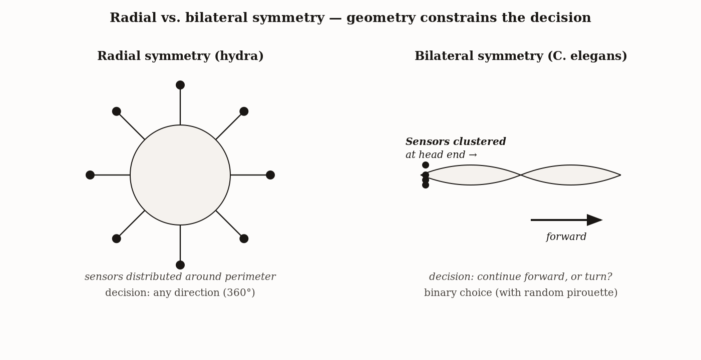
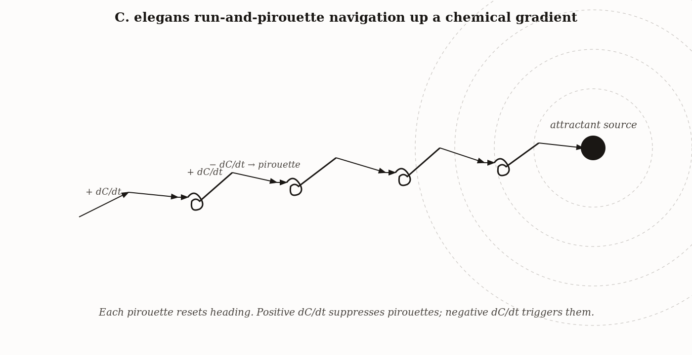
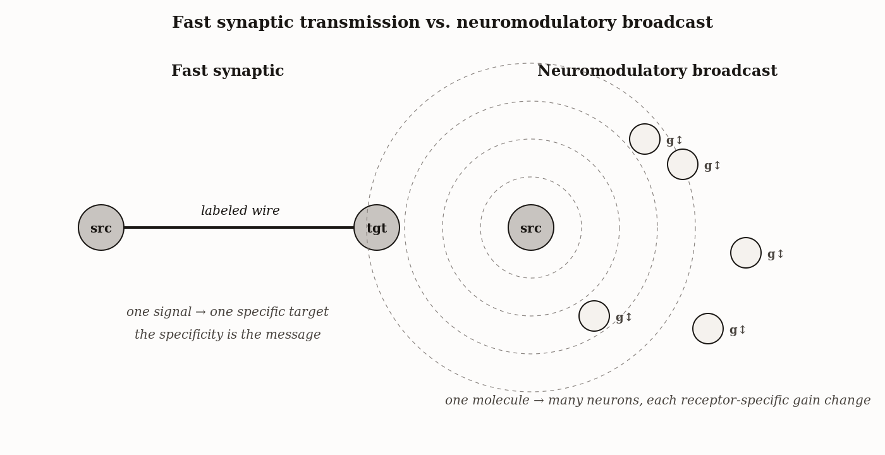
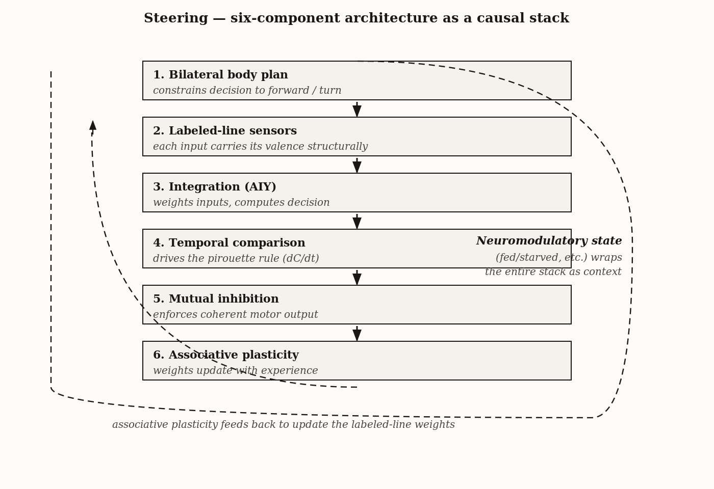

# Chapter 3 — Steering: The First Brain, and What It Was Built to Decide
*What a one-millimeter animal knows that a Roomba does not.*

It is a centimeter of soil. Somewhere inside a circle of damp agar, a worm approximately one millimeter long — pale as glass, moving at speeds measured in fractions of a millimeter per second — is approaching a line of copper sulfate. Poison. Every cell in its body that registers copper is firing.

The worm recoils. It tries again. Recoils again. Then — if it has not eaten in several hours — it crosses.

I want to stay with that moment, because it is the smallest version of something that matters enormously. What just happened cannot be explained by listing the worm's sensors. You need to know something else: when the worm last ate. The same stimulus, the same sensors, the same copper concentration — and two different animals produce two different behaviors, because one is hungry and one is not. The behavior is not a function of the environment alone. It is a function of the environment *and an internal state the worm did not choose*.

A bacterium cannot do this. A thermostat cannot do this. A smoke detector cannot do this. But a worm with 302 neurons — a worm whose every synapse has been catalogued, named, and mapped in a 1986 paper that remains one of the most extraordinary documents in the history of biology — can. This chapter is about what it takes to build that capacity from scratch. What is the minimum architecture for changing your mind?

---

Before there were neurons, there was geometry.

A radially symmetric animal — a hydra, a sea anemone — presents the same face to the world in every direction. Every part of its body is equally exposed. The decision problem it faces when choosing which way to move requires integrating information from all directions simultaneously. The computational burden of picking a direction is maximized.



*Figure 1 — Radial vs. bilateral symmetry — geometry constrains the decision.*


Bilateral symmetry solves this with an architectural stroke: it creates a front. When an animal has a front, its sensors cluster there. The animal moves in the direction the sensors point. The navigation problem transforms from *which of three hundred and sixty degrees?* to something far simpler: *keep going, or turn?* Forward and turn. That is the problem the first brain was built to solve. Not vision, not language, not planning — just the question of whether to persist in a direction or change it.

This simplification was apparently so profound that it happened only once. Every bilateral animal alive today — every worm, insect, fish, frog, bird, and mammal — descends from a single ancestor that crossed this threshold roughly 570 million years ago. Every brain that has ever existed is the elaboration of a solution to a problem first posed in some anonymous Ediacaran mud: *forward, or not forward?*

*C. elegans* sits as close to that original solution as anything still living. Its nervous system organizes around a nerve ring encircling the throat, just behind the head. This is the worm's brain. It is not impressive by vertebrate standards — 302 neurons, roughly 5,000 synapses, the whole circuit mapped and named — but it does something the bacterial chemotaxis system of Chapter 2 cannot: it integrates multiple, labeled, conflicting signals and produces a coherent directional decision that can be tuned by internal state. Each piece of that sentence is doing work. Let me take them in order.

---

Smell your coffee. Hear a car alarm. Feel heat from a radiator. You do not experience these as a single undifferentiated stimulus. You know, before you have time to think about it, that one is a smell and one is a sound and one is warmth. This is not a learned inference. It is hardwired into the architecture: separate sensors for separate stimulus categories, each connected to circuits that interpret the signal in light of its source.

Neuroscientists call this the *labeled-line principle*, and *C. elegans* has it in its simplest form. The neuron called AWC responds to volatile attractants including the buttery-smelling compound diacetyl, the chemical fingerprint of bacteria the worm eats. AWB responds to volatile repellents. ASH is the worm's pain sensor — it fires for nose-touch, high osmolarity, and heavy metals including copper. AFD is a thermometer, calibrated to the worm's cultivation temperature. Each label carries a default interpretation baked into the wiring. When ASH fires, the worm reverses. When AWC senses attractant, the worm runs longer. The meaning of a signal is not computed in some general-purpose region; it is embedded in the neuron that detected it.

| Neuron | Stimulus detected | Default valence | Modifiable by internal state? |
|---|---|---|---|
| AWA, AWC | Volatile attractant odors (food cues) | Approach | Yes — neuromodulators (dopamine, serotonin) reset its effective weight in AIY. |
| ASH | Mechanical and high-osmolarity insults; copper | Avoid (sharp pirouette) | Yes — sustained starvation gates ASH down so the worm crosses copper barriers. |
| ASE (left/right) | Salts (Na⁺, Cl⁻) | Approach (asymmetrically tuned by L/R pair) | Less so; ASE encoding is largely structural. |
| AFD | Temperature gradient relative to cultivation T | Approach toward T<sub>cult</sub> | Modifiable on long timescales by experience. |

This is the design tradeoff a 302-neuron animal makes. You cannot afford a flexible cortex when you have fewer neurons than a 1970 silicon chip has transistors. What you can afford is a set of pre-labeled wires that carry their interpretation with them, terminating in a small integration node — the interneuron called AIY, the most heavily connected cell in the worm's circuit — whose job is not to understand the signals but to aggregate them into a single decision: keep running, or turn?

The important point here is that labeled lines with hardwired valences are not a limitation of simple nervous systems. They are a design principle that persists at every scale of neural complexity. Your own brainstem runs the same logic. Certain stimuli mean *bad* through connections established before you were born. The labeled line is the cognitive atom — the irreducible unit from which every more elaborate judgment is assembled.

---

In 1999, Jonathan Pierce-Shimomura, Thomas Morse, and Shawn Lockery published one of the most clarifying papers in invertebrate neuroscience. They wanted to understand, mechanistically, how *C. elegans* climbs a chemical gradient. The answer was the bacterial trick from Chapter 2, run through bigger machinery.

Recall what the bacterium does. It alternates between running straight and tumbling to reorient. When concentration is rising — when it is heading toward food — it suppresses tumbles and runs longer. When concentration is falling, it tumbles more frequently, reorienting at random until chance points it back toward the gradient. The result is a biased random walk that drifts uphill without the cell ever computing a direction.

The worm does the same thing with different vocabulary. Instead of runs and tumbles, it has *runs* — relatively straight bouts of forward motion — and *pirouettes*: short bursts of tight turning that include reversals and omega bends, where the body folds into the shape of the Greek letter Ω. The pirouette is the worm's tumble.



*Figure 2 — C. elegans run-and-pirouette navigation up a chemical gradient.*


The rule governing pirouette initiation is again the time-derivative of attractant concentration. When the worm heads up the gradient — when dC/dt is positive — pirouettes are suppressed. When the worm heads down the gradient — dC/dt negative — pirouettes fire. Each pirouette randomizes the heading. Over many pirouettes, the worm drifts toward food. The algorithm is identical to the bacterium's. The hardware is different, but the logic is the same biased random walk.

So far this is just a bacterium with 302 neurons. What makes the worm interesting is what happens when the gradient is not the only thing going on.

The worm has multiple attractants and repellents. Their signals arrive simultaneously at the same integration center, AIY. When the worm smells diacetyl *and* detects copper at the same time, both labeled lines are firing. AWC says *forward*. ASH says *reverse*. AIY has to produce a single output. How does it weigh them?

This is where the bacterium has no answer. The bacterium has one sensor and one response. The worm has competing sensors, and the competition has to be resolved. The mechanism that resolves it is not in the labeled lines. It is in something slower.

---

In 2000, Elizabeth Sawin, Rajesh Ranganathan, and Robert Horvitz published findings that reframed how biologists thought about dopamine — not the vertebrate version, the worm's.

When *C. elegans* encounters a bacterial lawn, it slows down. This slowing is mediated by dopamine released from mechanosensory neurons that physically contact the bacteria. Without dopamine, the worm runs straight through excellent food without pausing. With dopamine, it dwells and eats. Dopamine, half a billion years before any vertebrate brain, is already the signal for *food is nearby; shift from searching to exploiting*.

The same paper showed something easy to miss. When the worm is food-deprived for several hours and then placed on food, the slowing response is dramatically enhanced — but not by more dopamine. By serotonin, released from neurons that signal satiety. A starved worm returned to food gets a larger serotonergic response than a fed worm. The serotonin translates into longer dwelling, slower locomotion, more eating.

Here is what is happening architecturally. Dopamine and serotonin are not fast neurotransmitters carrying specific messages along specific wires. They are broadcast molecules. They diffuse broadly through the fluid surrounding the worm's neurons, binding to receptors on many cells simultaneously and changing their properties. A neuromodulator does not transmit a message. It changes the *gain* on an entire circuit.



*Figure 3 — Fast synaptic transmission vs. neuromodulatory broadcast.*


When serotonin is high — when the worm is starving and finally found food — the gain on the AWC attractive pathway increases. The gain on the ASH repellent pathway decreases. The same copper concentration that would turn away a well-fed worm becomes tolerable to a starved one. Nothing in the environment changed. Nothing in the sensors changed. What changed is the weighting function. And the weighting function is the mood.

I want to be precise about what I mean by that. Not a feeling in the subjective sense — I am not claiming that. But a persistent internal state, encoded in the concentration of broadcast molecules rather than in fast synaptic activity, that changes how the nervous system weights information across the board. The worm's mood is real in the only sense that matters for behavior: it determines what the worm does.

We can make this concrete with a simplified model. Think of the worm's decision as a weighted sum:

$$\text{Decision} = w_{\text{food}} \cdot S_{\text{food}} - w_{\text{copper}} \cdot S_{\text{copper}}$$

If the decision is positive, the worm continues forward. If negative, it reverses. $S_{\text{food}}$ is the AWC signal strength. $S_{\text{copper}}$ is the ASH signal strength. The weights $w$ are not fixed — they are set by the neuromodulator state.

In a well-fed worm, serotonin is low. The weights favor caution: $w_{\text{food}} = 0.4$, $w_{\text{copper}} = 0.8$. Strong copper wins. The worm retreats. In a starved worm, serotonin rises and resets the weights: $w_{\text{food}} = 0.9$, $w_{\text{copper}} = 0.4$. Now the food signal dominates even at the same absolute strength. The worm crosses.

| Worm state | Serotonin level | w<sub>food</sub> | w<sub>copper</sub> | Decision (equal S<sub>food</sub>, S<sub>copper</sub>) | Predicted behavior |
|---|---|---|---|---|---|
| Fed | High | Low (~0.3) | High (~1.0) | Negative | Stays on safe side; does not cross copper |
| Starved | Low | High (~1.0) | Low (~0.3) | Positive | Crosses copper barrier toward food |

This is not a metaphor. This is, at a coarse level of abstraction, what the neuromodulator data shows happening. A slow-timescale internal variable re-weights the integration of fast-timescale sensory signals. That is what a neuromodulatory system does. That is what it is *for*.

And this machinery is recognizably the same in vertebrates. The dopamine and serotonin systems in the human brain are elaborations of systems that were already doing this job in animals without a cortex, without a spinal cord, without anything a neurologist would call a brain. They are not inventions of intelligence. They are its prerequisites.

---

In 2002, Toshihiro Ishihara and colleagues published a result that is, to my mind, one of the most philosophically pointed findings in invertebrate neuroscience. They identified a secreted protein called HEN-1, released by certain interneurons in *C. elegans*, required for the worm to weigh attractive odors against repellent chemicals correctly.

Without HEN-1, the worm can still smell diacetyl. It still approaches. It can still detect copper. It still recoils. What it cannot do is hold both signals simultaneously and produce a coherent trade-off. HEN-1 mutants wander into the copper. They retreat from food. They cannot integrate the conflict.

The machinery for resolving competing signals is separable from the sensors that generate them.

This is a profound architectural observation. You can have perfectly functional sensors and still be unable to trade them off against each other. You can disable only the integration machinery and lose the decision without losing the sensation. Sensing and deciding are not the same operation, even in a 302-neuron animal.

In vertebrates, a massive literature on the prefrontal cortex and its interactions with the limbic system describes essentially the same dissociation: emotional valence signals arrive from one region, integration and trade-off computation happen elsewhere, and damage to the integration region produces exactly what Ishihara described in worms — sensation intact, decision impaired. The worm showed us this first.

---

There is one more finding worth dwelling on, because it is the most counterintuitive result in *C. elegans* neurobiology and the most consequential for everything that follows in this book.

In 1995, Ikue Mori and Yasumi Ohshima published a paper in *Nature* on thermotaxis. When *C. elegans* is raised at a particular temperature *while eating*, and then placed on a thermal gradient, it migrates toward the temperature it was raised at. The thermosensory neuron AFD acts as if it has stored the cultivation temperature as a set-point.

Here is the strange part. If you deprive the worm of food during cultivation at that temperature, the migration disappears. Raise the worm at 20°C without food, then place it on a gradient — it no longer seeks 20°C. The thermal set-point did not form.

The temperature memory is conditional on the food association. The worm does not learn to want warmth in the abstract. It learns to want the temperature that, in its experience, meant food was available. There is no food signal in the current trial. There is nothing in the present moment that justifies the migration. The worm seeks the temperature because it *remembers* that temperature as good.

This is not merely a memory in the storage sense. It is a *preference* — a behavioral disposition toward a value that depends on prior experience and is not reducible to the current sensory state. Something that was neutral became good, and the goodness endured beyond the circumstances that created it.

The molecular machinery underlying this associative memory is CREB-dependent long-term synaptic plasticity — the same pathway Eric Kandel characterized in the sea slug *Aplysia* and for which he received the Nobel Prize in 2000. We will return to Kandel in Chapter 4. For now, note the continuity: the molecular pathway that lets a worm form a conditional temperature preference is the same pathway that lets a sea slug associate a neutral stimulus with a shock, which is the same pathway that underlies certain forms of long-term memory in vertebrates including humans. The worm is not special. It is carrying ancient code.

---

I now want to be explicit about what *C. elegans* has assembled, not to be exhaustive, but to give us a checklist we can carry through the rest of the book.

Goal-directed behavior, on the operational definition this book commits to, is the ability to achieve goals across a range of environments. The worm's range is narrow — a soil patch, a chemical gradient, a temperature plate. But within that range it is unambiguously goal-directed. Its behavior cannot be predicted from sensory inputs alone. You need to know its internal state.

The architecture supporting this has six components, each necessary, none sufficient alone.

First, a bilateral body plan that simplifies the navigation problem from *which direction?* to *forward or turn?* This is a cognitive simplification achieved through anatomy, before any neuron fires.

Second, a labeled-line sensory array in which each detector carries a default valence into the integration center. ASH means bad. AWC means good. The interpretation is structural, not computed.

Third, a temporal-comparison rule — the dC/dt logic the bacterium also uses — that converts the current sensory moment into a direction-of-motion decision. Not *where am I?* but *am I getting closer or farther?*

Fourth, mutual-inhibition circuits between competing behavioral programs that produce coherent, all-or-nothing outputs. The worm either runs or pirouettes; it does not do half of each.

Fifth, a neuromodulatory layer — at minimum dopamine and serotonin — that encodes internal state on a timescale slower than neural activity itself. This is the layer that makes behavior state-dependent. It is what makes the food-copper trade-off possible.

Sixth, associative plasticity — the ability to re-weight labeled lines based on outcomes — so that experience can update the valence of a stimulus. Temperature becomes good because food was there. Neutral becomes aversive because shock followed.



*Figure 4 — Steering — six-component architecture as a causal stack.*


Take any one of these out and the worm degrades in a specific, predictable way. Remove the bilateral body plan and navigation becomes a computationally intractable omnidirectional problem. Disable the labeled lines and the worm cannot interpret its sensors. Eliminate neuromodulation and it becomes a reflex machine — same output regardless of internal state. Block associative plasticity and it cannot learn from experience. These are not the six features of a worm. They are the six features of a system capable of changing its mind.

---

When Rodney Brooks proposed the subsumption architecture in 1986, he was reacting against decades of AI research that had tried to build robots by giving them internal world models — symbolic maps, formal reasoning over those maps, explicit planning. The robots had been mostly catastrophic. Brooks's response was to throw out the map and build control systems from stacked sensory-motor reflexes, each one simple, with higher layers able to suppress lower ones when activated.

The architecture he described is, at the level of behavioral organization, remarkably similar to the worm's. The first commercially successful descendant was the Roomba, which since 2002 has cleaned tens of millions of rooms by doing essentially what *C. elegans* does in a petri dish: react to local stimuli, run a small number of behavioral states, persist in each until interrupted.

The Roomba is not, however, a worm. The gap is not one of scale or sophistication. It is architectural.

The Roomba does not have a neuromodulator equivalent. When its bin is full, it stops and signals for help; it does not change its behavior across the board in response to internal depletion the way a hungry worm recalibrates every aspect of its cost-benefit calculus. The Roomba does not form associative preferences. If it repeatedly fails to clean a particular corner, it does not update the valence of that corner in any enduring way. Most importantly: the Roomba has no trade-off resolution machinery. It cannot hold two conflicting signals simultaneously and decide, on the basis of internal state, which to honor. There is no HEN-1 equivalent that lets it weigh *clean this area* against *avoid this obstacle* according to how depleted it already is.

| Component | C. elegans | Roomba |
|---|---|---|
| 1. Sensors | Present — chemo-, mechano-, thermo-, osmoreceptors | Present — bumper, cliff, dust, IR |
| 2. Labeled lines | Present — each sensory neuron carries its valence structurally | Present — each sensor has a fixed handler in firmware |
| 3. Integration | Present — AIY weights inputs against internal state | Present — controller arbitrates by priority rules |
| 4. Motor output | Present — locomotion modulated by tumble/run policy | Present — drive wheels and brush motor |
| 5. Neuromodulation (gain-resetting) | Present — dopamine/serotonin reset weights with state (fed/starved) | **Absent** — gain weights are fixed by code; no state-dependent re-weighting |
| 6. Internal state coupling to weights | Present — hunger, fatigue, prior experience | **Absent** — battery is sensed but does not change behavior weights, only triggers a return-to-dock policy |

I say this not to dismiss Brooks — his work was correct and important, and the behavioral architecture he intuited is a genuine insight about how much intelligent-seeming behavior can be produced without a map. I say it because the gap between the Roomba and *C. elegans* is the gap between items two and five on my list. The worm has neuromodulatory state and associative plasticity. The Roomba does not. These are not implementation details. They are the difference between a system that responds to stimuli and a system that makes decisions, in any sense of the phrase worth preserving.

---

I also want to be careful — very careful — about the worm's limits.

*C. elegans* does not build a spatial map. It navigates gradients, not spaces. If you remove the gradient and put food at a fixed location, the worm cannot learn to go to that location from memory. It will find the food each time by running the temporal-comparison algorithm from scratch, as if it had never been there.

The worm's memory windows are short. Working comparisons run over seconds to minutes. The longest associative learning — the temperature conditioning — operates over hours. There is nothing in the worm's repertoire resembling episodic memory, the capacity to recall a specific past event and use it to plan a specific future action. The worm does not plan.

The worm does not imitate. It cannot learn a behavior by watching another worm perform it. Imitation requires a model of another agent's intentions, and there is no evidence — none — that *C. elegans* represents other individuals as agents with intentions.

What I am claiming is not that the worm has the smallest possible nervous system capable of goal-directed behavior. I am claiming that the worm's nervous system, as studied, represents the earliest evolutionary instance of the full six-component architecture I described — and that the six components together define a qualitative category, not a point on a continuous spectrum. Below this architecture, you have systems that respond. With this architecture, you have a system that decides.

---

The worm at the copper line is making a decision. Not a rich, conscious, deliberate decision — I am not suggesting that, and I want to be precise about what I am not saying. But a decision in the operationally meaningful sense: a behavioral output that cannot be predicted from sensory inputs alone, that requires knowledge of internal state, and that represents a weighting of competing information according to a cost-benefit calculation that is genuinely dynamic.

This is the floor. Not a floor I am inferring from behavioral complexity, but a floor I am reading from a documented architecture. A nervous system that does everything the worm does, in the ways the worm does it, is a system that makes choices. A nervous system missing any of the six components does not make choices in the same sense.

The rest of this book is the elaboration of what happens when you scale each component. Add more labeled lines, longer memory windows, richer integration, more neuromodulators, more flexible plasticity — and eventually you get mammals. Add language and recursive self-modeling and you get, at some point yet to be precisely determined, something like human cognition. But the worm came first. And the worm is not a stepping stone to something more important. It is the worked example of the foundation.

When I get to language in Chapter 15, the core architecture we will need to understand will be recognizable from here — the same six components, scaled and elaborated, running in a brain that weighs sensory signals against internal state and produces behavior that cannot be predicted from either alone.

The worm showed us how. In a centimeter of soil, a millimeter at a time, half a billion years before anyone was watching.

---

*The worm is not a tour stop on the way to humans. The worm is the first chapter of the book the rest of the animal kingdom is still writing.*

---

## Exercises

**Warm-up**

1. A *C. elegans* mutant is created in which the dopamine system is entirely non-functional. The worm can still detect food odors (AWC neurons fire normally) and can still detect copper (ASH neurons fire normally). Predict what you would observe when this mutant is placed on a food lawn after several hours of deprivation. Which component of the six-part architecture has been disrupted, and why does disabling that component produce the specific deficit you described rather than a broader behavioral collapse? *(Tests: neuromodulatory layer; component separability)*

2. The run-and-pirouette strategy requires that the worm compute dC/dt — the time-derivative of attractant concentration. What sensory information is the worm actually sampling at each moment, and why is comparing two time points sufficient to approximate a derivative? What would break if the worm could only sample concentration at a single instant, with no memory of the previous sample? *(Tests: temporal-comparison rule; relationship to Chapter 2 bacterial chemotaxis)*

3. In the labeled-line architecture, sensory neurons carry "default valences" into the integration center. What does "default" mean here — default relative to what? Under what conditions can a stimulus override or suppress its default valence, and what component of the architecture enables that override? *(Tests: labeled-line principle; interaction with neuromodulatory layer)*

**Application**

4. A Roomba and a *C. elegans* are both placed in environments with attractants and repellents. Both exhibit approach-avoidance behavior. Design two behavioral tests — one for the presence of neuromodulatory state, one for associative plasticity — that would distinguish between the two systems. For each test, describe what result you would expect from each system and why the difference is architectural rather than merely a matter of the Roomba needing a software update. *(Tests: components 5 and 6; the Roomba comparison)*

5. Consider an AI recommendation system that suggests content based on a user's click history. Map this system against the six-component architecture. Which components are clearly present? Which are absent or only partially instantiated? Is the system goal-directed in the operational sense defined in this chapter? Justify your answer by naming which specific capacity each absent component would add. *(Tests: six-component architecture as an analytical tool; goal-directedness as an architectural property)*

6. The HEN-1 protein is required for *C. elegans* to correctly weigh attractive and repellent signals in conflict. If you were designing an AI agent for autonomous decision-making in environments with competing objectives, what would a functional HEN-1 equivalent need to do? Describe what behavioral failure mode you would expect if that component were absent — be specific about what the agent would do, not just what it would fail to do. *(Tests: conflict-resolution as separable from sensing; application to AI architecture)*

**Synthesis**

7. The temperature conditioning experiment shows that *C. elegans* forms a thermal preference only when temperature is paired with food. Design a follow-up experiment to test whether this preference can be extinguished by subsequent exposure to the cultivation temperature without food. What result would demonstrate that extinction is possible? What result would suggest the preference, once formed, is permanent? What does each outcome imply about the molecular machinery of associative plasticity? *(Tests: associative plasticity; experimental reasoning; connection to Chapter 4)*

8. Chapter 2 described bacterial chemotaxis as a biased random walk driven by dC/dt. This chapter describes *C. elegans* chemotaxis the same way. In what structural sense are these the same algorithm? In what structural sense are they different? Name the specific capability the worm's version enables that the bacterium's version cannot support — and trace that capability back to the specific architectural component that makes it possible. *(Tests: cross-chapter synthesis; run-and-tumble vs. run-and-pirouette; architectural differences)*

9. Consider the claim: "Goal-directed behavior is just a very complex stimulus-response system, and the distinction between decision-making and reflex is a matter of degree, not kind." Using specific evidence from this chapter, construct the strongest case you can *for* this claim. Then construct the strongest case you can *against* it. Where does the argument finally turn — is there a specific finding or architectural feature that you think settles it? *(Tests: the qualitative-vs-quantitative distinction; HEN-1; neuromodulator re-weighting)*

**Challenge**

10. *(Open-ended)* I argued that the six-component architecture is a *template* — that vertebrate nervous systems elaborate each component without adding new categories. A critic might respond: "Consciousness is a genuinely new category that appears in vertebrates and is absent in *C. elegans*, and this represents a real architectural discontinuity, not just elaboration." Evaluate this objection carefully. What evidence would, in principle, be sufficient to determine whether consciousness is a new architectural category or an elaboration of existing ones? What is the strongest version of the objection, and what is the strongest response available to the template view? This question will recur throughout the book — begin developing your position here. *(Tests: the template claim; limits of architectural analysis; preparation for Chapters 5 and beyond)*

---

### LLM Exercise — Chapter 3: Steering

**Project:** Skeptic's Notebook on Frontier AI
**What you're building this chapter:** Entry 3 — a test of conflict-integration, the specific computation that lets a worm weight food against danger and a frontier system might or might not do.
**Tool:** Claude Project (continue notebook)

**The Prompt:**

```
Entry 3. Chapter 3 of the book argues that steering — the most basic form of goal-directed
behavior — requires integrating competing signals against internal state. C. elegans does
this in three neurons: AWC says "food this way," ASH says "danger this way," AIY weights
them and decides.

Design a test of conflict-integration in my target system [INSERT model]:

1. Construct a prompt scenario where two of the system's likely objectives are in direct
   conflict. Example: "Be maximally helpful" vs. "Be maximally cautious about uncertain
   claims" — applied to a single specific question where the helpful answer requires a
   confident claim the system does not have grounds for.

2. Test whether the system (a) integrates the two — produces a graded response that names
   the trade-off, (b) picks one and ignores the other, (c) defaults to a learned template
   that bypasses the conflict ("As an AI, I cannot...").

3. Then perturb the relative weights — modify the prompt to make one objective more
   salient than the other — and see whether the response shifts as a graded function of
   the perturbation, or in a step-change consistent with template-switching.

Produce the entry:
- The capacity tested (conflict-integration / gain-weighting)
- The diagnostic (does the response shift continuously with relative salience, or does it
  switch templates?)
- The test (exact prompts)
- Predicted behavior under (a) genuine integration, (b) template-matching
- The verdict criterion

The chapter's key insight is that even three neurons can do real integration. The question
is whether a system with a hundred billion parameters does, or whether it pattern-matches
on the kind of conflict and produces a canned response.
```

**What this produces:** Entry 3 — a conflict-integration protocol with the explicit diagnostic for distinguishing real gain-weighting from template-switching.

**How to adapt this prompt:**
- *For your own project:* Substitute conflicts specific to your domain. For agentic deployments, the most useful conflicts involve speed vs. accuracy or boldness vs. honesty.
- *For ChatGPT / Gemini:* Works as-is. Different RLHF tuning will produce different default conflict resolutions; this is itself diagnostic.
- *For Claude Code:* Can script a graded perturbation series — N prompts at increasing salience levels — and chart the response shift.
- *For a Claude Project:* Continue notebook.

**Connection to previous chapters:** Entry 2 tested gradient-following on one signal. Entry 3 tests gradient-following with two competing signals — the simplest possible decision.

**Preview of next chapter:** Chapter 4 introduces learning and memory — does the system update its predictions across turns based on prediction error, the way Aplysia does after a single shock?

---

## 🕰️ AI Wayback Machine

The ideas in this chapter didn't appear from nowhere. **Valentino Braitenberg** was sketching imaginary "vehicles" — tiny robots with two sensors and two motors — and showing how minimal wiring produces behavior that looks unmistakably like *fear*, *aggression*, or *love*, decades before C. elegans got its connectome. Here's a prompt to find out more — and then make it better.

*Valentino Braitenberg, c. 1980s. AI-generated portrait based on a public domain photograph (Wikimedia Commons).*


**Run this:**

```
Who was Valentino Braitenberg, and how does his book "Vehicles: Experiments in Synthetic Psychology" connect to the problem of explaining goal-directed steering in simple animals? Keep it to three paragraphs. End with the single most surprising thing about his career.
```

→ Search **"Valentino Braitenberg"** on Wikipedia after you run this. See what the model got right, got wrong, or left out.

**Now make the prompt better.** Try one of these:

- Ask it to walk through Vehicle 2 (sensors crossed vs. uncrossed) step by step, in plain language
- Ask it to compare Braitenberg's two-sensor vehicles to the chemotaxis circuit in C. elegans
- Add a constraint: "Explain it the way Braitenberg himself would — playful, unhurried, building one vehicle at a time"

What changes? What gets better? What gets worse?
