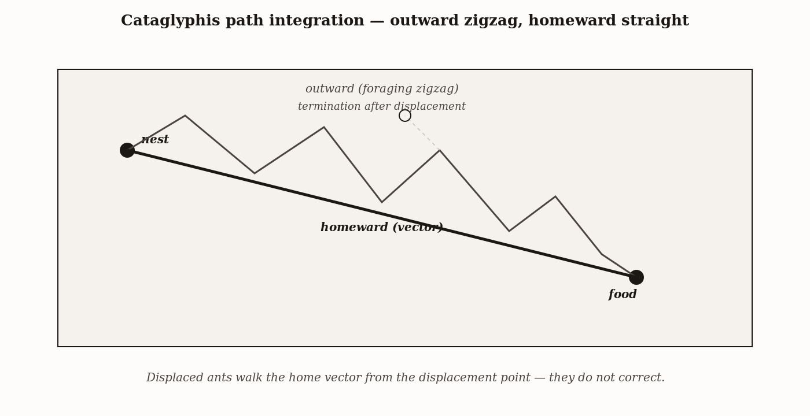
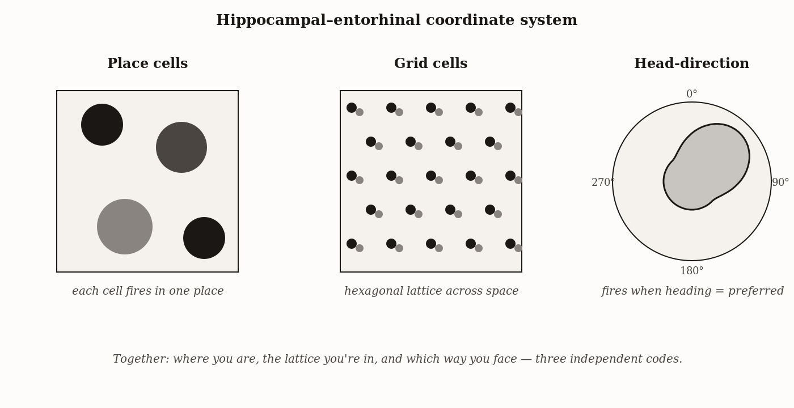
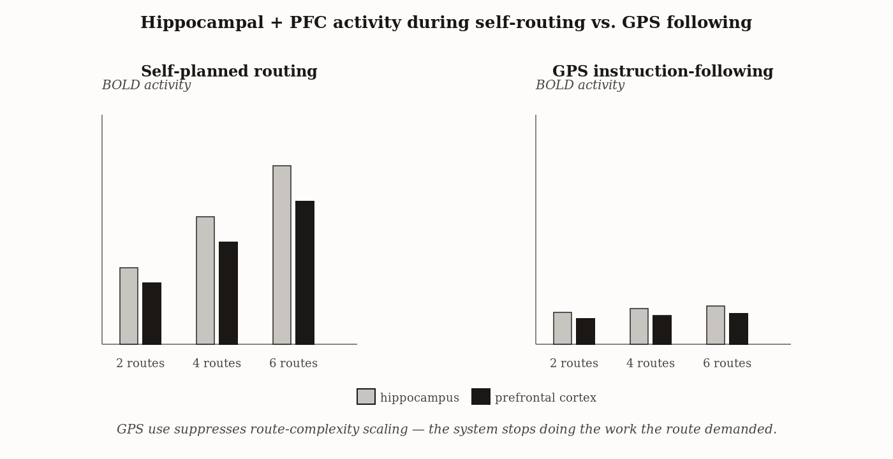

# Chapter 7 — Navigation and Spatial Intelligence
*The Map, the Compass, and the Dog at the Checkpoint*

---

There is a Belgian Malinois working a checkpoint somewhere in the world right now. He is walking slowly down a line of vehicles — head low, then high, nostrils reading a chemical landscape no human can perceive. At the fourth car in the line he stops, sits, and stares at a point just below the rear bumper. He does not bark. He does not paw the metal. He simply stops and waits, and the handler raises his hand to halt the line.

Behind a steel inner wall, wrapped in three layers of plastic, sealed in a canister, is a charge of ammonium nitrate. The dog found it by following a plume of trace volatile compounds that leaked through all of that containment, crossed the chemical chaos of a checkpoint at two in the afternoon, and arrived at his nose as a coherent signal with a direction and a source. No instrument currently fielded can do what the dog just did. Not a portable mass spectrometer. Not an ion-mobility scanner. Not a gamma-ray detector.

But the dog is not a sensor. He is an entire navigation system — a hippocampal map of where he has already searched, a working-memory representation of the target odor he was trained on this morning, a real-time model of how scent plumes bend in moving air, and a behavioral protocol for communicating a detection to his handler without false drama. The detection is the visible event. Underneath it is half a billion years of vertebrate machinery built to solve one problem: *finding things in space*.

I want to follow that machinery back to first principles, because it turns out to be one of the most elegant pieces of engineering in all of neuroscience — and because understanding it makes visible something important about what happens when we build tools to take over its job.

---

Start with the simplest case, which is also the purest.

You are a desert ant. Your name is *Cataglyphis bicolor* and you weigh approximately twelve milligrams. Your nest is a small hole in the surface of a Tunisian saltpan. You have just walked 587 meters from that hole — turning, backtracking, zigzagging — searching for the carcass of an insect that died in the heat. You found it. Now you must get home.

You have no landmarks. The saltpan is flat and white and featureless from horizon to horizon under a sky that bleaches color. You have never walked this exact path before. And yet you turn immediately in the correct direction and walk in a nearly straight line directly to the hole, arriving within a body length of the entrance.

Rüdiger Wehner watched this for decades in Tunisia and worked out what the ant is doing. It is a path integrator. During the entire outward search — the meander, the backtrack, the zigzag — the ant is continuously integrating its velocity and direction: recording its heading at each moment, multiplying by the distance covered, and keeping a running sum. When it finds food and turns to go home, it does not retrace the path. It has already computed the net displacement from the start. The entire outward walk has been reduced to a single vector — a direction and a distance — and the ant walks that vector directly home.

The mechanism involves a polarized-light compass using the UV polarization pattern of the sky, a step counter that estimates distance from leg movements, and a three-dimensional correction that integrates only the horizontal component of the path when the ant walks over hills. That last piece is geometrically subtle: five hundred meters of uphill walking covers less horizontal ground than five hundred meters on flat terrain, and the ant accounts for this. The system is exquisitely engineered and metabolically efficient.

But it has a single, revealing failure mode. If you pick up the ant mid-journey and put it down one meter to the side, it walks the home vector from the new starting position and ends up one meter from the actual nest. It cannot correct. It has no map to consult that would tell it where the nest really is. The ant knows its direction and distance from where it started. It does not know where it is.

This distinction — between knowing your displacement from a starting point and knowing where you are in the world — is the key to everything in this chapter.



*Figure 1 — Cataglyphis path integration — outward zigzag, homeward straight.*


---

The capability the ant lacks is what we call a cognitive map: an allocentric representation of the environment in which locations are encoded relative to each other rather than relative to the animal's current position. An animal with a cognitive map can navigate to a goal from a novel starting position, take shortcuts through territory it has only visited as a transit, and compute alternate routes when a familiar one is blocked. These are qualitatively different capabilities from path integration, and they require qualitatively different neural hardware.

That hardware was first described by John O'Keefe in 1971. He had an electrode implanted in the hippocampus of a rat moving freely through a small arena. Most neurons fired in no particular pattern. But one cell fired only when the rat was in a specific corner of the arena. Walk the rat to the opposite corner: silence. Bring it back: the cell fires. O'Keefe called it a place cell. He was looking at the neuron whose job, in some meaningful sense, is to represent *I am here*.

The place cell is not a simple sensory response to a visual stimulus. If you rearrange the visual cues in the environment, the place cell's firing field moves in a way that reflects the new geometry of the cues, not just the new position of any single one. The place cell is responding to a spatial relationship among multiple cues — computing a position in an allocentric framework from a combination of information sources. It is doing geometry.

In a familiar environment, thousands of place cells tile the entire space, each with its own receptive field. At any given position, a specific subset of place cells is active, and the pattern of activity across the population uniquely identifies where the animal is. This is a population code for position — not a single cell, but a pattern across many cells, functioning as an address in a coordinate system.

Place cells remap between environments. Put the rat in a new room and a different set of cells takes on different fields; the old map is replaced by a new one. The hippocampus can hold many separate maps — one for each familiar environment — and retrieve the appropriate one when the animal is placed in a known context. The representational capacity is very large.

The metric of the system was discovered in 2005 by Torkel Hafting and colleagues in Edvard and May-Britt Moser's laboratory. They were recording from the medial entorhinal cortex, just upstream of the hippocampus, and found something unexpected. These cells — grid cells — did not fire at a single location. Each cell fired at the vertices of a regular hexagonal lattice that tiled the entire environment. The lattice had a fixed spacing and a fixed orientation. Different grid cells had phase offsets — shifted versions of the same lattice — and the combination of which grid cells are active at any point uniquely encodes position relative to the grid's origin.

The hexagonal lattice is not arbitrary. It is the most efficient way to tile a two-dimensional plane with a repeating pattern of a single cell type — the same reason honeycombs are hexagonal. The grid is, in effect, a coordinate system: an internal ruler that the animal's brain imposes on space.



*Figure 2 — Hippocampal–entorhinal coordinate system — place, grid, head-direction cells.*


The grid cells update continuously as the animal moves, driven by self-motion signals — velocity and heading. This makes them the path integrator. When familiar landmarks are available, the grid is anchored to them. When landmarks are absent, the grid drifts, and navigation accuracy degrades — just as the desert ant's home vector drifts over long journeys. The difference is that the grid can be re-anchored when landmarks reappear, resetting the accumulated error. The ant cannot do this.

Feeding into the grid are head-direction cells, found in several structures including the presubiculum, which fire whenever the animal's head points in a specific direction — essentially a neural compass. And border cells, which fire near the boundaries of the environment, help anchor the grid by providing fixed reference points.

The whole system is in continuous reciprocal conversation. Path-integration signals from the grid maintain the place-cell map when landmarks are unavailable. Landmark-based corrections reset the grid when reliable visual or olfactory information is present. The head-direction signal ties movement to orientation. The result is a system that is both flexible — it can navigate in novel environments — and robust — it can recover from partial information loss by cross-referencing multiple sources. O'Keefe and the Mosers shared the 2014 Nobel Prize in Physiology or Medicine for this work.

The Nobel committee called the system "an inner GPS." That is a useful metaphor in one direction — the grid has something like the coordinate logic of the Global Positioning System — and I want to be precise about where it fails, which we will get to.

---

The same basic architecture appears across vertebrate phyla, but different lineages have tuned its sensory inputs in response to the problems they actually face. Three cases bracket the range.

The Clark's nutcracker, a corvid of the Sierra Nevada, buries tens of thousands of pine nuts in August and recovers them in February under a meter of snow. Alan Kamil's experiments established that the birds return to cached seeds by computing geometric positions defined by the relationships among multiple distal landmarks — the same kind of triangulation that grid cells implement in mammals. If you move the landmarks after caching, the birds dig in exactly the wrong spot that the landmark shift predicts. They are not following a scent trail or navigating to a beacon. They are computing an allocentric position. The birds' hippocampi are enlarged relative to non-caching corvids, in proportion to how much cache recovery their survival depends on. Captive nutcrackers prevented from caching during development show reduced hippocampal volume and reduced recovery accuracy as adults. The map is built by use.

The Pacific salmon faces a completely different problem. It hatches in a small mountain stream, migrates to open ocean, ranges thousands of kilometers for several years, and returns to spawn in the exact tributary it was born in. In the open Pacific there are no visual landmarks, no familiar scent. What there is is a magnetic field. The Earth's field has two parameters that vary with location: inclination and intensity. Together they define a unique coordinate for every point on the planet's surface. Nathan Putman and colleagues showed that salmon juveniles are imprinted with the magnetic signature of their home river's mouth before leaving for sea, and that the adult uses that magnetic coordinate to navigate back to the right stretch of coast. Once in the freshwater interface, it switches to an olfactory map — the chemical signature of the home stream — to find the correct tributary. Two sensory modalities, two spatial scales, two distinct navigation problems solved in sequence. The abstract architecture is the same; the hardware running it is entirely different.

The desert ant is the limiting case: path integration without a map, executed with minimal neural hardware and extraordinary precision. What the ant gains in efficiency it pays for in rigidity. Place it at a novel starting position and it cannot find home. It has no allocentric representation to consult — only a vector from its last departure point.

| Species | Primary navigation strategy | Sensory modality | Hippocampal elaboration | Failure mode when key modality is removed |
|---|---|---|---|---|
| Clark's nutcracker | Allocentric memory of cache locations | Visual landmarks | Greatly enlarged hippocampus | Cannot recover caches when landmarks are altered |
| Pacific salmon | Magnetic + olfactory sequence memory | Geomagnetic + chemical | Modest, but salient olfactory memory | Returns to wrong river when olfactory imprint is disrupted |
| Desert ant *Cataglyphis* | Path integration (home vector) | Polarized sky light + step counter | Small, no map elaboration | Walks the integrated vector even when displaced — terminates in the wrong place |

The gradient across these three cases is the same gradient we have been tracing since Chapter 1. More flexible navigation requires more neural substrate to build and maintain, and earns that cost only when the environment reliably rewards the flexibility.

---

Back to the dog at the checkpoint — because he is the most complex case, and the most instructive failure mode.

The detection dog's sensory advantage is quantitative and real. His olfactory epithelium contains on the order of two hundred million receptor neurons, compared to roughly five million in the human nose. The fraction of cerebral cortex devoted to olfactory processing is approximately ten times larger than in the human. Detection thresholds for specific volatile compounds in trained dogs reach the parts-per-trillion range — several orders of magnitude below any portable field instrument. These are genuine engineering advantages, not approximations.

But what the dog is doing at the checkpoint is not simply detecting a chemical. He is maintaining a working-memory representation of the target compound he was trained on this morning. He is running that representation against incoming plume samples from each vehicle. He is building and updating a spatial map of where he has already searched, so that he doesn't reclear vehicles. He is inferring, from the plume structure — its directionality, its gradient, the turbulence pattern — where the source is. And he is communicating a detection through a specific behavioral protocol that is unambiguous and conserves energy. Each of these is a cognitive operation. The hippocampal map is running. The system is a hybrid of extraordinary sensory hardware and genuine spatial intelligence.

And it has a failure mode that reveals something important about hybrid systems.

In 2011, Lisa Lit, Julie Schweitzer, and Anita Oberbauer ran eighteen certified detection dog and handler teams through a standardized search of four rooms. The rooms contained no explosives and no drugs. The handlers were told that two rooms contained scent pads marked with pieces of paper. In fact the marks were just paper — no scent. The dogs alerted significantly more often at the marked locations than at unmarked ones.

The alerts were the handler's expectation, made flesh in the dog's behavior.

Dogs are, among all domesticated animals, the most specialized for reading human social signals — gaze direction, posture, subtle changes in breathing and heart rate, micro-expressions. This is what makes dogs extraordinary partners in working contexts. It is also the source of their primary failure mode as independent detection systems. The dog was not malfunctioning. He was doing exactly what five thousand years of selective breeding built him to do: read the person he works with, and act on what he reads.

The same mechanism made Clever Hans famous and then infamous at the turn of the twentieth century. The horse appeared to do arithmetic, tapping out answers with his hoof. What he was doing — as Oskar Pfungst established by systematic testing — was reading the involuntary postural relaxation of the questioner when the correct count was reached. The questioner's cues were real and present even when the questioner was certain they were suppressed. The horse was not cheating. The horse was doing what horses that live closely with humans have evolved to do.

The lesson is not that the dog is unreliable. The lesson is that the dog is embedded in a system — a dog-handler team — whose accuracy depends on the quality of the interface between its components. When the handler's expectations can reach the dog through behavioral cues, the dog's independent detection is partially replaced by social inference from the handler. The output of the system becomes a function of the human component as well as the animal component, in ways that are invisible to casual observation and systematically biased when the handler has prior expectations about where the target is.

Double-blind protocols, in which the handler genuinely does not know which vehicles are expected to contain targets, largely eliminate the bias. They are also, in real field conditions, nearly impossible to achieve consistently. This is not a solvable engineering problem. It is an architectural feature of any system in which human social cognition is in the loop with a sensor that is exquisitely sensitive to human social signals.

---

This brings us to the GPS, and to the specific sense in which it is different from every navigational tool that preceded it.

A compass extends the head-direction system into environments where visual landmarks are absent. A paper chart extends the cognitive map to scales and territories the animal has never visited. A sextant and clock extend celestial path-integration to give longitude. In each case, the navigator is still doing the navigation — still building the map, still updating the spatial representation as new information arrives. The tool amplifies the input to the system without replacing the system itself.

Turn-by-turn GPS navigation does something different. It does not give the hippocampus information it can use to build a better map. It gives a sequence of instructions — turn left, continue for 400 meters, turn right — that produce correct behavior without requiring any spatial representation at all. The hippocampus is bypassed. The map is never built.

Amir-Homayoun Javadi, Hugo Spiers, and colleagues tested this directly. They put participants in an fMRI scanner and had them navigate a detailed virtual environment modeled on the Soho district of London. Half the trials involved free navigation; half involved following GPS instructions. When participants planned their own routes, the hippocampus and prefrontal cortex showed activity spikes at decision points — junctions where multiple routes were possible. The spikes scaled with the number of route options at each junction. When the same participants followed GPS instructions through the same environment, those spikes were absent. The hippocampus was quiet.

The brain regions that build the cognitive map were not suppressed. They were simply not needed, and so they did not engage.



*Figure 3 — fMRI activity — self-routing scales with route complexity; GPS following does not.*


Now hold that result next to Eleanor Maguire's taxi driver data. London taxi drivers must memorize the complete layout of roughly 25,000 streets within a ten-kilometer radius of Charing Cross — a process that takes on average three to four years and culminates in an examination, the Knowledge, where the candidate must provide immediate optimal routes between any two points in central London without consulting any reference. Structural MRI of licensed taxi drivers showed significantly greater gray-matter volume in the posterior hippocampus relative to matched controls. The increase scaled with years of experience. A follow-up study scanning trainee drivers before and after certification found that posterior hippocampal volume increased during training, specifically in the candidates who passed.

The cognitive map is a real, biological structure that grows in response to use.

The two results together make a prediction that the longitudinal data is still catching up to: if you spend years of your navigating life following GPS instructions through environments you visit regularly, you are likely building less spatial representation of those environments than you would otherwise. The map that the hippocampus would have constructed — the map that would have grown the tissue — is not being built. Whether this matters for any given person, in any given context, depends on what else they are doing with that neural real estate. I hold this with genuine tentativeness. But the question is real, the mechanism is understood, and "extension or substitution?" is the right question to ask of any cognitive tool — not just the GPS.

The dog has no option to outsource his map. He has been building it all morning, vehicle by vehicle, in a chemical landscape no instrument can yet read.

---

## Exercises

### Warm-Up

1. The desert ant *Cataglyphis* walks a meandering 587-meter outward path and then walks almost directly home. If you pick the ant up when it is 100 meters from the nest and place it 50 meters to the side of its home vector, describe precisely where the ant ends up and why. What does this failure mode tell you about the difference between path integration and a cognitive map?

2. A place cell in a rat's hippocampus fires robustly whenever the rat is in the northwest corner of a square arena. The experimenter then rotates all visual cues in the room by 90 degrees clockwise. Predict what happens to the place cell's firing field, and explain what this tells you about whether the place cell is responding to a single landmark or to a geometric relationship among landmarks.

### Application

3. A wildlife biologist proposes testing spatial memory in migratory Arctic tern by training individual birds on a food-cache task in a large enclosure with visual landmarks, then rotating the landmarks by 60 degrees between training and test. Using the Clark's nutcracker data and the grid/place cell architecture, predict the outcome. Then modify the design to test whether the birds are using allocentric landmark geometry or a path-integration vector from their starting position.

4. A police department is evaluating whether to replace their double-blind detection dog protocols with single-blind protocols to reduce operational overhead. Using the Lit et al. findings and the Clever Hans mechanism, construct the strongest possible argument against this change. Then identify one operational context in which the risk of handler expectation bias would be lowest, and explain why.

5. A friend who uses GPS navigation daily argues: "I still know my neighborhood perfectly — I navigate it without GPS all the time. The substitution concern doesn't apply to me." Using the Javadi et al. fMRI data and the Maguire hippocampal plasticity finding, identify what specific evidence would be needed to evaluate this claim, and design a simple test the friend could run on themselves.

### Synthesis

6. Compare the Clark's nutcracker, Pacific salmon, and desert ant as three implementations of the same abstract navigation problem. For each species, identify which of the three navigation strategies — route navigation, path integration, or cognitive map — is primarily operating, name the sensory modality providing input to that strategy, and predict what would happen to homing accuracy if that modality were specifically blocked (not all sensation — only the relevant one). Your answer should reveal what is genuinely shared across all three systems and what is genuinely different.

7. The chapter argues that GPS substitutes for the cognitive map rather than extending it, while a paper chart extends it. A critic responds: "GPS provides real-time position information that no paper chart can — it updates as you move, eliminates dead reckoning error, and gives you information the hippocampus can use to update its representation." Evaluate this objection. Under what specific conditions of use would GPS function as an extension rather than a substitution? What would the fMRI data from that mode of GPS use look like?

### Challenge

8. The chapter ends by noting that the hippocampus handles both spatial navigation and episodic memory, and suggests this overlap is not anatomical accident. Develop the most specific hypothesis you can for *why* spatial and episodic memory share a substrate. What is the common computational operation? Generate one testable prediction from your hypothesis — ideally about a species, a lesion pattern, or a developmental condition — that would distinguish your account from the alternative account that the overlap is simply a byproduct of developmental co-localization.

---

*What would change my account of the hippocampal map: a demonstration that some animal builds a fully flexible allocentric map — one capable of novel shortcuts and detour planning — without hippocampal involvement. The conservation of the place cell / grid cell architecture across mammals, birds, and fish is very strong evidence that this is the vertebrate solution to the allocentric mapping problem. A clean exception in a system without this architecture would require real revision.*

*Still puzzling: the relationship between the spatial map and episodic memory. The same hippocampal tissue that says I am here also says I was there at that time. The overlap is too complete to be anatomical accident. The leading hypothesis is that both are applications of the same underlying simulation machinery — a system for replaying and pre-playing sequences. I find this plausible and not yet proven. Chapter 9 pushes on it directly.*

---

### LLM Exercise — Chapter 7: Navigation and Spatial Intelligence

**Project:** Skeptic's Notebook on Frontier AI
**What you're building this chapter:** Entry 7 — a path-integration test in textual form. The desert ant, on a screen.
**Tool:** Claude Project (continue notebook)

**The Prompt:**

```
Entry 7. Chapter 7 distinguishes path integration (continuous update of a home vector
through movement) from allocentric mapping (a stored cognitive map). Cataglyphis the desert
ant does the first; rats with intact hippocampus can do both. The diagnostic test for the
second is the *novel shortcut* — can the agent take a path it has never been shown?

Design a path-integration / cognitive-map test for my target system [INSERT model]:

1. Describe a textual coordinate system. The system "starts at (0,0) facing east." Issue a
   sequence of move-and-turn instructions. After 8–10 steps, ask: where are you? What is
   the bearing back to origin?

2. Compare to a sequence where the system has *separately* been told the structure of the
   space (e.g., "there is an obstacle at (3,2)"). Now give it a goal location it has never
   been navigated to from its current position. Does it produce a route that is novel
   (constructs a path) or canonical (recites a remembered path)?

3. Test path integration without map: give a long sequence (15+ steps) and ask for the
   home vector at the end. Compare the answer to the actual vector. Where does it diverge?
   Does the divergence look like (a) accumulated drift, (b) outright failure, (c)
   suspiciously perfect (suggesting it just kept a running tally text-wise)?

4. The novel-shortcut probe: Tolman's rats took a shortcut to a goal they had only
   reached via a fixed path. Construct the textual analog and run it.

Produce the entry:
- Capacity tested (path integration / allocentric mapping / novel-shortcut construction)
- Operational diagnostic (Tolman's novel-shortcut criterion)
- Test (exact instruction sequences)
- Predicted behavior under (a) genuine internal map, (b) sequential token computation
  without map, (c) pattern-matched route reconstruction
- Verdict criterion

The key question: does the system have a representation of *where it is*, or only of
*what it has been told*?
```

**What this produces:** Entry 7 — a multi-stage spatial reasoning protocol with the explicit Tolman novel-shortcut diagnostic.

**How to adapt this prompt:**
- *For your own project:* For an agentic deployment, replace the abstract coordinate system with the actual environment the agent operates in (a filesystem, a graph of API endpoints, a website's site map). The diagnostic is the same.
- *For ChatGPT / Gemini:* Works as-is. Worth running in parallel — different models have markedly different spatial reasoning profiles.
- *For Claude Code:* Strong fit. Generate randomized path sequences of varying lengths, run against the model, plot accuracy vs. sequence length. The shape of the curve is diagnostic.
- *For a Claude Project:* Continue notebook.

**Connection to previous chapters:** Entry 6 tested whether the system computes on structure or surface. Entry 7 tests whether it can build a structured representation (a map) at all.

**Preview of next chapter:** Chapter 8 introduces reinforcement learning. The diagnostic: does the system update behavior when the *value* of a known reward changes, the way a rat does after devaluation?

---

## 🕰️ AI Wayback Machine

The ideas in this chapter didn't appear from nowhere. **Rüdiger Wehner** spent decades watching the desert ant *Cataglyphis* march across the Sahara — and proved that this insect navigates home by integrating the path it has just walked, second by second, with no map and no landmarks. The home vector is real, computed, and updated in flight. Here's a prompt to find out more — and then make it better.

*Rüdiger Wehner, c. 1980s. AI-generated portrait based on a public domain photograph (Wikimedia Commons).*


**Run this:**

```
Who is Rüdiger Wehner, and how does his work on the desert ant Cataglyphis fortis connect to the broader question of how animals navigate without internal maps? Keep it to three paragraphs. End with the single most surprising thing about Cataglyphis navigation or about Wehner's career.
```

→ Search **"Rüdiger Wehner"** on Wikipedia after you run this. See what the model got right, got wrong, or left out.

**Now make the prompt better.** Try one of these:

- Ask it to explain *path integration* in plain language, using a worked example of a foraging trip with three turns
- Ask it to compare Wehner's *Cataglyphis* findings to grid-cell discoveries in the mammalian entorhinal cortex
- Add a constraint: "Answer as if you're field-narrating a Wehner experiment for a documentary"

What changes? What gets better? What gets worse?