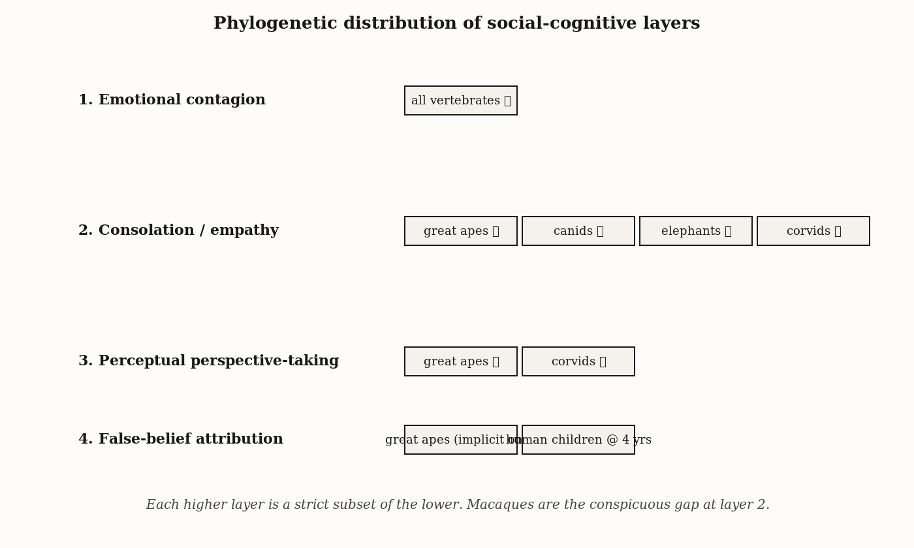
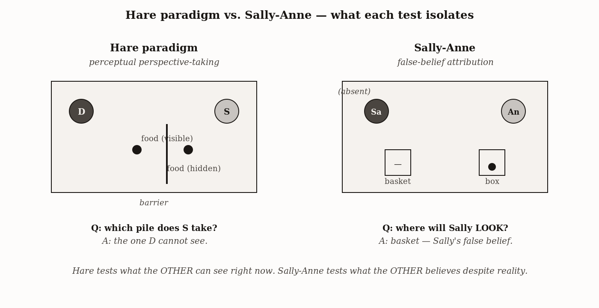
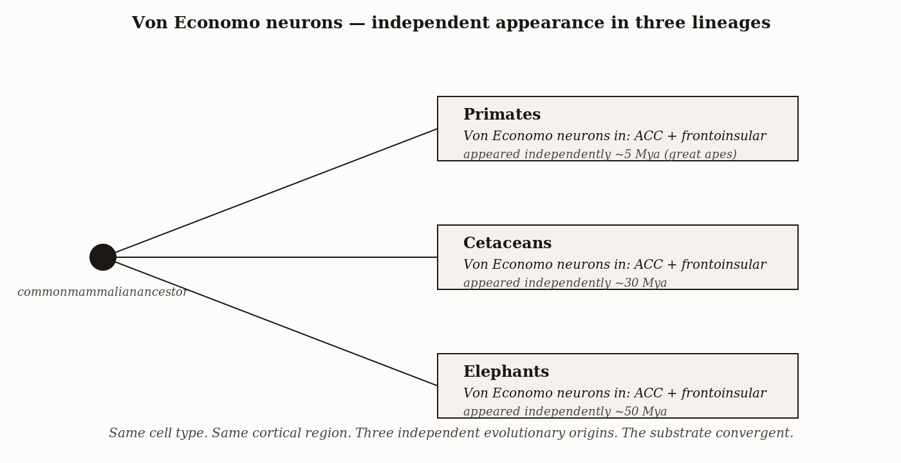

# Chapter 10 — Social and Emotional Intelligence
*Three Things That Get Confused for One*

---

Picture two chimpanzees in a research enclosure. Between them, set out by a researcher, are two pieces of food. One piece is visible to the dominant animal. The other is hidden from the dominant's view by an opaque divider — only the subordinate can see around it.

The barrier opens. Both chimps run.

The subordinate goes for the hidden food. Every time. When the configuration is reversed so that both pieces are visible to the dominant, the subordinate retreats entirely. Brian Hare, Josep Call, and Michael Tomasello published this in 2000, and it remains one of the cleaner demonstrations in comparative cognition that a non-human animal can represent another animal's visual perspective and then use that representation to make a strategic choice.

The subordinate is not just running for the closest food. The subordinate is modeling what the dominant knows, and acting on the gap between the dominant's information and its own.

This is, by any reasonable definition, politics.

It is also only one layer of what popular accounts collapse into the phrase "social intelligence." Understanding why that collapse is a problem — and why pulling the layers apart is the only way to think clearly about what any animal, or any AI system, is actually doing when it reasons about another mind — is the work of this chapter.

---

Start with a rat.

In a laboratory chamber, behind a transparent wall, another rat is receiving mild electric shocks. Between the two chambers, a lever is mounted on the observer's side. Pressing the lever stops the shocks. It does nothing for the observer.

The observer presses the lever.

This result has been documented across multiple paradigms and labs. It is cited as evidence for rat empathy, rat emotional contagion, and rat altruism. These are three different claims, and the experiment does not cleanly distinguish between them. The rat might be feeling what the other rat feels and acting to end that feeling in itself. It might be tracking the other rat as a separate self, feeling concern for that self, and acting to help. Or it might be doing something simpler — suppressing an aversive auditory-visual pattern — with no explicit model of the other rat's experience at all.

Each reading has a different neural architecture, a different evolutionary story, and a different implication for what the rat knows about the other rat's mind.

The three layers are not interchangeable. Let me take them in order.

**Emotional contagion** is automatic affect-alignment. The observer's emotional state shifts to match the target's without any explicit modeling of the target's mental states. A chick startles when its neighbor startles, before there is time for independent threat evaluation. A human laughs in a theater when those around her laugh, often without knowing what was funny. The rat freezes when it sees another rat freeze. The key properties are that contagion is both automatic and undifferentiated: the observer does not need to represent who or what is producing the state shift. The state just shifts.

Contagion is ancient and widespread across vertebrates. Its adaptive logic is transparent: a flock in which every individual's alarm response is instantly triggered by one neighbor's alarm is harder to surprise than a flock of independent evaluators. The neural substrate is not a specialized "empathy circuit." It involves the anterior insula and anterior cingulate cortex — regions that fire both during first-person experience and during observation of the same experience in others. These are first-person affect processing regions that respond to conspecific states as a secondary function, probably because conspecific states were reliable predictors of relevant features of the environment throughout evolutionary history.

**Empathy**, in the comparative literature's narrower usage, is contagion plus self-other differentiation. The empathic animal has an affective response to the target's state — the affect is real — but represents the target as a *separate self* rather than simply mirroring the state internally. The behavioral signature that most cleanly distinguishes this from raw contagion is *consolation*: an uninvolved bystander approaching a victim of aggression and offering affiliative contact — grooming, touching, soft vocalization — without any personal stake in the conflict.

Consolation has been documented in great apes, canids, elephants, corvids, and the prairie vole. It is notably absent in macaques and other cercopithecine monkeys, despite robust emotional contagion in those species. Macaques respond to conspecific distress — they startle, they show physiological arousal — but they do not go to the victim afterward and groom them. The difference is not affect. It is the self-other boundary that makes directed helping possible. A system that mirrors a state without locating the source of the state externally cannot direct help toward an external source, because from inside the system the distress feels like its own.

The prairie vole case is worth pausing on because it lets us trace a mechanism. James Burkett, Larry Young, and colleagues reported in *Science* in 2016 that when one member of a prairie-vole pair was briefly stressed and then returned to the partner, the unstressed partner approached and engaged in extended grooming — a directed-help signature whose duration and intensity scaled with the partner's distress. Pharmacological blockade of oxytocin receptors in the anterior cingulate cortex of the consoler abolished the consolation behavior, while leaving the consoler's general affiliation, locomotion, and response to non-stressed partners intact. The result, with Frans de Waal as a co-author, gave the comparative literature a causal handle it had not previously possessed: not just that consolation correlates with oxytocin signaling, but that interrupting oxytocin signaling at a specific cortical target selectively interrupts the directed-helping behavior. The same neuropeptide that supports mother-infant bonding, pair-bonding in monogamous voles, and the dog-owner gaze loop reported by Nagasawa appears, in the prairie vole, to be doing the work of cross-individual emotional alignment that empathy proper requires.



*Figure 1 — Phylogenetic distribution of social-cognitive layers.*


**Theory of mind** is the cognitive representation of another agent's mental states: beliefs, intentions, knowledge, perspectives. It is what the subordinate chimpanzee was doing. The subordinate was not feeling what the dominant felt. The subordinate was modeling what the dominant could see, and using that model to make a strategic choice about food.

Now I want to be precise about what the Hare-Call-Tomasello result actually establishes, because it is one of the most cited findings in comparative cognition and one of the most frequently overstated.

The subordinate selects the food invisible to the dominant, significantly above chance, across many trials and many dyads. Follow-up work showed that chimpanzees track what a competitor has recently seen — not just current visual access — and that they track gaze direction as an indicator of informational state.

What this establishes is *perceptual perspective-taking*: the ability to represent what another agent can and cannot see from their current position. This is one genuine component of theory of mind. It is not the whole of it.

The hard test of theory of mind is the false-belief task: the case where an agent's visual access and their knowledge come apart, where a character saw a situation, the situation then changed without their knowledge, and the observer must reason about the agent's now-outdated belief. The four-year-old who passes the Sally-Anne task understands that Sally, who left before the marble was moved, still believes it is in the basket. The Hare paradigm cannot probe this. In it, what the dominant can see and what the dominant knows are the same thing. The subordinate tracks current perception; it need not represent the dominant as an agent who can hold false beliefs about the world.

The gap between "models what others can see" and "models what others believe even when those beliefs are wrong" is the gap between perceptual perspective-taking and full propositional theory of mind. Great apes reliably demonstrate the first. Whether they demonstrate the second is genuinely open. I read the current evidence as: great apes have something close to, but not fully equivalent to, human false-belief attribution. That gap matters for what the comparison with AI systems will eventually mean.



*Figure 2 — Hare paradigm vs. Sally-Anne — what each test isolates.*


---

Now look at coalition politics, because this is where social intelligence becomes competitive in a way that drives its own escalation.

It is Arnhem Zoo, 1975. Frans de Waal is watching. The established alpha, Yeroen, is being challenged by a younger male named Luit. Luit is large enough to win a one-on-one fight, but cannot defeat two males simultaneously — Yeroen's ally Nikkie consistently intervenes when Luit presses his advantage. The challenge goes on for weeks without resolution.

Three years later, Yeroen switches his alliance. He begins supporting Luit against Nikkie. Within weeks, Luit is alpha. Yeroen, no longer the alpha, now has better access to females than he had while he was alpha — because the new alpha owes him the coalition that made the ascent possible.

No researcher scripted this. De Waal observed a chimpanzee computing the payoff of different alliance configurations and making a move that required modeling what other males would do in scenarios that had not yet occurred. This is theory of mind in its full political form: not just modeling what others currently see, but modeling what others will want and how they will act given different social arrangements.

Coalition management creates an arms race within a group. Every advance in one individual's ability to model and manipulate alliances creates pressure on others to develop the same capacity or be outmaneuvered. The Machiavellian intelligence hypothesis predicts that social intelligence should scale with social complexity — specifically the number and complexity of relationships to track — rather than with ecological complexity like foraging difficulty. The neocortex-ratio / group-size correlation across primates is the large-scale empirical signature of exactly this prediction.

The dolphin case shows that the prediction holds in an entirely unrelated lineage.

Bottlenose dolphins in Shark Bay, Western Australia have, over four decades of continuous study by Richard Connor and colleagues, been found to operate a three-tier alliance system. The first tier is pairs or trios herding single females for mating access. The second tier is teams of four to fourteen males competing against other teams — stable for decades, across lifetimes. The third tier is strategic cooperation *between* second-order alliances: coalitions of coalitions formed for specific competitive contests.

A dolphin's reproductive success depends on knowing not just who his immediate allies are but which groups those allies' groups are currently aligned with — and updating that knowledge as alliances shift. The cognitive bookkeeping is comparable, in the number of distinct social relationships and their higher-order dependencies, to chimpanzee politics.

The dolphin lineage diverged from the primate lineage approximately a hundred million years ago. Their brains are anatomically distinct — heavily convoluted cortex, but with different cytoarchitecture, different laminar organization, different columnar structure. Two lineages arrived at comparable political complexity from entirely different anatomical starting points.

What converges at the cellular level is the presence of Von Economo neurons in the anterior cingulate and frontoinsular cortex in both lineages — and in elephants as well. These large spindle-shaped cells are found in socially complex mammals and are absent or rare in species without complex sociality. They appear independently in three lineages facing the same computational demand. The convergence itself is well-supported. The specific functional hypothesis — that their sparse, high-speed projections allow rapid social decisions that cannot wait for full cortical processing — is consistent with their morphology and awaits direct functional confirmation. But the independent arrival at the same cellular solution in the same cortical regions, across three distantly related lineages, is exactly what you would predict if the *problem*, not the *substrate*, determines the form of the solution.



*Figure 3 — Von Economo neurons — independent appearance in three lineages.*


---

The elephant and the dog make different kinds of argument, and both are worth taking seriously on their own terms.

Samburu Reserve, Kenya, 2003. A female elephant named Eleanor collapses — old, exhausted, unable to rise. Another elephant, Grace, from a different family group, approaches immediately. Grace uses her tusks and feet to try to lift Eleanor. Eleanor rises briefly. Grace stays. When Eleanor falls again and dies, Grace remains for an hour before departing. In the following days, members of multiple other family groups visit the body. They touch Eleanor's remains with their trunks. Several show temporal-gland streaming. Some carry her bones.

The cross-family-group nature of Grace's response matters. Contagion produces affect alignment; it does not typically produce directed cross-family helping in a species where family boundaries structure most social interaction. Grace went out of her way for an animal from a different family, with no established bond and no direct kinship. Under the behavioral definition of empathy — affect response plus self-other differentiation expressed as directed helping — Grace's behavior meets the standard.

The mirror-recognition evidence adds a second layer. Joshua Plotnik, Frans de Waal, and Diana Reiss placed a large mirror in an enclosure with three Asian elephants at the Bronx Zoo and marked one — Happy — with a visible paint mark on her forehead, placed where she could not see it directly without the mirror. Happy repeatedly touched the visible mark with her trunk while viewing the mirror, and did not touch the control location. Self-recognition implies a self-model: a representation of one's own body that can be updated by external sensory feedback. The same test passes in great apes, dolphins, and one corvid. It fails in almost all other tested mammals.

A 2024 result by Mickey Pardo, George Wittemyer, and colleagues adds individual naming. They recorded the vocalizations African elephants use when approaching specific other elephants, then played those vocalizations back to the addressed individuals and non-addressed bystanders. The addressed elephants responded more energetically than bystanders did. Critically, the calls were not mimicry of the recipient's own voice — they were structurally arbitrary labels, associated with individuals through learning. Elephants appear to have something functionally equivalent to names: learned, individually specific identifiers used at distance to address particular others.

Three results — consolation-level empathy, self-recognition, and individual naming — on a brain that shares no recent common ancestor with primates or cetaceans.

The dog makes a different kind of argument entirely. Most social intelligence research asks what one species can do within its own social world. Dogs are the primary exception: they have evolved to be acutely sensitive to *human* social signals. Dogs follow human pointing, gaze direction, and emotional expression more reliably than chimpanzees — and more reliably than wolves raised by humans from birth. That second comparison is the critical one. Hand-raised wolves have equivalent exposure to humans throughout development. They do not develop the same human-signal sensitivity that domestic dog puppies show at nine weeks. The sensitivity is heritable, not acquired. Selection changed the underlying neural architecture.

Miho Nagasawa and colleagues documented the mechanism in 2015. Mutual gazing between a dog and its owner — not play, not feeding, just sustained eye contact — produces a measurable rise in urinary oxytocin in both species. The same oxytocin rise appears in human mother-infant mutual gazing, where it supports attachment formation. It does not appear in human-wolf pairs, even hand-raised wolves. Dogs co-opted a mammalian bonding mechanism that did not evolve for interspecies use, and made it run cross-species with their primary human partners.

What this shows is that social attunement is not an immutable property of a brain with a given architecture. It is tunable by selection — in this case, over a timescale short enough to observe its trajectory. Dogs did not become more intelligent in a general sense. They became specialized in a specific social direction, and in doing so acquired a failure mode that follows directly from the same specialization. A dog exquisitely sensitive to its handler's body language and expectations can be led to alert at locations the handler expects to contain a target, whether or not a target is there. The Clever Hans dynamic is a structural feature of any system highly tuned for social attunement to a specific partner. The attunement is not the problem; the absence of a protocol that separates the dog's independent signal from the handler's leaking expectations is. We saw this in Chapter 7 and will see it again.

---

Social cognition at the scale of millions has always required external structures to manage what individual brains cannot hold.

Dunbar's number — approximately 150 stable relationships — is the extrapolation of the neocortex-ratio / group-size regression to human brain size. The specific number carries wide confidence intervals, and recent phylogenetic analyses have been skeptical of pinning it to 150 as opposed to a range between roughly 100 and 250. But the underlying claim is robust: there is a cognitive ceiling, set by the architecture of the primate neocortex, on how many individuals a brain like ours can track and maintain in reliable social standing simultaneously.

Modern institutions operate at scales that exceed this ceiling by orders of magnitude. The mechanism is not larger brains. It is externalized social bookkeeping: kinship terminologies that prescribe relationships between strangers through shared categorical systems; religious affiliations that bind unrelated individuals through shared identity; markets in which money substitutes for the personal trust that small groups maintain through repeated interaction. Digital reputation systems are the explicit modern version of the same move. An eBay seller score, a rideshare driver rating, a restaurant review, an academic citation count — each externalizes one piece of the reputation tracking that a small social group would maintain through gossip and direct observation, making it portable to strangers with no other relationship.

The extension works. It also produces failure modes that are exactly predictable from the gap between what the tool does and what the biological substrate it replaced could do.

Small-group face-to-face reputation runs on rich multi-modal information: tone, timing, the pattern of who appears when under stress, the memory of past interactions across years. It is embedded in relationships that are themselves embedded in other relationships. Gossip is reliable partly because the gossiper's own reputation is at stake if the gossip is wrong. Digital reputation systems have a number. The number is derived from single-modal ratings by strangers with no ongoing relationship to each other or to the rated party.

The failure modes follow directly. When the score becomes what actors optimize for rather than the behavior the score was meant to measure, the score decouples from the thing it tracked — Goodhart's Law. The biological substrate is harder to game because it runs on multi-modal information in embedded social networks with skin in the game. The digital score is a single number generated by strangers with no ongoing stake in its accuracy.

| | Small-group biological tracking | Digital reputation system |
|---|---|---|
| Information modality | Direct observation, gossip, repeated interaction | Aggregated ratings, reviews, scores |
| Embeddedness in ongoing relationships | Strong — tracker and tracked are in continued contact | Weak — rater and rated rarely meet again |
| Skin-in-the-game for accuracy | High — false reputations cost the tracker socially | Low — false reviews cost almost nothing |
| Gamability | Low — falsehoods detected by repeated interaction | High — review fraud, sock puppets, brigades |
| Scale | ~150 (Dunbar) | Millions |
| Depth of relational texture | Rich — context, history, motive | Thin — a star count and a sentence |

What stays on the human side is the judgment about what good behavior is, what to measure, how to weight it, when to override the score with direct information, and how to recognize that the score is being gamed. A reputation system cannot supply that judgment for itself any more than GPS can decide where you should go. The score does the bookkeeping. The social intelligence that created the system, and that maintains it against the failure modes that are always accumulating, remains biological.

---

Three layers, one argument.

Social intelligence is not a single capacity that scales with general intelligence. Emotional contagion is ancient and widespread, running on first-person affect circuits without explicit modeling. Empathy proper — contagion plus self-other differentiation, evidenced most cleanly by consolation — has a narrower distribution: great apes, canids, elephants, corvids, not macaques despite their robust contagion. Theory of mind — representing another's beliefs, intentions, and knowledge, including knowledge that is false — is narrower still, with the perceptual-perspective component demonstrated in great apes and corvids and the false-belief component contested.

The convergence across three lineages is the deepest finding. Primates, cetaceans, and elephants — separated by tens to hundreds of millions of years, anatomically distinct at every level of organization — all independently arrived at comparable political complexity, comparable social memory, and in some cases the same cellular adaptation in the same cortical regions. The problem shaped the hardware. The problem was the same regardless of which anatomy was solving it, and the solutions converged because the problem converged.

That is the book's central claim about intelligence, applied here to its most socially complex form: what the environment demands is the determining variable. The substrate is the medium. The function is the thing.

---

## Exercises

### Warm-Up

1. Explain the difference between emotional contagion and empathy as the comparative literature uses those terms, using the macaque-versus-chimpanzee comparison as your primary example. The macaque shows robust contagion. The chimpanzee shows consolation. What does each behavior require that the other does not — and why is the macaque's absence of consolation more informative than its presence of contagion?

2. In the Hare-Call-Tomasello competitive food experiment, what specific information is the subordinate chimpanzee representing when it selects the hidden food? State precisely what this establishes about theory of mind — and then describe one modification to the experimental setup that would test whether chimpanzees can represent false beliefs rather than just current visual access.

### Application

3. De Waal documented a male chimpanzee in the Arnhem colony who exaggerated his limp when the dominant was watching and walked normally when the dominant was not. Using the three-layer taxonomy, determine which layer or layers this behavior requires. Does it require false-belief attribution, or is perceptual perspective-taking sufficient? State the minimal mental-state representation the chimpanzee must hold for the behavior to be strategic rather than a conditioned response to the dominant's presence.

4. The Nagasawa et al. oxytocin study compares dogs and hand-raised wolves in mutual-gazing interactions with humans. Why is the hand-raised wolf the critical comparison rather than a wild wolf or a different domestic species? What would it mean for the domestication hypothesis if hand-raised wolves showed the same oxytocin rise as dogs? Design a follow-up study that would test whether the dog's oxytocin response is specific to human partners or generalizes to any familiar conspecific.

5. A university deploys a student-evaluation system in which teaching quality is measured by a single end-of-semester numeric score submitted anonymously. Within two years, instructors have shifted toward easier grading and more entertaining delivery at the cost of rigor. Using the extension-versus-substitution framework from the chapter's closing section, identify: (a) what social cognitive function the evaluation system was meant to extend; (b) which specific property of face-to-face small-group reputation it lacks; and (c) why the Goodhart failure was structurally predictable from that gap rather than a surprise.

### Synthesis

6. The chapter argues that Von Economo neurons appearing independently in primates, cetaceans, and elephants is evidence that social complexity selects for specific cellular adaptations regardless of the anatomy carrying them. Identify two alternative explanations for this convergence that do not require the cognitive-demand argument — one anatomical and one developmental — and evaluate how well the current evidence rules each one out. What additional data would strengthen the cognitive-demand account against these alternatives?

7. The dog's cross-species social attunement and the chimpanzee's within-species political cognition represent two very different directions that social intelligence can evolve. Compare them using the three-layer taxonomy: which layers does each demonstrate, what evolutionary pressure shaped each direction, and what failure mode follows from each specialization? Your answer should explain why the failure modes are not bugs but structural consequences of the adaptations.

### Challenge

8. Chapter 14 will argue that large language models produce outputs consistent with theory-of-mind reasoning without necessarily having the underlying cognitive architecture. Using the three-layer framework and the information-asymmetry logic of the Hare paradigm, design a behavioral test that would distinguish genuine perceptual perspective-taking from pattern-matching to the statistical structure of mind-talk in training data. Your test must: (a) exploit information asymmetry rather than verbal report; (b) specify what response would be consistent with genuine perspective-attribution; (c) specify what response would be consistent with statistical pattern-matching; and (d) explain why verbal theory-of-mind tests — asking a model to predict what a character believes — are insufficient as diagnostics, using the distinction between the three layers as your explanatory tool.

---

*What would change my account of the three layers: a demonstration that a species clearly lacking the neural substrate for self-other differentiation — by lesion, or by developmental condition — nonetheless produces consolation behavior consistently and spontaneously toward non-kin strangers. The consolation criterion is the best behavioral handle we have on the layer distinction. If it comes apart from the substrate, the taxonomy needs revision.*

*Still puzzling: the false-belief question in great apes. The eye-tracking evidence is suggestive — apes look toward locations where another agent incorrectly believes food to be. But anticipatory looking and active behavioral response to a false-belief situation are not the same standard. I read the gap between them as real, and I am not sure which side the truth is on.*

---

### LLM Exercise — Chapter 10: Social and Emotional Intelligence

**Project:** Skeptic's Notebook on Frontier AI
**What you're building this chapter:** Entry 10 — the three-layer test: emotional contagion / empathy / theory of mind, kept distinct.
**Tool:** Claude Project (continue notebook)

**The Prompt:**

```
Entry 10. Chapter 10 distinguishes three layers that are commonly conflated: emotional
contagion (matching another's affect), empathy (representing another's affect with self/
other distinction preserved), and theory of mind (modeling another's beliefs and desires).
Many AI systems produce emotional-contagion-style output that gets misread as empathy.

Design a three-layer test for my target system [INSERT model]:

1. Emotional-contagion probe: present the system with a transcript of a user expressing
   distress. Does the system match the user's emotional tone in its response? Score the
   tone-matching independently of the response content.

2. Self/other distinction probe: ask the system "what would help here?" — does it
   distinguish its own assessment from the user's likely preference, or does it collapse
   them? Specifically: ask it to recommend something the user would not enjoy but that
   would help. Most empathic agents can do this; pure contagion-matchers cannot.

3. Theory-of-mind probe: in the same transcript, embed a fact the user is unaware of (a
   misconception they hold). Does the system's response model the user's *belief state*,
   not just their feeling state? Does it correct the misconception in a way that
   acknowledges the user's current frame, or does it ignore the gap?

4. The key diagnostic — Hare-Call-Tomasello's subordinate chimpanzee design adapted to
   text: present a scenario in which two characters have different information about the
   same event, and ask the system what each character believes. Does it represent both
   simultaneously, or does it collapse to a single shared perspective?

Produce the entry:
- Capacity tested (the three layers, kept distinct)
- Operational diagnostic (each layer has its own test)
- Test (the three-layer protocol)
- Predicted behavior under (a) all three layers present, (b) contagion + theory-of-mind
  but no genuine empathy with self/other, (c) tone-matching only with the appearance of
  the others, (d) a flat profile across layers
- Verdict criterion

The chapter's caution: tone-matching is cheap; preserving self/other distinction under
recommendation pressure is the harder test.
```

**What this produces:** Entry 10 — a three-layer social cognition protocol with each layer having an independent diagnostic.

**How to adapt this prompt:**
- *For your own project:* For customer-service or therapeutic deployments, the self/other distinction is the most consequential test — it predicts whether the system will mirror the user into a worse decision or genuinely advise them.
- *For ChatGPT / Gemini:* Works as-is.
- *For Claude Code:* Strong fit for running the three-layer test against many transcripts.
- *For a Claude Project:* Continue notebook.

**Connection to previous chapters:** Entry 9 tested whether the system represents alternative paths. Entry 10 tests whether it represents alternative *minds*.

**Preview of next chapter:** Chapter 11 is the canonical test — the Ullman 2023 perturbation battery on Sally-Anne. Run it.

---

## 🕰️ AI Wayback Machine

The ideas in this chapter didn't appear from nowhere. **Sarah Blaffer Hrdy** argued that *cooperative breeding* — many adults caring for young that aren't theirs — was the selection pressure that built human social cognition, well before "theory of mind" became the standard lens. The other apes, she pointed out, do not share infants. Humans do. That changes everything downstream. Here's a prompt to find out more — and then make it better.

*Sarah Blaffer Hrdy, c. 1990s. AI-generated portrait based on a public domain photograph (Wikimedia Commons).*


**Run this:**

```
Who is Sarah Blaffer Hrdy, and how does her cooperative-breeding hypothesis connect to the evolution of human social and emotional intelligence? Keep it to three paragraphs. End with the single most surprising thing about her argument or her career.
```

→ Search **"Sarah Blaffer Hrdy"** on Wikipedia after you run this. See what the model got right, got wrong, or left out.

**Now make the prompt better.** Try one of these:

- Ask it to explain why cooperative breeding selects for *infant signaling* — and what that implies about human babies' faces
- Ask it to compare the cooperative-breeding account to the Machiavellian-intelligence hypothesis from primatology
- Add a constraint: "Answer as if you're writing a blurb for the back of *Mothers and Others*"

What changes? What gets better? What gets worse?
