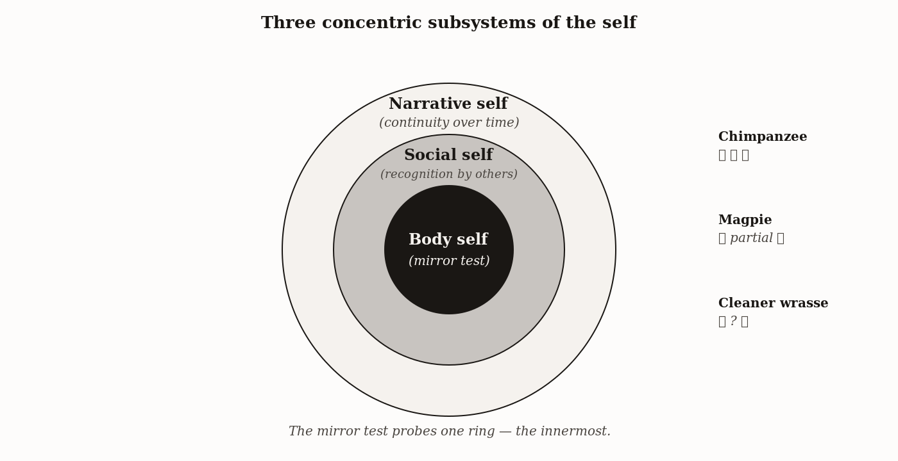
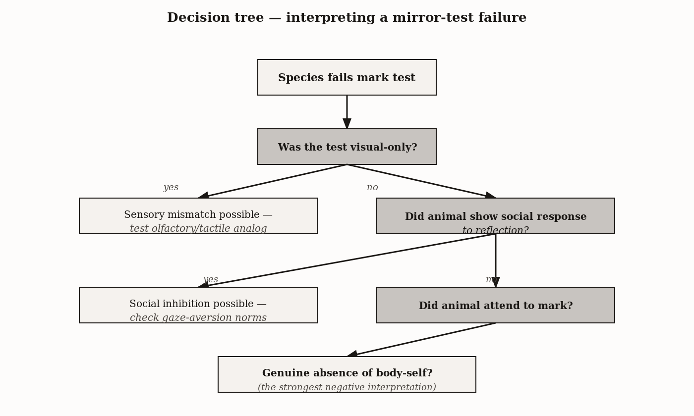
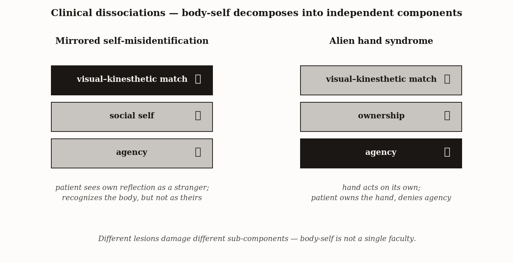

# Chapter 13 — Self-Awareness
*The Fish in the Mirror*

---

In an aquarium in Osaka, a small fish faces a mirror. The species is the bluestreak cleaner wrasse, *Labroides dimidiatus* — finger-sized, evolved to make its living removing parasites from the bodies of larger reef fish. Under its chin, researchers have placed a small brown mark, similar in color to the ectoparasites the wrasse normally eats. The mark is at a position the fish cannot see directly. It is visible only in the mirror.

The fish swims past the mirror. Notices the reflection. Performs the agonistic display the species typically makes toward another individual. Does it again. Then does something the researchers had been waiting for. The wrasse approaches the mirror, tilts its body to bring the marked spot into visual contact with the reflection, and scrapes the mark off against a rock at the tank bottom. It does this only when the mirror is present. Not for transparent sham marks. Not for visible marks it can see directly. After scraping, it returns to the mirror and inspects the spot again.

Masanori Kohda and colleagues published this in 2019. The cleaner wrasse, by every behavioral signature that Gordon Gallup's 1970 mark test was designed to detect, had passed.

The result was the most disruptive single finding in the mirror-test literature in fifty years. Until 2019, the list of passers — chimpanzees, orangutans, dolphins, elephants, magpies — had been held together by an implicit theory: that self-recognition required a neural substrate of sufficient complexity. The cleaner wrasse weighs a few grams. Its brain weighs less than a hundred milligrams. By every conventional metric of neural complexity, it should not have passed.

Either self-recognition extends much further down the animal kingdom than the field assumed, or the mirror test does not measure what it has been claimed to measure, and the wrasse is producing the right behaviors for reasons unrelated to self-recognition. Both readings are taken seriously in the current literature. The chapter is what we can conclude from the evidence we have, and what the test does and does not actually tell us.

---

Start with what the test requires, stripped to its computational core.

Gordon Gallup placed a mirror in the cage of a preadolescent chimpanzee that had never seen one before. After an initial period of social response — threat displays, vocalizations toward the reflection — the animal slowed, moved its face closer, made an unusual expression, watched the reflection make the same expression, and began examining parts of its own body using the mirror as a guide. It looked inside its mouth. It craned to examine its back. It inspected the inside of its ear.

Gallup then anesthetized the chimpanzee briefly and applied an odorless red dye to one eyebrow ridge and one ear, positions where the chimpanzee could not see without a mirror. When the animal woke and approached the mirror, it touched the dyed areas — not the undyed ear, not the corresponding spots on the mirror's surface. The chimpanzee was using the mirror to direct its own hand to its own face.

Strip this to its computational requirements and you find three things happening simultaneously. First, the animal must have an internal model of its own body — a body schema, a representation of its own physical form and movement that updates with proprioceptive feedback. Second, it must detect contingency: notice that a visual image moves in perfect lockstep with its own motor commands. Third, it must identify the contingent image as showing its own body rather than another body coincidentally performing the same movements. The mark test then adds one further demand: use that identification to direct action toward a part of the body visible only in the mirror. This is the visual-kinesthetic match — correlating what the proprioceptive system says the body is doing with what the visual system sees in the mirror.

That is what the test requires. What it does not require is anything more elaborate. A system that satisfies these demands need not have a narrative self — a continuous identity across time, a remembered past, an anticipated future. It need not have theory of mind about others. It need not have episodic memory or language. The mirror test is a test of one specific component of one specific system. Popular usage of the phrase "self-awareness" reaches for something much richer, and the conflation has caused most of the philosophical trouble in this literature.

Let me name the components properly.

The *body self* is the model of one's own physical body as a distinct object in the world — its shape, position, and movement. It is what the mirror test assesses. It supports motor planning, sensory integration, and the sense of ownership over one's own actions.

The *social self* is the model of oneself as an agent visible to and assessable by others — the capacity to represent how one appears from the outside, to predict how others will respond to one's behavior, to feel embarrassment. Chapter 10's coalition politics and false-belief attribution were about this layer. It depends on the body self but is not reducible to it.

The *narrative self* is the model of oneself as a continuous individual across time — with a remembered past, an anticipated future, and a coherent identity that persists through circumstance. It depends on episodic memory and prefrontal systems that maintain working memory across time. It is what most popular discussions of self-awareness are reaching for, and it is what humans have most elaborately and most differentially compared to other species.



*Figure 1 — Three concentric subsystems of the self — body, social, narrative.*


The mirror test says almost nothing about the social self or the narrative self. When a species passes the mirror test, the evidence is specifically for the body self. When a species fails, nothing follows about the other two. And when popular accounts say a species has or lacks self-awareness on the basis of mirror performance alone, they are conflating three different things.

---

Now walk the catalog of passers, because the distribution is the argument.

Chimpanzees and orangutans pass cleanly and reliably. The behavioral progression Gallup documented unfolds across hours — social response first, contingency testing within several hours, self-directed behavior and mark test passed after a day or so. The result has been replicated in dozens of laboratories across multiple decades. It is the most robust comparative finding in this literature.

Bottlenose dolphins. Diana Reiss and Lori Marino's 2001 paper documented mark-test success in two captive bottlenose dolphins. The motor signature is different from chimpanzees — dolphins have no hands — so the behavioral evidence is the marked dolphin orienting its body so that the marked area faces the mirror and sustaining that orientation, examining the mark for substantially longer than control trials. The test's logic is the same.

Asian elephants. Plotnik, de Waal, and Reiss's 2006 paper documented clean mark-test success in Happy, one of three tested elephants at the Bronx Zoo. Happy used her trunk to probe the visible mark while ignoring the transparent sham. Self-recognition in a species whose brain organization and evolutionary history are entirely separate from primates and cetaceans.

Eurasian magpies. Prior, Schwarz, and Güntürkün's 2008 paper was the first non-mammal. Five magpies tested; several passed cleanly, scratching at stickers visible only in the mirror and ignoring them without the mirror present. No neocortex. A brain the size of a walnut.

Cleaner wrasse. Kohda et al. 2019 and the 2022 follow-up. Whether the wrasse result reflects the same underlying body-self computation as chimpanzees, or something specific to the wrasse's parasite-removal ecology, is not settled. The 2022 follow-up showed that mark-removal behavior was strongest when the marks resembled real ectoparasites — suggesting the behavior is integrated with the wrasse's natural professional foraging rather than a generic body-investigation response. Both interpretations have defenders and the field has not converged.

| Species | Brain structure | Relative brain size | Year of first confirmed pass | Key behavioral evidence | Primary contested alternative |
|---|---|---|---|---|---|
| Chimpanzee | Six-layered neocortex | Large for body | 1970 (Gallup) | Mark-directed touching of own face | None still serious — replicated widely |
| Bottlenose dolphin | Six-layered neocortex (different organization) | Very large | 2001 | Use of mirror to inspect novel marks | Memory and visual habituation accounts |
| Asian elephant | Six-layered neocortex | Largest among terrestrial mammals | 2006 | Trunk-directed touching of marked spot | Pass rate is low (one individual of three) |
| Eurasian magpie | Pallial (no neocortex) | Large for bird | 2008 | Foot-directed scratching at marked throat | Replication contested in some labs |
| Cleaner wrasse | No cortex | Modest | 2019 | Throat-mark inspection and scraping | Active dispute — alternative accounts in olfactory and tactile cuing remain on the table |

Now look at what these species share. Chimpanzees have a multilayered neocortex and a large brain relative to body size. Dolphins have convoluted cortex but not a neocortex in the mammalian six-layer sense. Elephants have large brains with very different cortical organization from primates. Magpies have no neocortex at all, a pallial organization that solves broadly similar computational problems through entirely different structural means. Cleaner wrasse have no cortex of any kind.

There is no single anatomical feature these species share that the non-passers lack. The only common denominator is functional: all of them can match a visual image of a body in motion against an internal proprioceptive model of their own body in the same motion, identify the match, and direct action to the matched body accordingly. The capacity evolved, or was present ancestrally, in lineages with no common neural ancestor for the specific circuits involved. What is conserved is the computation. What varies is the hardware.

This is the function-not-substrate argument applied to self-recognition. It is the same argument the book has been making since Chapter 2 about bacterial chemotaxis and slime mold maze-solving. The function is the thing. The substrate is the medium.

---

The most instructive non-passer is the gorilla, because it shows what failure actually means.

Gorillas mostly fail standard tests, and the failure is not what it appears. Gorilla social norms make direct eye contact a dominance threat. In a mirror, the gorilla confronts what looks like a strange gorilla making prolonged direct eye contact, and the social response is to break the gaze — the animal never reaches the contingency-testing stage the protocol requires. The human-reared gorilla Koko, desensitized to the threat-meaning of human gaze through years of close human contact, was reported to pass mark tests with relative ease. The gorilla case shows the asymmetry between passing and failing: the failure is a social confound rather than an absence of the body self, and a properly designed study controlling for gaze aversion would likely show passing.

Dogs are the other canonical failer, and the dog case is worth examining carefully because it is routinely overstated.

Alexandra Horowitz set up her experiment with dogs. The dogs were presented with samples of their own urine in a clean container. Then with samples of unfamiliar dogs' urine. Then with a crucial condition: their own urine, modified by the addition of a small amount of an additional odorant. The dogs investigated the modified-own-urine samples longer than either the unmodified own-urine or the unfamiliar-dog urine. They were noticing that their own scent had been altered — detecting a discrepancy between a stored representation of how their own scent should be and the presented sample. This is olfactory self-recognition in the same operational sense that the visual mirror test measures visual self-recognition.

The dogs failed the mirror test. They did not fail the olfactory version.

Dogs are primarily olfactory animals. Their visual acuity is substantially lower than humans'. The mirror test provides a silent, scentless visual image. A dog's body model may be calibrated primarily to olfactory and proprioceptive information, making the visual reflection uninformative. The failure tells us that dogs do not have a visually-calibrated body self. It says nothing about whether they have a body self calibrated to the modality they actually use.

This is the asymmetry that every comparative claim about self-awareness must honor. What a pass establishes: strong evidence for visual self-recognition, specifically the body self in its visual-kinesthetic form. What a failure establishes: much less. Failure can result from sensory mismatch (a non-visual species confronting a visual test), social inhibition (the gorilla's gaze-threat response), motivational irrelevance (the animal doesn't care about the mark), or insufficient procedural exposure (not enough mirror time to progress through the behavioral stages). None of these alternatives requires an absent body self.

A rigorous comparative claim that a species *lacks* self-recognition requires ruling out all four. Very few published studies have done so comprehensively. The pass list is a genuine list of demonstrated capacities. The fail list is, at most, a list of species that did not pass this version of this test under these conditions.



*Figure 2 — Decision tree — interpreting a mirror-test failure.*


---

Now the clinical cases, which show the same system from a different angle.

A patient in a memory unit looks into a mirror. She has late-stage Alzheimer's disease. She looks, and then she calls for the nursing staff. There is a stranger in her room. The stranger keeps appearing in this mirror. She is frightened of the stranger. If a nurse stands beside the patient and looks into the mirror, the patient correctly identifies the nurse's reflection. She can see reflections. She can identify other people in them. The specific recognition that *this body is my body* is broken, while nothing else about her perception or social cognition is broken in the same targeted way.

The condition is mirrored self-misidentification syndrome. It occurs in some patients with late-stage Alzheimer's disease, certain schizophrenic presentations, and occasionally after right hemisphere strokes. Its defining feature is the specificity: face recognition for others is preserved, mirror comprehension is preserved, social cognition is preserved. What fails is the identification of *this moving body in this mirror* as *my body* — the visual-kinesthetic matching component of the body self.

This syndrome tells us something precise about the architecture: the recognition that a mirror image is one's own is a distinct neural computation that can be damaged selectively, leaving adjacent capacities intact. The body self is not a global property of the brain. It is a specific functional network with specific neural substrates that can fail in a targeted way.

Alien hand syndrome produces the complementary dissociation. Damage to the supplementary motor area, the anterior cingulate, or the corpus callosum can produce a condition where one hand performs purposeful-looking actions that the patient does not consciously intend or control. The hand reaches for objects the patient is not trying to reach. It may interfere with the other hand's actions. Sometimes the patient uses the unaffected hand to physically restrain the alien one.

The dissociation alien hand reveals is between ownership and agency. The patient retains full sense of *ownership* of the alien hand: they know it is their hand, it belongs to their body, it shows up in mirrors as their hand. What is lost is *agency*: the sense that they are the cause of the hand's actions. Ownership says *this is my body*. Agency says *I am the one moving it*. The two feel unified in normal experience. Alien hand syndrome demonstrates they are produced by different neural systems that can be damaged independently.



*Figure 3 — Clinical dissociations — body-self decomposes into independent components.*


Together, the two syndromes reveal a picture of self-awareness as a distributed, multi-component system rather than a unitary capacity. At minimum, the system includes the visual-kinesthetic match (damaged in mirrored self-misidentification), the sense of ownership (preserved in alien hand), the sense of agency (damaged in alien hand), the social self (preserved in both), and the narrative self (impaired to varying degrees in Alzheimer's but distinct from the mirror-specific failure). None of these is the same as the others. All of them fit comfortably under the single phrase "self-awareness" in popular usage, which is precisely why popular usage is so misleading.

The function-not-substrate argument from the animal catalog and the dissociation argument from clinical neurology converge on the same picture: self-awareness is a family of related capacities, each implementable by diverse neural architectures, each dissociable from the others, and each present in varying forms across the animal kingdom.

---

What the wrasse changes is the question, not the answer. For the mammalian and avian portion of the passer catalog, the function-not-substrate argument was already strong before 2019. Chimpanzees, dolphins, elephants, and magpies share no neural architecture specific to self-recognition, and yet they all pass the same test. The wrasse adds a fish — a creature without cortex of any kind — to that list, and forces a choice between two readings: either the computation required for visual self-recognition is even more widely accessible than the field assumed, or the mark test is measuring something specific to the wrasse's ecology rather than the underlying body-self capacity it was designed to detect. The 2022 follow-up, which showed the behavior was strongest for parasite-resembling marks, made the second reading more plausible. Neither has been excluded.

What has not changed: the asymmetry between passing and failing is analytically required and must inform every comparative claim. The three-self taxonomy is a tool for making those claims precisely. The clinical dissociations are the clearest window into the system's architecture available from the human side.

The fish scraped the mark off its throat. That behavior, whatever produces it, is not nothing.

---

## Exercises

### Warm-Up

1. Describe the three computational requirements of the mirror mark test — body schema, contingency detection, and visual-kinesthetic identification — in your own words. Then explain why satisfying all three does not require a narrative self or theory of mind about others. What specifically is being tested, and what is not?

2. A news article reports: "Pigs fail the mirror test, proving they lack self-awareness." Using the three-self taxonomy and the asymmetry between passing and failing, explain exactly what is wrong with this conclusion. Name at least two alternative explanations for the failure that the article has not ruled out.

### Application

3. Gorillas mostly fail the standard mirror test, but the human-reared gorilla Koko was reported to pass relatively easily. Using the four-alternative-failure-source framework, identify which failure mode explains the typical gorilla result, explain why Koko's developmental history would specifically remove that failure mode, and describe what this tells us about the relationship between social behavior and the body self.

4. Alexandra Horowitz tested dogs with modified own-urine samples and found they investigated them longer than unmodified own-urine. A critic argues: "This doesn't prove olfactory self-recognition — the dog might just be investigating the novel odorant that was added, regardless of whose urine it was mixed with." Evaluate this objection. What specific control condition would Horowitz need to run to rule it out, and what result would be required to retain the self-recognition interpretation?

5. A company markets a smartwatch that tracks heart rate, blood oxygen, skin temperature, and sleep staging, displaying each as a continuous graph with a 30-day trend. Using the extension-versus-substitution framework, analyze what component of the body self this tool extends, what sensory modality was previously unavailable for self-monitoring, and what the wearer still has to supply that the device cannot provide. Be specific about at least one judgment the device cannot make on the user's behalf.

### Synthesis

6. The chapter argues that the passer catalog — chimpanzees, dolphins, elephants, magpies, and conditionally cleaner wrasse — supports the function-not-substrate claim for visual self-recognition. A skeptic responds: "The mammals on this list all have large, complex brains. The magpie's corvid brain is known to be functionally sophisticated despite lacking a neocortex. The wrasse is the only genuinely small-brained passer, and its result is contested. The function-not-substrate argument rests almost entirely on the contested case." Evaluate this objection carefully. How much of the function-not-substrate argument survives if the wrasse result is set aside entirely? What would strengthen the argument without relying on the wrasse?

7. Mirrored self-misidentification syndrome and alien hand syndrome each reveal a different fracture line in the self-system. Using both syndromes together, reconstruct the minimal architecture of the self-system that is consistent with both dissociation patterns. Your reconstruction must specify at least four distinct components, identify which component each syndrome damages, and explain why the two syndromes together reveal something that neither syndrome alone could establish.

### Challenge

8. Chapter 14 on metacognition will ask whether knowing what you know — monitoring your own cognitive states — builds on the body self described in this chapter or is an independent capacity. Using the three-self taxonomy and the clinical dissociation evidence, construct the strongest possible argument that metacognition requires the body self as a foundation (not just as a correlated capacity). Then construct the strongest possible argument that the two are independent. Identify what empirical finding — in animal cognition, developmental psychology, or clinical neurology — would most cleanly distinguish between the two accounts.

---

*What would change my reading of the wrasse result: a version of the experiment in which the marks were clearly non-parasite-like in shape and color — geometric marks, blue marks, marks nothing in the wrasse's evolutionary history would prepare it to treat as professional targets — that produced the same mirror-directed removal behavior. If the wrasse removes marks that have nothing to do with ectoparasites in the same mirror-contingent way, the ecology-specific reading becomes much less plausible and the body-self reading becomes the most parsimonious account.*

*Still puzzling: the distribution of the social self versus the body self across taxa. The chapter has argued that passing the mirror test establishes the body self and says little about the social self. But the empirical overlap between species that demonstrate coalition management (the social self) and species that pass the mirror test is very high — chimpanzees, dolphins, elephants all appear on both lists. Is that a coincidence of shared neural real estate? Or is the social self genuinely a later elaboration that is rarely present without the body self as its foundation? I do not know the answer, and I am not sure the field does either.*

---

### LLM Exercise — Chapter 13: Self-Awareness

**Project:** Skeptic's Notebook on Frontier AI
**What you're building this chapter:** Entry 13 — the LLM analogs of body-self, social-self, and narrative-self mirror tests.
**Tool:** Claude Project (continue notebook)

**The Prompt:**

```
Entry 13. Chapter 13 distinguishes three subsystems of self: body self (mirror test),
social self (recognition by others), narrative self (continuity over time). The mirror
test in mammals tests one of three. For an LLM with no body, the body-self version has to
be reformulated.

Design a three-layer self-awareness test for my target system [INSERT model]:

1. Output-self-recognition (LLM analog of mirror test). Present the system with five short
   text passages. One is a passage it produced earlier in this conversation. The others
   are produced by other models or humans, matched on topic and length. Ask it to identify
   which is its own. Run with N=10 different passage sets.

2. Capability-self-recognition. Ask the system to predict its own performance on a novel
   task before attempting it. Then have it attempt the task. Does its predicted accuracy
   correlate with actual accuracy? This is the direct analog of the Hampton macaque
   uncertainty paradigm applied to the system's self-model.

3. Narrative-self continuity. Within a long conversation, ask the system to summarize
   "what we've been doing for the past hour, in order." Then introduce a fact you and it
   discussed earlier (something the system said, not the user) and ask: did you say that?
   Does it correctly distinguish what it said from what it didn't?

4. The Kohda variant. After each answer above, ask the system: "Are you sure?" Does the
   uncertainty signal match where it should — high uncertainty on the items it should be
   uncertain about, low on the rest?

Produce the entry:
- Capacity tested (three subsystems of self-awareness, kept separate)
- Operational diagnostic (output-recognition, capability-prediction, narrative-continuity)
- Test (the four-stage protocol)
- Predicted behavior under (a) three layers present, (b) narrative-self present but
  capability-self mis-calibrated (a common LLM profile), (c) all three flat
- Verdict criterion

Note: the body-self analog is not perfect. The LLM has no body. The substitute — output-
recognition — tests whether the system has any *internal model of its own outputs* that
discriminates them from others'. Worth naming this limitation in the entry.
```

**What this produces:** Entry 13 — a three-layer self-awareness protocol with the explicit body-self / social-self / narrative-self structure preserved.

**How to adapt this prompt:**
- *For your own project:* The output-recognition test is the most novel and the most controversial. Skip it if you don't want to deal with the body-self translation problem. The capability-prediction test is the most diagnostic.
- *For ChatGPT / Gemini:* Works as-is.
- *For Claude Code:* Strong fit. Automate the passage-matching test with N=100+ passage sets.
- *For a Claude Project:* Continue notebook.

**Connection to previous chapters:** Entry 12 tested whether the system evaluates its own outputs. Entry 13 tests whether it *recognizes* its own outputs and *predicts* its own performance — the deeper self-model.

**Preview of next chapter:** Chapter 14 is the calibration test — how well does the system's stated confidence track its actual accuracy?

---

## 🕰️ AI Wayback Machine

The ideas in this chapter didn't appear from nowhere. **William James** drew the line carefully in *The Principles of Psychology* (1890), distinguishing the *material self* (the body), the *social self* (recognition by others), and the *spiritual self* (the introspecting "I") — the three-part division that this chapter's three subsystems trace directly to. The mirror test had not yet been invented. The distinctions had. Here's a prompt to find out more — and then make it better.

*William James, c. 1890. AI-generated portrait based on a public domain photograph (Wikimedia Commons).*


**Run this:**

```
Who was William James, and how does his treatment of the self in The Principles of Psychology (1890) connect to modern empirical work on body-self, social-self, and narrative-self in animals and humans? Keep it to three paragraphs. End with the single most surprising thing about his account.
```

→ Search **"William James"** on Wikipedia after you run this. See what the model got right, got wrong, or left out.

**Now make the prompt better.** Try one of these:

- Ask it to explain James's distinction between the *I* (knower) and the *me* (known) in plain language
- Ask it to compare James's three-part self to what the mirror test, mark test, and theory-of-mind tasks each measure
- Add a constraint: "Answer as if you're writing the introduction to a 21st-century neuroscientific reading of James"

What changes? What gets better? What gets worse?