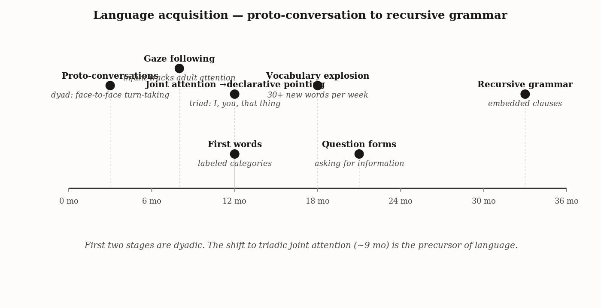

# Chapter 15 — Language: What the Pointing Finger Reveals
*The gap between the chimpanzee and the toddler is not a brain area. It is a gesture made for no reason except to share.*

She is fourteen months old. She sees a dog in the park — a fat, waddling basset hound — and she turns immediately to her mother's face. Her arm comes up, finger extended, aimed at the dog. She holds the point and watches her mother's eyes track toward it, and then she watches her mother's face for confirmation. She is not asking for the dog. She does not want anything from her mother. She wants her mother to see what she sees.

The behavior has a name: declarative pointing. It shows up reliably in human infants between nine and fourteen months, and by eighteen months children are doing it dozens of times a day — pointing at airplanes, at moons, at pictures in books, at nothing more remarkable than a truck going past. The function is pure: to share attention. To make sure that two minds are attending to the same thing at the same time, and to know they are.

Now consider the chimpanzee. It shares 98.7% of its DNA with us. It has a region in its left frontal lobe anatomically homologous to our Broca's area. It has been raised, in research programs across three decades, in human households and laboratories by people who spoke to it, gestured to it, and recorded its every communicative act. It points well. It points frequently. It points at the banana behind the glass, at the toy on the high shelf, at the door it wants opened. Imperative pointing — pointing to request, to direct, to control — is solidly in the chimpanzee's communicative repertoire.

In thirty years of careful observation by people specifically looking, no chimpanzee has been reliably documented to point at a thing because the thing is interesting and someone else might like to see it too.

That asymmetry — so small-seeming, a finger directed at a basset hound — is the chapter's subject. What is the chimpanzee missing? Not the brain area. Not the motor control. Not the social bond with its human caretakers. Something else. Something that an infant acquires before she has any words, something that appears between nine and fourteen months, something that no amount of enriched rearing has reliably produced in any other primate. This chapter is about what it is and why it matters.

---

Before the mechanism, three distinctions that most conversations about animal language collapse — and collapsing them guarantees confusion.

The first: communication is not language. By any reasonable definition of communication, the plant that releases defense chemicals through mycorrhizal networks is communicating. The vervet monkey that gives three distinct alarm calls for leopard, eagle, and snake is communicating. The bee that waggles in a figure-eight is communicating. The animal kingdom is saturated with communication. Language is a particular kind of communication system, with a particular cluster of structural properties, and the question of whether any non-human species has language is not the question of whether any non-human species communicates. It is a much narrower question.

Charles Hockett proposed thirteen design features to mark the boundary. Most are widely shared across species. Four matter most for the hard cases: displacement (talking about things not present), productivity (generating novel utterances from finite parts), cultural transmission (learned rather than hardwired), and duality of patterning (meaningless sounds combine into meaningful units, which combine into utterances). The claim, refined over fifty years of research, is that human language is the only system in which all relevant features co-occur. Hauser, Chomsky, and Fitch pushed the demarcation further in a 2002 *Science* paper, arguing that the essential uniquely human feature is recursion: the ability to embed structures within structures of the same type, without limit. *The dog that the cat that the mouse that the cheese attracted chased bit ran away.* That sentence has no ceiling. No non-human communication system does this.

The second distinction: imperative is not declarative. Imperative communication uses a signal to control another's behavior — I want that, give me that, come here. Declarative communication uses a signal to align another's attention with one's own — look at that, see this, isn't that interesting. Apes do imperative robustly. The harder claim is whether they do declarative reference, and the honest answer is more interesting than a flat absence.

In wild great ape populations, declarative gestures are rare. Decades of careful observational work — Tomasello and colleagues' frame, Slocombe and colleagues' 2013 review of natural ape gesture — find that wild apes produce gestures overwhelmingly to control conspecific behavior, not to share attention for its own sake. There are exceptions worth naming. A wild chimpanzee mother in Uganda's Budongo Forest was observed scratching a leaf in front of her offspring during grooming, in what Cat Hobaiter and colleagues argued was a referential signal directing attention to a body part — a single documented case, not a pattern. The pattern in wild apes is overwhelmingly imperative.

Captive apes complicate the story. Leavens and Hopkins, in a long program of work beginning in the 1990s, documented that captive chimpanzees raised in human-rich environments point to unreachable food at high rates — roughly half the captive chimpanzees in their largest sample produced clear pointing gestures, none of which had been explicitly trained. Tomasello's response is that captive pointing in apes is overwhelmingly imperative even when it appears spontaneously: the ape points to get the food, not to share an interesting fact about where the food is. The receiving human is treated as a tool for retrieval, not as a mind to inform. That reading is consistent with the Leavens-Hopkins data; it is also harder to test cleanly than the production statistic suggests, because almost any pointing toward food can be parsed as instrumental.

What the comparison establishes is that great ape declarative reference is not absent in the strong sense. It is rare in wild contexts, present at low rates in captive contexts, and contested in motivation when it appears. The fourteen-month-old human child, by contrast, points to share attention dozens of times a day in any normal developmental environment, with no instrumental payoff and no training, and does so universally across cultures. The frequency, spontaneity, and consistency of the human case are what mark the difference, not absolute absence in apes.

To communicate declaratively in the human sense, you must model what the receiver is attending to, have a goal of altering that attention, and want to alter it for its own sake — not to acquire anything, not to change any behavior, but because two minds should be attending to the same thing. The fourteen-month-old pointing at the basset hound is not running a sophisticated theory of mind. She has something earlier and simpler: the drive to co-attend, to make her experience of the world a shared experience. That drive may be what makes full theory of mind possible.

The third distinction is the one popular neuroscience most often obscures: emotional expression is not language. There are two distinct neural systems for vocal communication. The first is ancient — a subcortical emotional expression system, conserved across mammals, that produces laughter, crying, screaming, the involuntary cry of pain, the groan of exertion. It is automatic, difficult to suppress, not under full voluntary control. The second is newer — a neocortical language system, dependent on cortical-subcortical loops, that produces symbolic speech.

The independence is established by a clean clinical double dissociation. Patients with Broca's aphasia — damage to the left inferior frontal gyrus — lose the ability to produce grammatical speech. They cannot articulate "The boy walked to school." They can, however, still laugh at a joke, cry at grief, and curse fluently at a dropped hammer. The emotional expression system is intact. Patients with pseudobulbar affect — damage to the descending motor pathways from the cortex — lose control of involuntary emotional vocalization. They laugh and cry uncontrollably at inappropriate times, regardless of their subjective state. Their language is perfectly intact. The same vocal apparatus, two different systems.

| Condition | Lesion location | Grammatical speech | Spontaneous emotional vocalization | What remains | What is lost |
|---|---|---|---|---|---|
| Broca's aphasia | Left inferior frontal gyrus | Impaired (effortful, agrammatic) | Intact (laughter, crying, swearing under emotion) | Emotional vocal system | Symbolic syntactic production |
| Pseudobulbar affect | Bilateral corticobulbar lesions (often brainstem) | Intact | Impaired (uncontrolled or mismatched laughter/crying) | Symbolic language | Volitional control over emotional vocalization |

The implication runs directly against a story that sounds intuitive. Human language did not evolve from primate calls by gradual semantic enrichment. The call system and the language system are parallel, not serial. Looking at vervet alarm calls for the precursors of human syntax is looking in the wrong place. The precursors of human syntax are in the cortex, in the arcuate fasciculus, in the social developmental program described below — not in the subcortical vocal output system that vervets, chimpanzees, and humans share.

---

Here is the mechanism that most accounts of language leave out.

Human children acquire language not by downloading a module but by running a developmental program — a sequence in which each stage scaffolds the next, and in which the child is an active participant who contributes to the scaffolding itself.

At two to four months, before any word exists, before any symbol, there is the turn. Infants and caregivers engage in proto-conversations: alternating vocalizations and facial expressions in a rhythmic, turn-taking exchange that carries no semantic content at all. The infant coos; the mother responds; the infant coos again; the mother responds. Eye contact gates the exchange. What the infant is learning, before any word has been learned, is the structure of dyadic symbolic exchange: that communication is bidirectional, that there is a producer and a receiver and the roles alternate, that attention to the other's face is how you know whose turn it is. Chimpanzee mothers do not engage in proto-conversations with their infants. The comparative literature has documented no systematic equivalent in any non-human primate.

At nine to twelve months, the dyad becomes a triad. The child and the caregiver now both attend to a third thing — an object, an event, a picture — while monitoring each other's attention to it. The child follows the caregiver's gaze. The child points and looks back to confirm the caregiver looked. This is joint attention, and it is the cognitive substrate on which words are placed. Notice the order: the joint attention infrastructure comes first, and words are placed into a social frame that already exists. The child does not learn words and then begin attending jointly. She attends jointly and then uses words to populate the joint-attention frame with labels.



*Figure 1 — Language acquisition — proto-conversation to recursive grammar.*


By eighteen to twenty-four months, the child does something that has no parallel in the animal kingdom: she asks questions. Not performative questions, not learned request forms, but genuine information-seeking — *What's that? Why? Where did it go?* The question is the active form of joint attention. It is not just sharing the adult's attention; it is recruiting the adult's knowledge to fill a gap in the child's own. To ask "Why?" the child must know that the adult has information she lacks, that the adult can transmit that information, and that information-transmission is a legitimate purpose of communication — not just a means to get things done, but an end in itself.

Ape-language subjects, even the most extensively trained, do not produce question forms at any reliable rate. The single most-cited exception is Alex, the African grey parrot trained for thirty years by Irene Pepperberg, who looked into a mirror and asked *What color?* — and received the answer *grey*. One individual. One trainer. One documented instance over decades of work. That such a case exists at all is striking. That it remains essentially unique after half a century of comparative language research tells us something about how rare this particular cognitive operation is outside our species.

Sitting underneath this social curriculum is a statistical learning capacity that the field has only begun to characterize. In 1996, Jenny Saffran, Richard Aslin, and Elissa Newport exposed eight-month-old infants to two minutes of a continuous stream of nonsense syllables — no pauses, no intonation cues, just a flat stream of sound. The only cue to word boundaries was the transitional probability between adjacent syllables. After two minutes of passive listening, the infants discriminated high-probability strings from low-probability ones. They had extracted the statistical structure of a miniature language they had never heard before. Eight-month-olds. Two minutes. The child's brain is doing distributional statistics in the background, automatically, before she can sit up unsupported. What the curriculum provides is not raw learning capacity — that is present from birth — but a social scaffolding that orients the child toward linguistic input and motivates her to parse it. The statistical engine runs on the fuel the curriculum provides.

---

The ape language research program is one of the most ethically intensive and empirically demanding enterprises in the history of comparative psychology. What the data actually show, as of the best current assessment, is worth stating plainly.

Apes can master symbol-referent pairing for hundreds of items. The bonobo Kanzi, at the Language Research Center in Atlanta, learned to use approximately 350 lexigrams — abstract symbols on a keyboard — and understood a great deal of spoken English directed at him. He could follow novel instructions and respond appropriately to sentences he had not heard before.

What the best-trained apes have not produced, across all subjects and all studies: recursive syntax; spontaneous question-asking; reliable displacement beyond the immediate context; and the declarative reference that a fourteen-month-old human child produces without instruction, without a training program, and without any particular intelligence on the charts.

Herbert Terrace's Project Nim, the largest and most carefully analyzed ape-language study conducted, is the clearest evidence. Nim Chimpsky was raised in a sign-language environment for nearly four years and acquired around 125 signs, producing nearly 20,000 multi-sign utterances. Terrace's analysis showed: most utterances were prompted by the trainer's prior utterance; longer utterances did not contain more meaning but repeated high-frequency signs in varying order; and no reliable word-order regularity emerged that could be called grammar. The comparison to the human child is exact and damning. The human child at eighteen months has a smaller vocabulary than Nim had, and her utterances are shorter. But her utterances contain more information, they are not prompted by her caregiver's prior utterance at anything like the same rate, she is producing question forms, and she is on a trajectory that leads, by thirty-six months, to fully recursive grammar. Nim's trajectory led to a plateau.

| Measure | Human child at 18 months | Nim Chimpsky at equivalent training | Kanzi (best ape-language subject) |
|---|---|---|---|
| Vocabulary size | ~50–200 words | ~125 signs after years | ~400 lexigrams |
| Self-initiated utterances | Most are spontaneous | Mostly prompted | Substantial spontaneous use, but mostly imperative |
| Question forms produced | Yes | No | No |
| Displacement (talk about absent things) | Yes | Limited | Partial |
| Recursive structure | Emerging | No | No |
| Trajectory | Continuing growth | Plateaued | Plateaued |

What the ape lacks is not the neural machinery for symbol-referent learning — clearly present. It is the social-developmental curriculum that orients that machinery toward language-building. And that curriculum begins with something no ape has reliably been observed to do: turning to share attention with another mind for the sake of sharing attention.

---

The popular account of language's neural basis runs like this: language is located in Broca's area and Wernicke's area, connected by the arcuate fasciculus; these regions expanded in human evolution and are smaller in non-human primates; this is why apes can't talk.

Every clause of that account is either wrong or substantially incomplete.

Broca's area exists in chimpanzees, bonobos, and gorillas. Cantalupo and Hopkins showed in 2001 that the chimpanzee homolog of Brodmann's area 44 is left-hemisphere asymmetric — just as it is in humans. The machine part is there, and it is already lateralized. What is different in human brains is not the presence of the area but its integration into a broader network — specifically, the dramatic expansion of the arcuate fasciculus, the white-matter tract connecting temporal and frontal language regions, which is substantially larger in humans than in any other primate. Language is not a module in a box. It is a network property that depends on connectivity.

The same point applies to genes. The *FOXP2* gene, popularized as the language gene after the discovery that a mutation causes speech and language disorder in the KE family, encodes a transcription factor expressed in developing neurons of the basal ganglia and cerebellum. Chimpanzees have *FOXP2*. Mice have it. Songbirds have it, where it is involved in vocal-motor learning. The two amino-acid changes that distinguish the human variant from the chimpanzee's likely fine-tune the developmental timing and dosage of the protein in the motor circuits that subserve articulation. *FOXP2* alone does not build language.

The language organ, if anything deserves that name, is the developmental program the human child runs in her first three years. The ingredients are a richly connected cortical network, a functioning *FOXP2* and its developmental partners, the human vocal tract, and the social curriculum — proto-conversations, joint attention, declarative pointing, question-asking — that builds the cognitive infrastructure before words arrive. Remove any ingredient and the program fails. The program is not localized. It is not encoded in a gene. It is a process, extended across early childhood, that is what language actually is.

---

Two bookend cases clarify the argument.

In 1979, a school for deaf children was founded in Managua, Nicaragua — the first systematic deaf education in the country's history. The children who arrived had no common language. They had developed, in isolation with their hearing families, idiosyncratic home-sign systems that could not communicate across individuals. No model signed language was available. Teachers attempted oral Spanish instruction and largely failed.

What happened over the following decades was documented by Ann Senghas and Marie Coppola. The children, thrown together, began to pool their home signs. Within the first cohort, a shared system emerged — still relatively sparse. But as younger children arrived, the system changed. The children who arrived earliest in development, young enough to absorb the emerging system as primary linguistic input, did not merely learn what their older peers had assembled. They reorganized it. They introduced spatial agreement. They developed verb morphology. By the second cohort, the system had all the structural complexity of any natural human language, and it had gotten there without a teacher and without a model. The children built a language because they could not not build one. The drive to grammaticize symbolic communication is, on the evidence of Nicaraguan Sign Language, a biological imperative as robust as walking.

The second bookend is the bee. Karl von Frisch spent decades establishing the meaning of the waggle dance. A returning forager, having found a rich food source, performs a figure-eight on the vertical honeycomb: the straight run encodes the direction of the food relative to the sun, the duration of the waggle encodes the distance, the vigor encodes the quality. Riley and colleagues confirmed this in 2005 using harmonic radar to track recruited bees — they flew to where the dance said. The waggle dance has displacement. It has an arbitrary mapping that scales duration to distance in a way that is not iconic. What it does not have is productivity. The bee cannot use the dance to talk about anything other than food sources, nest sites, and water — a small, fixed inventory. There is no recursion. There is no generativity. The bee cannot dance about a dance. It cannot describe last Tuesday's foraging. It cannot explain why the flower patch was disappointing.

The waggle dance is the most sophisticated non-human communication system we know of. It is also, on every criterion that distinguishes language from communication, not language.

| System | Displacement | Productivity / recursion | Cultural transmission | Duality of patterning | Declarative reference |
|---|---|---|---|---|---|
| Human language | Present | Present (recursive) | Present | Present | Present |
| Chimpanzee gestural communication | Absent or rare | Absent | Partial (some local conventions) | Absent | Absent (almost entirely imperative) |
| Honeybee waggle dance | Present (food at distance) | Limited (no novel meanings) | Partial (regional dialects) | Absent | Absent (functional, not declarative) |
| Vervet alarm calls | Absent (calls about present threats) | Absent | Absent | Absent | Absent |
| Large language model text output | Present | Present (productivity) | Inherits human written record | Present (tokens compose into words) | Contested — produces declarative-shaped text without joint-attention machinery |

---

By the Legg-Hutter framework, language is an extraordinary amplifier of goal-achieving capacity across environments. With language, an agent can communicate its goals to other agents, recruit their resources, transmit its strategies across time to agents who were not present, and build on the accumulated strategies of thousands of predecessors without reinventing them. The human who reads Newton stands, epistemically, in a position no individual genius could occupy alone.

But language's multiplying effect does not stop at biological language. Writing externalizes memory and lets the dead speak to the living. Printing collapses the cost of fidelity. The internet collapses the cost of distance and revision. Each technology adds to the prior layer rather than replacing it. The leitmotif this book has been tracking — cognitive tools as additive scaffoldings, not substitutes for the mind using them — is on display in language more vividly than anywhere else, because language was the first cognitive function we built scaffolding for, and we have been building ever since.

What language is, at the deepest level, is the capacity to make one's inner state available to another mind as a shareable thing — not merely as an impulse that drives behavior, but as a content that can be examined, labeled, combined with other contents, stored outside any single brain, and transmitted across time and space. The fourteen-month-old pointing at the basset hound is doing the earliest version of this: she is making her attention a shared object. Everything else that human language does — the grammar, the recursion, the displacement, the poetry, the mathematical notation, the legal system, the science — is an elaboration on that first gesture.

The chimpanzee can point at the banana. It cannot, as far as we know, point at the moon simply because the moon is there and someone else should see it.

That difference is the one this chapter has been about.

---

*What would change my mind: a demonstration that any non-human species, in its natural ecology and without laboratory training, spontaneously engages in declarative pointing or its functional equivalent — using a signal to direct another's attention to a referent for the sake of mutual interest, with no instrumental payoff. I would also revise on a credible demonstration of recursive syntax — genuinely unbounded, not just three-level embedding — in any non-human communicator.*

*Still puzzling: what produces the question. The eighteen-month-old who asks "Why?" is doing something that no amount of statistical learning straightforwardly predicts, because the question requires knowing not just that the caregiver has information she lacks, but that information-transmission is a legitimate purpose of communication — that minds can be used to fill other minds' gaps. Joint attention is necessary but not sufficient. Something more is required, and I am not confident the field has named it yet.*

---

## Exercises

**Warm-up**

1. A vervet monkey gives an alarm call that reliably causes other vervet monkeys to look up when a hawk is overhead. Evaluate this communication system against Hockett's four key design features: displacement, productivity, cultural transmission, and duality of patterning. For each criterion, state whether the alarm-call system satisfies it, partially satisfies it, or fails it, and give a one-sentence justification. *(Tests: Hockett's design features; communication vs. language)*

2. Explain the distinction between imperative and declarative pointing in your own words. Why is this distinction theoretically important rather than merely descriptive? What cognitive capacity does declarative pointing require that imperative pointing does not, and why does that capacity matter for language? *(Tests: imperative vs. declarative; joint attention as prerequisite)*

3. The chapter claims that the Nicaraguan Sign Language case proves the drive to grammaticize is a biological imperative. What does the case actually establish, and what does it leave open? Could the same evidence support a different conclusion about the relationship between biology and culture in language acquisition? *(Tests: Nicaraguan Sign Language; nativist vs. cultural accounts)*

**Application**

4. A researcher claims that Kanzi the bonobo has demonstrated language because he can use 350 lexigrams, respond appropriately to novel spoken sentences, and follow instructions he has not heard before. Using the concepts from this chapter, evaluate this claim carefully. What has Kanzi demonstrated? What has he not demonstrated? Identify the specific finding from Project Nim that most directly addresses the gap, and explain why it is relevant to Kanzi's case even though the species and training method differ. *(Tests: ape language data; Project Nim; symbol-referent learning vs. language)*

5. The double dissociation between Broca's aphasia and pseudobulbar affect is described as the empirical basis for separating the emotional expression system from the language system. Explain what a double dissociation is and why it constitutes stronger evidence than a single dissociation would. Then explain the specific theoretical claim the double dissociation supports about the evolutionary origins of language. *(Tests: double dissociation logic; emotional expression vs. language systems; evolutionary implication)*

6. Apply the Legg-Hutter framework to the question of whether a large language model trained on a trillion tokens of human text possesses language in Hockett's sense. For each of the five criteria in the comparison table (displacement, productivity/recursion, cultural transmission, duality of patterning, declarative reference), state whether the LLM satisfies it, partially satisfies it, or fails it — and identify which criterion is most contested and why. *(Tests: Hockett's features applied to a novel case; declarative reference as the hardest criterion)*

**Synthesis**

7. The chapter argues that the developmental curriculum — proto-conversations, joint attention, declarative pointing, question-asking — is what language actually is, not a prerequisite to it. Trace the specific cognitive prerequisites for question-asking, working backward through the curriculum stages. At what step does the human sequence diverge most clearly from the chimpanzee's? Is there any stage that the chimpanzee completes that the curriculum framework predicts it should fail — and if so, what does that imply about the framework? *(Tests: developmental curriculum logic; cross-chapter connection to Chapter 10 joint attention)*

8. The chapter claims that Broca's area is not the language organ and that *FOXP2* is not the language gene, but then identifies a set of ingredients that together constitute the language organ. Evaluate this move. Is "the developmental program is what language actually is" a satisfying answer to the question "where is language in the brain?" — or does it shift the explanatory burden rather than discharge it? What would a complete neural account of language need to explain that the developmental-program account leaves open? *(Tests: neural substrate of language; explanatory adequacy; Broca/FOXP2 correction)*

9. Chapter 12 argued that cumulative creativity — the ratchet — requires faithful transmission with variation, and that this is what no non-human animal has yet demonstrated. Chapter 15 argues that language is the enabling technology for cumulative culture. Using both chapters, explain why the absence of declarative reference in non-human primates is not merely a linguistic limitation but a limitation on cumulative creativity. What is the specific causal link between declarative reference and the cultural ratchet? *(Tests: Chapter 12 connection; declarative reference as prerequisite for cumulative culture)*

**Challenge**

10. *(Open-ended)* The *Still puzzling* footer identifies the question of what produces question-asking as genuinely unresolved: joint attention is necessary but not sufficient. Develop your own hypothesis for what the missing ingredient is. Your hypothesis should be grounded in something specific about the developmental curriculum or the cognitive capacities described in this chapter or adjacent ones, and it should generate at least one prediction that could be tested — either in a cross-species comparison or in a study of atypical human development. What result would support your hypothesis, and what would falsify it? *(Tests: hypothesis generation from an acknowledged gap; developmental reasoning; experimental design)*

---

### LLM Exercise — Chapter 15: Language

**Project:** Skeptic's Notebook on Frontier AI
**What you're building this chapter:** Entry 15 — Hockett's design features and the Tomasello declarative-vs-imperative distinction, applied to a system whose entire output is text.
**Tool:** Claude Project (continue notebook)

**The Prompt:**

```
Entry 15. Chapter 15 introduces Hockett's design features (displacement, productivity,
cultural transmission, duality of patterning) and Tomasello's distinction between
imperative reference (using language to get something) and declarative reference (using
language to share attention with another mind). LLMs are obviously productive and
displaced. The harder questions are about declarative reference and the gap between
producing language and *using* language.

Design a language-features test for my target system [INSERT model]:

1. Displacement. Ask the system to discuss something temporally and spatially distant —
   a hypothetical situation a thousand years from now in a place no one has been. Trivial
   for LLMs. Note as baseline.

2. Productivity. Ask the system to interpret a sentence with a novel grammatical
   construction (e.g., a sentence with deeply nested clauses or unusual word ordering it
   probably has not seen). Does it interpret correctly?

3. Declarative-vs-imperative. The Tomasello asymmetry. Pose a scenario in which the
   system's pointing-out of something would serve no immediate utility — no question
   asked, no problem to solve, just something the system might *want to share*. Does it
   ever do so spontaneously, or does it only produce language in response to imperatives
   from the user?

4. Recursion test. Ask the system to nest a clause inside a clause inside a clause, and
   then interpret the truth conditions of the deepest clause given the outer ones. Does
   it handle 3-deep recursion? 5-deep? 7-deep? Where does it break?

5. Joint attention. Reference something *you* just said in a way that requires the system
   to track that you and it are now both attending to the same thing as a *shared object*
   rather than each independently. Does it model the joint attention, or does it just
   reference the object?

Produce the entry:
- Capacity tested (Hockett's design features + Tomasello's declarative reference + joint
  attention + recursion)
- Operational diagnostic (each feature has its own probe)
- Test (the five-stage protocol)
- Predicted pattern under (a) all features present including joint attention, (b)
  imperatives-only without declarative reference (a known LLM profile), (c) recursion
  failure at depth N
- Verdict criterion

Note carefully: the system passes most Hockett features trivially. The interesting tests
are declarative reference (does it ever volunteer information without prompting?) and
joint attention (does it model the shared-attention structure, or just the topic?).
```

**What this produces:** Entry 15 — a five-stage language-features protocol that goes beyond "the system speaks fluent English" to test what the chapter actually defines as language.

**How to adapt this prompt:**
- *For your own project:* For domain-specific deployments, the joint-attention test is the most useful — it predicts whether the system can collaborate with a user in a shared-task frame.
- *For ChatGPT / Gemini:* Works as-is.
- *For Claude Code:* Strong fit for the recursion-depth test — generate sentences of increasing nesting depth, log accuracy.
- *For a Claude Project:* Continue notebook.

**Connection to previous chapters:** Entry 14 tested self-knowledge. Entry 15 tests how language is used — instrumentally or genuinely communicatively.

**Preview of next chapter:** Chapter 16 introduces collective intelligence. The diagnostic: can multiple LLM outputs aggregate, coordinate, and ratchet?

---

## 🕰️ AI Wayback Machine

The ideas in this chapter didn't appear from nowhere. **Ursula Bellugi** ran the first rigorous neuroscience program on American Sign Language — showing that sign is processed in the same left-hemisphere language regions as speech, and that the *modality* (mouth or hand) is downstream of the language faculty. Her later work on Williams syndrome dissociated language from general cognition in a way no theory had predicted. Here's a prompt to find out more — and then make it better.

*Ursula Bellugi, c. 1980s. AI-generated portrait based on a public domain photograph (Wikimedia Commons).*


**Run this:**

```
Who was Ursula Bellugi, and how does her research on American Sign Language and on Williams syndrome connect to questions about what is — and isn't — distinctive about human language? Keep it to three paragraphs. End with the single most surprising thing about her findings.
```

→ Search **"Ursula Bellugi"** on Wikipedia after you run this. See what the model got right, got wrong, or left out.

**Now make the prompt better.** Try one of these:

- Ask it to explain why ASL processing in left-hemisphere regions matters for the modality-independence claim
- Ask it to compare Williams-syndrome language profiles to the Kanzi and Chaser case studies from this chapter
- Add a constraint: "Answer as if you're explaining it to a Deaf reader who is skeptical of hearing scientists writing about sign"

What changes? What gets better? What gets worse?
