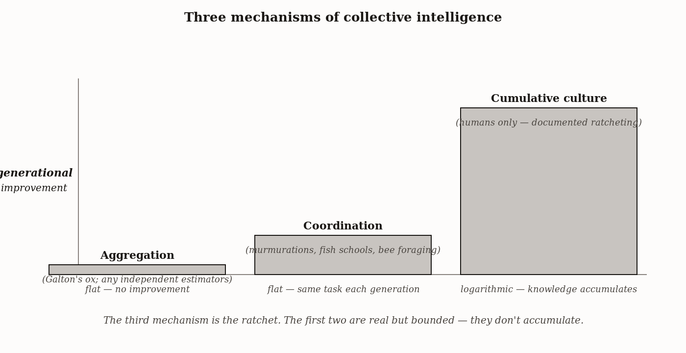
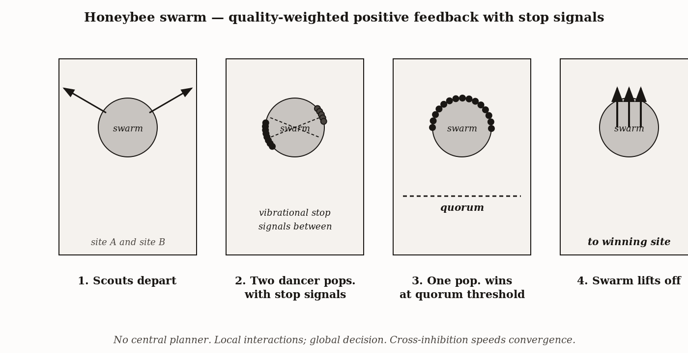

# Chapter 16 — Collective Intelligence
*The Swarm, the Ratchet, and the Record*

---

In June, on a warm afternoon in upstate New York, a honeybee colony becomes too crowded for its hive. The old queen leaves with roughly half the workers. The swarm settles — a writhing mass of ten thousand bees, the size of a basketball — on a nearby tree branch. The colony now has to find a new home. Choose a poor cavity and the colony does not survive winter. Choose well and the lineage continues. Nobody is in charge.

What happens next is one of the cleanest demonstrations in biology that a system can find good answers without any one node in the system holding the answer in advance.

A few hundred scouts fan out, survey candidate cavities, return, and dance on the surface of the swarm to report their findings. The dances compete. The better sites recruit more dancers, who recruit more scouts. But scouts also emit stop signals at rivals — brief vibrational pulses that quiet competing dances. The cross-inhibition prevents the system from locking onto whatever site first recruited a lead and forces it toward the best available option. When enough scouts have converged on a single site, a quorum signal fires, the cluster warms its flight muscles, and the swarm lifts off as a single body.

Thomas Seeley and colleagues demonstrated in 2012 that this stop-signal mechanism is mathematically equivalent to the cross-inhibition between competing neural populations in primate cortex during perceptual decision-making. The bee colony and the monkey brain are running the same algorithm on radically different substrates — bees vibrating at bees in one case, neurons firing at neurons in the other. The architecture of the decision is conserved. The substrate is not.

This is the first half of the chapter. The second half is about a form of collective intelligence that is uniquely human, that no bee colony runs, and that depends on something the printed record and the trained AI model have not been shown to carry.

---

The phrase "collective intelligence" names at least three mechanistically distinct things. Conflating them produces confusion about when each works, what each requires, and what each cannot do.

It is 1906. A livestock fair in Plymouth, England. Francis Galton collects 800 paper tickets on which visitors have each guessed the weight of a dressed ox. He computes the median of the 800 guesses: 1,207 pounds. The mean: 1,197 pounds. The actual weight: 1,198 pounds.

The result is real. Its conditions are specific. The errors of 800 independent estimators cancelled because they were independent — no one estimator had been told what any other guessed, no systematic source of bias pushed all 800 in the same direction. The mechanism requires no communication between estimators. It does not require any one estimator to be especially accurate. It requires only that the errors do not all point the same way. This is **aggregation**, and it is the most commonly cited and most frequently misunderstood form of collective intelligence.

Aggregation fails when errors are *correlated* — when all estimators have incorporated the same misleading information in the same direction. It fails when the crowd is *herding* — when later estimators adjust toward earlier ones rather than forming independent judgments. The wisdom of crowds is, correctly understood, the wisdom of *independent* judgments about *factual questions*. It is not a general endorsement of majority opinion.

**Coordination** is different. A starling murmuration — fifty thousand birds turning as one body in response to a peregrine — is the canonical case. Ballerini and colleagues showed in 2008 that each bird interacts with its six or seven nearest topological neighbors regardless of the flock's density, which is why the coordination signal propagates without degradation as the flock expands or contracts. The coupling is scale-free. Local rules produce global coherence.

Coordination is not the same as collective intelligence. The flock is not deciding anything. It is aligning behavior, which is a precondition for some collective intelligence systems but is not itself intelligence. A market that price-coordinates millions of buyers and sellers is doing coordination. Whether it deserves to be called intelligent depends on whether the coordinated output is solving a problem better than any individual could.

**Cumulative culture** is the third thing, and it is the one that separates humans from everything else we have found. Each generation begins from the modified output of the previous generation — a ratchet that clicks forward without slipping back. The flint tools of 800,000 years ago became, over scores of millennia, the Levallois prepared-core technique, then pressure-flaked microliths, then bronze, then iron, then the transistor. No individual dropped naked into a forest re-derives any of this from scratch in a lifetime. The ratchet is what separates human collective cognition from the bee colony's collective cognition. The bee swarm finds a good cavity. The human ratchet finds the transistor and then the microprocessor and then asks what comes next.



*Figure 1 — Three mechanisms of collective intelligence.*


These are three different mechanisms with three different failure modes and three different requirements. The chapter takes them in turn.

---

Start with the swarm, because the mechanism is beautiful and it will tell us something we need for the rest of the chapter.

In 1997, Thomas Seeley was watching a swarm cluster on a branch near Ithaca when a graduate student with a vibrometer detected something. Scouts dancing for a candidate site were occasionally stopping their dances. Another scout would approach, head-butt the dancer, emit a brief 380-Hz buzz. The dancer went quiet. The stop signal. The piece Seeley had been missing.

Here is how the swarm decides.

A scout that has surveyed a candidate cavity returns to the cluster and performs a waggle dance that encodes direction, distance, and quality — a better site earns a more vigorous, longer-lasting dance. The scoring is done by each scout independently against a battery of criteria: cavity volume above about 40 liters, entrance size roughly 15 square centimeters, dryness, defensibility, height above ground. The dance is a multi-attribute quality signal compressed into a single vigor indicator.

Other scouts watching a vigorous dance are more likely to fly out and inspect the advertised site. If they agree with the assessment, they add their own dance to the population advertising that site. Positive feedback amplifies genuine quality differences — a site that is twice as good will, on average, recruit scouts at a faster rate.

Without a counter-mechanism, positive feedback would lock onto whichever site first recruited a lead, regardless of quality. Early random fluctuations would dominate the outcome. The cross-inhibition is the counter-mechanism. Scouts actively inhibit rival dancers, in proportion to the size of their own population. Larger populations produce more stop signals. The mathematical effect is that sites accumulate support in proportion to their quality but also drain support from rivals in proportion to the rivals' support. The system is not just biased toward the best site; it actively depletes alternatives.

When the number of scouts arriving simultaneously at a single site exceeds approximately fifteen, those scouts return to the cluster and pipe — a high-frequency thoracic vibration that warms the flight muscles of the mass. Above a threshold temperature, the swarm lifts off as a single body. The quorum requirement prevents the swarm from acting before consensus is genuine.



*Figure 2 — Honeybee swarm decision — quality-weighted positive feedback with stop signals.*


Now here is what Seeley and Visscher showed in 2012. This four-component architecture — quality-weighted positive feedback, cross-inhibition between competing populations, quorum threshold — is mathematically equivalent to the leaky competing accumulator model that Joshua Gold and Michael Shadlen used to describe perceptual decision-making in primate lateral intraparietal cortex. In the primate model, two neural populations — one tuned to "leftward," one to "rightward" — each receive sensory input and each inhibit the other. When one population's firing rate crosses a threshold, the decision is made. The bee swarm is the same algorithm at a different scale: two populations of dancers, each inhibiting the others, evidence accumulating, decision at threshold.

The isomorphism is not a metaphor. It is the same mathematical structure identified in two independent systems, on two independent biological substrates, both of which have been selected to solve the speed-accuracy trade-off in decision-making under noisy, time-pressured conditions. The bee colony and the primate brain did not inherit this architecture from a common ancestor. They arrived at it independently, because it is the right solution to the problem. Function-not-substrate, applied now not to the body self or to spatial navigation but to the architecture of collective decision-making.

And there is a corollary. The swarm's stopping quality is not fixed. Clusters in dangerous exposed positions — high on a branch over open water, say — accept lower quorum thresholds and decide faster. Clusters in protected positions wait longer for higher confidence. The threshold responds to context. The system monitors its own decision process and adjusts the reliability requirement based on the cost of being wrong. This is not just collective intelligence. It is collective metacognition.

---

Now the ratchet.

Somewhere in central Africa, approximately 800,000 years ago, a hominin kneels by a rock outcrop. She is knapping flint against a harder stone. The technique she is using is not something she invented. She was taught it by someone older, who was taught it by someone older still. The tool she produces is slightly better than what her teacher made, because she noticed something her teacher did not. She will teach her technique to the next generation. Nobody designs this process. The click is imperceptible in any one generation. Across a hundred thousand years, it produces Levallois. Across a million years, metallurgy.

Michael Tomasello's argument in *The Cultural Origins of Human Cognition* is that individual humans are not dramatically smarter than individual chimpanzees in any single cognitive capacity. The chapters before this one have found no cognitive operation that a human performs so far above a chimpanzee that it explains the gap between flint tools and the International Space Station. What explains the gap is transmission fidelity.

The ratchet requires three things. First, individuals capable of making improvements to inherited practices. Second, transmission fidelity high enough that improvements survive copying — that the next generation inherits the improvement rather than a noisy version of it. Third, enough variation that improvements are possible at all.

Other species fail on the second requirement. Chimpanzee cultural transmission is real — tool styles differ between populations in ways that can only be attributed to cultural transmission. But the transmission degrades: when a novel innovation is introduced into a chimpanzee group, the copies are noisier than the original, and across multiple generations the technique drifts away from the optimal form. The degradation is slow, but it is faster than the rate of improvement. The chimpanzee ratchet, if it exists, does not click faster than it slips.

Human transmission fidelity above the ratchet threshold rests on joint attention, declarative pointing, imitative learning, and language — the components Chapter 15 identified as parts of the human developmental program. Each raises the fidelity of the copy. Together they push human cultural transmission above the threshold where the ratchet clicks.

Joseph Henrich's anthropological work quantifies the consequence. His documentation of cultural knowledge losses in isolated groups — the Tasmanian toolkit collapse after separation from mainland Australia, the many cases of European explorers who starved in environments where indigenous populations thrived — demonstrates that the ratchet depends on population connectivity. Below a critical network size, a community loses skills faster than it generates them; the ratchet runs in reverse. Above that size, improvements accumulate. The knowledge is not in the individuals. It is in the network.

---

Here is where the chapter turns to its most practically consequential distinction.

Michael Polanyi, in *Personal Knowledge* (1958), distinguished between the explicit record of a practice — what can be written down, transmitted in text, inherited from a book — and the tacit dimension of the practice — what cannot be fully articulated but nonetheless does most of the work in any functioning expertise.

A master violin-maker knows in his hands how much pressure to apply when shaping the spruce top. He cannot fully articulate this knowledge. He cannot write it down in a form that would allow a novice to replicate it from the description alone. The novice must apprentice — must stand at the workbench and make thousands of attempts while the master's feedback modifies the novice's hands, not just the novice's propositions about what to do. The tacit is transmitted in person, in practice, in the same physical space where the work happens.

This is not a minor addendum to the explicit record. It is what makes the explicit record legible. A medical student who reads every paper on surgical technique and has never held a scalpel cannot perform surgery. The papers are a precondition, not a substitute. A research scientist who reads every paper in her subfield but has never run an experiment does not know, when she looks at a result, whether it is too clean to be trustworthy — a judgment that experienced scientists hold and rarely articulate, because it was transmitted to them at the bench, not in the text.

| Domain | Explicit (transmissible by text) | Tacit (requires apprenticeship) | Failure mode of text-only transmission |
|---|---|---|---|
| Science | Hypotheses, methods sections, results, equations | Bench technique, reagent intuition, calibration habits, judgment about which experiments are worth running | Replication failure — papers describe what was done, not what was *needed* to make it work |
| Surgery | Anatomy, decision criteria, written protocols | Tissue handling, pacing, micro-judgments under bleeding | Trainees who pass exams cannot operate; outcomes depend on hours of supervised practice |
| Skilled craft | Patterns, materials specs, written instructions | Tool feel, error recovery, sense of when a piece is "right" | Apprenticeship cannot be skipped; written guides produce mechanically correct but qualitatively poor work |

The ratchet runs on both layers. The explicit record accelerates the transmission of what can be written down — the click is faster when the record is better. But the tacit layer is what allows the next generation to do the experiments rather than just read about them, to stand at the bench and notice the thing that is not in the paper, to teach the generation after that the thing they noticed. The institution that has most successfully accelerated the ratchet — the research university, the modern laboratory — is the one that has kept both layers in the same building, with the record-keeping and the practice-transmission happening in the same space, one enriching the other.

---

Now the question about AI, which is the practical point of the last section.

A large language model trained on the corpus of published human knowledge has compressed an unprecedented fraction of the explicit record into a queryable form. The compression is real. The cognitive amplification at the aggregation layer is real. For tasks well-served by the explicit record — literature synthesis, first-pass drafting, transposition of knowledge across domains, rapid survey of what is known — a capable language model is a genuine accelerant. It is several orders of magnitude further along the axis of making the explicit record accessible than anything before it.

What the model has not been shown to do is participate in the practice that generated the record.

The researcher at the bench who notices that the buffer is the wrong color — not the color specified in the protocol, but the color that contamination produces — has a judgment that is not in any paper she has read. It came from years of physical co-presence in a laboratory where that judgment was modeled by someone more experienced, corrected when wrong, reinforced when right. The model has read the papers. It has not run the experiments. It has not been told, by someone with a hand on its metaphorical wrist: *this is what we don't publish, and here is why we don't trust it*.

The failure modes this produces are specific and predictable. A model trained on the record will produce outputs consistent with the record. It will not notice when the record is wrong. It will not notice when a consensus was produced by a cascade of correlated errors — the garden-path findings that dominated a subfield for a decade before replication studies collapsed them. It will not notice that a result is too clean, because that judgment is tacit knowledge that experienced scientists hold and that was transmitted in person, not in print. The model has the clicks. Whether it can contribute to the next one is the open question.

There are two live counter-arguments that I want to engage rather than leave to the exercises.

The first is empirical. Polanyi wrote in 1958, before video capture of skilled practice, before high-frame-rate proprioceptive logging on demonstration robots, before reinforcement learning from human demonstrations. Recent vision-language-action models — Google DeepMind's RT-2 line published in 2023, and the open-source successors that followed — were trained on large corpora of robot manipulation demonstrations annotated with language. They acquired manipulation behaviors that experienced roboticists had previously called tacit: how much grip force to apply, how to adjust mid-action when a grasp is slipping, how to recover from a near-miss without restarting the trajectory. None of this was articulated in symbolic rules. It was learned from data about expert behavior. The behavior cloned. The tacit dimension, in this domain, partly compressed.

The strong reading is that Polanyi was wrong: tacit knowledge is not in principle uncapturable, it is just expensive to capture, and the cost has fallen far enough that some of it can now be lifted from demonstrations into models. The weak reading is that what RT-2 acquires is a functional approximation that *behaves* like tacit knowledge in the trained distribution but lacks whatever made the master violin-maker's hands transferable to a problem the master had never seen.

There is a specific name for the mechanism the weak reading anticipates, and it is worth borrowing here. Imitation learning researchers call it *cascading errors*. The demonstrator's training data is drawn from states the demonstrator handled competently, which means the trained agent has been shown what to do near the demonstrator's typical trajectory and very little of what to do once it ends up somewhere the demonstrator never went. The first small error puts the agent slightly off-distribution; the next decision is made on input that resembles the training distribution less; errors compound. Brian Christian, surveying this literature in *The Alignment Problem* (2020), traces the failure mode through autonomous driving systems and Mario-playing agents that drove or played beautifully so long as they stayed on the demonstrator's line and lost the road or the level the moment they deviated. The master violin-maker's hands are not just trained on the master's good trajectories — they are trained on the master's recoveries from near-misses, which the master accumulated over a lifetime of getting it slightly wrong and adjusting. RT-2 has not had that lifetime. Whether the gap can be closed by enough demonstration data, or whether something about the recovery information is intrinsically difficult to capture from outside, is the open question.

Current evidence does not settle which reading is right. The honest framing is: the question of whether tacit knowledge is in principle capturable has shifted from a settled matter to a live empirical question, and which forms compress and which do not is something the next decade will tell us.

The second counter-argument is the AlphaFold case. DeepMind's AlphaFold2, published in 2021, predicts three-dimensional protein structures from amino acid sequences with accuracy comparable to experimental methods on most proteins, including proteins with no known structural homolog. By 2022 the team had released predicted structures for roughly two hundred million proteins — covering essentially the known proteome. Working biologists report using AlphaFold predictions in the early stages of experimental design with results that survive eventual experimental verification. This looks, from one angle, like exactly what a ratchet click is supposed to be: an extension of the prior generation's record into territory the prior generation could not reach, used by the next generation as starting input.

The harder question is what AlphaFold is doing. It is not discovering new physics of protein folding. It compressed the Protein Data Bank — the accumulated record of experimentally solved structures, the work product of fifty years of crystallographers and NMR spectroscopists — into a model that interpolates and extrapolates within the regularities present in that record. The system did not generate the record; it operates on the compressed shadow of the record. Whether this counts as a ratchet click depends on what we are willing to call cumulative-culture participation. If extending the prior generation's record into prediction-relevant territory counts, AlphaFold is in. If the click requires generating new evidence that becomes part of what the next system trains on, AlphaFold is a sophisticated reader, not a contributor.

I lean cautiously toward "in." The structures AlphaFold predicts are now used as inputs to new experiments; in some cases experimentalists treat them as starting hypotheses against which results are checked, in some cases as scaffolds for designing molecules that did not exist before. That feedback loop — model output enters the practice, which generates new evidence, which enters future training — is the shape a ratchet takes. The case is not airtight. It is no longer airtight in either direction. The chapter's earlier formulation — "powerful participants in aggregation, not demonstrated participants in the cumulative-culture layer" — needs softening.

Here is the more honest reading. AI systems are unambiguous participants in the aggregation layer. They are unambiguous participants in the explicit-record-extension layer in domains where the record is rich and the relevant tacit dimension compresses to demonstration data. Whether they are participants in the practice itself — the part that generates the record by doing experiments and interpreting failures — is unsettled, and the rate at which the systems are being deployed in practice-adjacent roles is itself the experiment. The record is the frozen output of the ratchet. The ratchet runs in the practice. The new question is whether systems trained on the record can also be deployed in the practice in a way that contributes back. The answer is not yet known, but it is no longer obviously no.

---

The three mechanisms, collected.

Aggregation requires independent, unbiased estimates. Coordination aligns behavior without necessarily deciding anything. Cumulative culture is the uniquely human ratchet, and it requires transmission fidelity above a threshold that runs through the explicit record and through something the record cannot contain.

The bee swarm and the primate cortex are running the same decision algorithm. The algorithm is the thing. The substrates differ. The institutions that have successfully accelerated the human ratchet have maintained both the record and the practice in the same space — peer review, replication, and pre-registration as devices for raising the fidelity of the explicit layer, apprenticeship and mentorship as the channel for the tacit layer. Neither substitutes for the other.

The swarm chose its cavity. The colony survived the winter. The next generation does not inherit the decision. It inherits the algorithm. Whether we are building AI systems that will contribute to the next click of the ratchet, or systems that will remix the last one, is the question the book ends on.

---

## Exercises

### Warm-Up

1. Galton's ox-weighing result is the canonical demonstration of aggregation. Describe two conditions that must hold for aggregation to produce an accurate collective estimate, and give one concrete example of a real-world situation where each condition is violated — producing a failure of the "wisdom of crowds" despite a large number of estimators.

2. In the bee swarm's nest-selection mechanism, explain the specific role of the stop signal. Why does the mechanism produce better decisions than a system that relies only on positive feedback? Use a tied-candidates scenario — two sites of approximately equal quality — to show concretely what positive feedback alone would do and what cross-inhibition adds.

### Application

3. A technology company runs weekly design reviews in which proposals are discussed by a team of eight engineers. The company has noticed that the first proposal discussed tends to dominate the final decision regardless of its quality. Using the drift-diffusion / cross-inhibition framework from the swarm mechanism, diagnose which component of the bee decision architecture is missing from the review process, and propose one specific change to the protocol that would introduce it. Explain the mechanism by which your change would improve decision quality.

4. Polanyi's tacit-versus-explicit distinction applies to medical training. A senior surgeon can look at an intraoperative image and know, from experience, which tissue planes are safe to dissect and which are treacherous — a judgment that is not in any textbook. Using the record-versus-practice framework, explain: (a) what a medical student who has read the complete surgical literature but never operated would be unable to do that the senior surgeon can; (b) why that inability follows from the specific nature of tacit knowledge rather than simply from lack of information; and (c) what this implies for an AI system trained on the surgical literature and imaging data but not present in the operating room.

5. Henrich's documentation of the Tasmanian toolkit collapse shows that below a critical population size, the ratchet runs in reverse. After European contact, the Tasmanian Aboriginal population declined catastrophically, and with it, many complex technologies — bone tools, cold-weather clothing, fishing — were lost within a few generations. Using the three-requirements framework for cumulative culture, explain which of the three requirements was violated, and why population loss specifically produces this failure rather than, say, a decline in individual intelligence.

### Synthesis

6. The chapter argues that the bee swarm and the primate cortex are running the same decision algorithm — cross-inhibition, positive feedback, quorum threshold — on different substrates. Extend this argument to one human institutional decision mechanism of your choice (jury deliberation, scientific consensus formation, democratic voting, or prediction markets). Map each component of the four-part bee swarm architecture onto a corresponding feature of your chosen institution, identify which component is present and which is absent or weakened, and explain what failure mode the missing component produces. Your answer should show that the isomorphism is structural, not merely metaphorical.

7. The chapter distinguishes the language model as a "powerful participant in aggregation" from a "demonstrated participant in the cumulative-culture layer." A critic responds: "AlphaFold predicted protein structures that no human had solved — that is a genuine ratchet click, a case where an AI contributed to what the next generation of scientists starts from." Evaluate this objection using Tomasello's three-requirements framework for the ratchet. Does AlphaFold's protein-structure prediction meet all three requirements, or only some? What would it take for the objection to be fully decisive?

### Challenge

8. Polanyi argued that tacit knowledge cannot be fully articulated — but this was written in 1958, before large-scale digitization of expert behavior, video capture of skilled practice, and reinforcement learning from demonstration. A strong version of the counter-argument is: "All tacit knowledge is, in principle, capturable as a sufficiently large corpus of expert behavior, and a model trained on that corpus would inherit the tacit dimension." Evaluate this counter-argument. Identify the strongest version of the case for it, and then identify the most fundamental reason Polanyi would give for why it fails. Design one behavioral test that would distinguish between a system that has genuinely internalized the tacit dimension of a practice from a system that has learned to produce outputs statistically consistent with expert behavior without the underlying judgment.

---

*What would change my assessment of language models as ratchet participants: sustained, verified cases in which a language model identifies a genuine gap in the record — not a synthesis of known results but a prediction that the known results are incomplete, followed by a novel experimental result that advances the practice of the field in a way that survives replication. The remixing of existing knowledge is real and useful. The question is whether it extends to the generative contribution that Tomasello defines as the ratchet's click. I have not seen convincing evidence of this yet.*

*Still puzzling: the relationship between tacit knowledge transmission and population size in Henrich's model. The model predicts that knowledge loss accelerates below a critical network size. But the mechanism is not fully specified: which tacit skills degrade first, which explicit skills are most robust to population contraction, and whether digital record-keeping has changed the critical threshold by preserving the explicit layer more reliably. The Tasmanian case predates writing. Whether the same dynamics hold for a digitally connected but socially isolated community is not yet clear.*

---

### LLM Exercise — Chapter 16: Collective Intelligence

**Project:** Skeptic's Notebook on Frontier AI
**What you're building this chapter:** Entry 16 — three independent tests for the three forms of collective intelligence (aggregation, coordination, cumulative culture).
**Tool:** Claude Project (continue notebook)

**The Prompt:**

```
Entry 16. Chapter 16 distinguishes three forms of collective intelligence: aggregation
(independent error cancellation, Galton's ox-weight), coordination (local rules producing
global coherence, Seeley's bee swarm), and cumulative culture (ratcheting across
generations, Tomasello). Each requires different machinery.

Design a three-form test for my target system [INSERT model]:

1. Aggregation. Generate the same factual question through 20 independent fresh sessions
   (or 20 different models, or both). Compute the median answer. Compare to the
   ground truth. Compute also the mean accuracy of individual answers. Does aggregation
   improve over individual accuracy? By how much? Where does aggregation help (high-
   variance, low-bias errors) and where does it not (systematic shared bias)?

2. Coordination (Seeley quorum analog). Set up a multi-LLM scenario where two or more
   instances must converge on a decision through limited exchanged messages. Does
   coordination emerge, or do the instances either deadlock or both default to a learned
   prior?

3. Cumulative culture (Tomasello ratchet). Feed Output A from session 1 to session 2,
   ask session 2 to improve on it, feed that to session 3, etc., for 10 generations. Does
   the output improve generation-over-generation, or does it degrade (regression to
   training-distribution mean) or saturate (no further improvement after generation 2-3)?
   The pattern is diagnostic.

Produce the entry:
- Capacity tested (the three forms of collective intelligence)
- Operational diagnostic (aggregation gain + coordination convergence + ratchet pattern)
- Test (the three-form protocol)
- Predicted behavior under (a) genuine ratchet — generation N+1 better than N, (b)
  aggregation gain on high-variance items but not on systematically-biased ones, (c)
  ratchet degradation (a finding that has been replicated; the chapter notes this), (d)
  coordination failure
- Verdict criterion

The cumulative culture test is the most interesting. The chapter argues that real ratchets
require selective transmission with stakes; LLM-only chains lack the selective filter and
produce predictable degradation patterns. The data here will say something concrete about
whether AI systems can participate in human cumulative culture or only inherit a frozen
snapshot of it.
```

**What this produces:** Entry 16 — a three-form collective intelligence protocol with the cumulative-culture ratchet as the deepest test.

**How to adapt this prompt:**
- *For your own project:* For multi-agent deployments, the coordination test is the most consequential — it predicts whether agents will deadlock or converge.
- *For ChatGPT / Gemini:* Works as-is. Different models in the multi-LLM aggregation produce different results — the heterogeneity itself is diagnostic.
- *For Claude Code:* Excellent fit. All three tests are well-suited to automation.
- *For a Claude Project:* Continue notebook.

**Connection to previous chapters:** Entry 15 tested individual language use. Entry 16 tests whether multiple LLM agents collectively produce more than the sum of their individual outputs.

**Preview of next chapter:** Chapter 17 is the integration chapter. The exercise: assemble the cumulative profile from Entries 1–16, identify the shape, and critique it.

---

## 🕰️ AI Wayback Machine

The ideas in this chapter didn't appear from nowhere. **Deborah Gordon** has spent her career watching harvester ant colonies in the Arizona desert and showing that colony-level decisions — when to forage, how aggressively to defend territory — emerge from local interaction rates, with no central control and no instructions handed down. The colony computes; no individual ant does. Here's a prompt to find out more — and then make it better.

*Deborah M. Gordon, c. 1990s. AI-generated portrait based on a public domain photograph (Wikimedia Commons).*


**Run this:**

```
Who is Deborah Gordon, and how does her research on harvester ant colonies connect to the broader question of how collective intelligence emerges without centralized control? Keep it to three paragraphs. End with the single most surprising thing about her findings.
```

→ Search **"Deborah M. Gordon"** on Wikipedia after you run this. See what the model got right, got wrong, or left out.

**Now make the prompt better.** Try one of these:

- Ask it to explain the *interaction-rate* mechanism using foraging-decision rules in plain language
- Ask it to compare ant-colony computation to honeybee swarm decision-making (Seeley's quorum-sensing work)
- Add a constraint: "Answer as if you're narrating a desert-ecology documentary"

What changes? What gets better? What gets worse?
