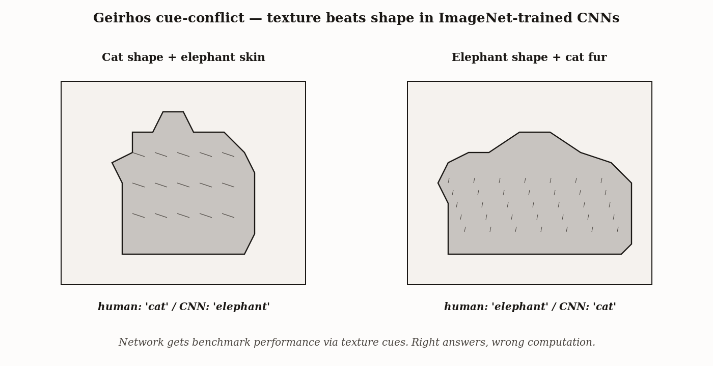
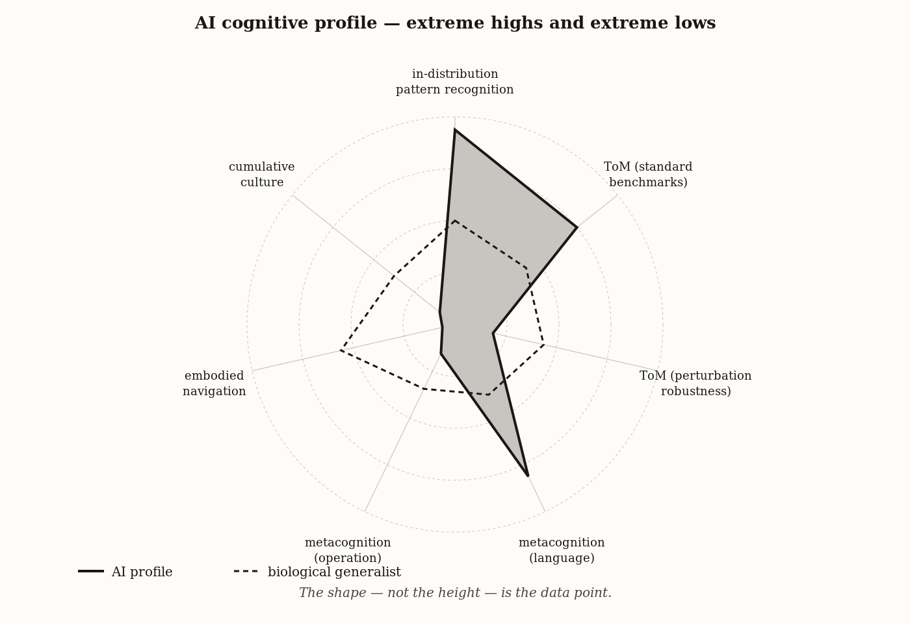

# Chapter 17 — AI as Data Point
*The diagnostic question has been the same since Chapter 1. We are applying it one more time.*

---

The screen in the Tübingen lab shows a cat.

You can see the ears, the posture, the silhouette — everything that makes something a cat. What you cannot see is a square centimeter of cat skin. The surface is gray and wrinkled and deeply furrowed, mapped from a photograph of an elephant. The researchers have done something surgically precise: they have separated the two cues that, in almost every natural photograph, arrive together. Shape says cat. Texture says elephant. It is a forced choice.

The network says: elephant.

The network in question is a convolutional neural network trained on ImageNet — 1.2 million labeled photographs, the benchmark on which deep-learning vision had, by 2018, matched and in some tasks exceeded human-level accuracy. Superhuman performance on the standard test. And here it is, looking at a cat-shaped object and reporting elephant.

The researchers ran the inverse: elephant-shaped objects covered in cat fur. Network said cat. Across hundreds of cue-conflict images the pattern held. The ImageNet-trained networks had learned to classify textures. The benchmark, it turned out, had texture cues redundant with the shape cues all along, and the networks had taken the statistically easier road. They reached human accuracy via a computation that was not the computation the human was running.



*Figure 1 — Geirhos cue-conflict — texture beats shape in ImageNet-trained CNNs.*


This is the diagnostic test. Not "did the system get the right answer" — it got superhuman-level right answers on ImageNet for years. The diagnostic is: *what is the system actually doing to produce the answer it produces?* That is the same question this book has been asking since the first page. It produced different results for the bacterium, the octopus, the crow, and the chimpanzee. It produces a different result here.

---

Before the profile, a prior problem needs naming.

"Is AI intelligent?" is not a question. It is three different questions wearing the same phrase.

The first question assumes intelligence is a quantity, like mass, that can be reported as a single number per entity. Chapter 1 argued against this, and sixteen chapters of comparative cognition have been the empirical case. The chickadee can cache 70,000 food items across a territory of several kilometers and recover most of them months later. It cannot produce a sentence. The octopus integrates color and polarization and texture information from eight independently mobile arms, producing a real-time environmental model richer in some dimensions than anything our visual cortex achieves. The octopus has almost no social cognition. The chimpanzee reads coalition dynamics and tracks third-party relationships with precision no textbook can fully capture. The chimpanzee cannot reliably pass a test of recursion.

No organism is uniformly high on all axes. "More intelligent" only has an answer once you specify which axis. Applied to AI: there is no global answer. The chapter reports a profile.

The second question conflates skill with skill-acquisition efficiency. François Chollet, in a 2019 paper, drew a line that comparative cognition had been drawing for decades without a clean name. A model trained on ten trillion tokens that scores 95% on a mathematics benchmark is showing skill. A child who scores 95% on the same problems after seeing five examples in school is showing something different — a much higher skill-acquisition efficiency, a richer deployment of prior structure, a much smaller data footprint for the same performance. Current AI systems buy skill with data at a cost that would be biologically ruinous. The ImageNet-trained network needs 1.2 million labeled examples and, as the Tübingen finding showed, gets there via a different computation than the human uses. Skill present. Skill-acquisition efficiency: much lower than the human child.

The third question — the most important and most easily confused — is whether the function is running or just the language. Systems that produce text learn that text. They learn the language that describes cognitive capacities: "I'm not sure about that," "I might be wrong," "I can see why someone would think that, but..." This language, in humans, is produced by cognitive operations — uncertainty monitoring, belief attribution, perspective-taking. In a language model, it is produced by next-token prediction on a training distribution that included enormous quantities of that language. The question is whether, underneath the language, there is an operation. Not a question about consciousness. A question about mechanism.

| Question | What it assumes | Evidence that would answer it | Evidence that cannot |
|---|---|---|---|
| (1) Is intelligence a height or a shape? | A single ranking exists across all systems | Multi-axis profile across cognitive capacities | Performance on one benchmark, however high |
| (2) Is the system *doing* the thing or *buying* the output? | Skill and skill-acquisition efficiency are separable | Performance on novel tasks given few examples (Chollet ARC) | Performance on tasks similar to training distribution |
| (3) Is the function running or just the language? | Surface output and underlying operation can be separated | Ullman-style perturbations that preserve logic and alter surface | Fluent text production on canonical templates |

---

Now the profile, axis by axis.

**Pattern recognition.** A modern transformer trained on a large enough corpus achieves, on next-token prediction and on many static-pattern-classification tasks, accuracy that no biological system matches in throughput, breadth, or scale. The 2017 dermatology result — a convolutional network trained on 130,000 dermoscopic images matching board-certified dermatologists on sensitivity and specificity — is real. AlphaFold2's protein structure predictions are real. The benchmark improvements are real.

The Tübingen diagnostic does not undo this. It specifies it. The win is real on the axes the benchmark measures. It is silent on the adjacent axes the benchmark does not measure — perceptual invariance to distribution shifts, generalization to cue-conflict inputs, causal structure below the correlational surface. "Superhuman at finding statistical structure in large, labeled, in-distribution datasets" is a true and useful sentence. "Understands what it sees" borrows a word whose full meaning extends well beyond that.

*Profile placement:* Extreme high on in-distribution pattern detection at scale. Drops sharply under distribution shift and cue-conflict conditions. The high is real. The cliff is real.

**Theory of mind.** Frontier language models pass the Sally-Anne test at near-ceiling rates. They have read every false-belief paper, every developmental psychology textbook, and an enormous quantity of fiction in which characters reason about each other's mistaken beliefs.

Tomer Ullman, in 2023, tested what happened when small, logically irrelevant perturbations were made to standard false-belief items. Make the container transparent. Have the character write the location label herself. Introduce a brief, task-irrelevant narrative interlude. In each case, the problem's logical structure was unchanged. A system actually running a false-belief inference — tracking an agent's belief state as a variable that updates based on what the agent has and has not observed — should be unaffected by these perturbations. They should not matter. In Ullman's testing, they mattered significantly: models that had reliably produced the correct answer in standard form failed under these surface-level modifications.

The Tübingen diagnostic, in a different domain. The system is producing the right output via a process that is not the process the human is using. A Rung 1 system — statistical association — can produce Rung 3 outputs if the training distribution contains enough examples of those outputs in their associated contexts. The output is sometimes correct. The machinery running underneath is not running the inference we would recognize as theory of mind.

*Profile placement:* High on standard false-belief benchmarks; drops under distribution-shift perturbations in a way that is inconsistent with the underlying operation.

**Metacognition.** Language models produce uncertainty language at appropriate-looking rates. They are also next-token predictors trained on a corpus in which competent writers deploy uncertainty language at appropriate rates. The surface behavior is present; the operation underneath it is not established.

The calibration work from frontier AI labs shows partial evidence: these systems' stated confidence correlates with their actual accuracy better than chance and better than smaller models. Whether this constitutes metacognitive monitoring in the Chapter 14 sense — a genuine internal certainty signal gating output — or a well-calibrated pattern-matcher on text features that correlate with difficulty, is not resolved. The test that would be diagnostic is something equivalent to Hampton's uncertainty paradigm: a novel out-of-distribution task on which the model has actual varying accuracy, with expressed uncertainty calibrated to that accuracy in real time, surviving Ullman-style perturbation of the surface features.

*Profile placement:* Uncertainty language present. Calibration partially present. The underlying operation not yet established.

**Embodied navigation.** A modern multimodal language model, given high-resolution imagery of a Tunisian salt pan, can describe it in four languages, produce a historically accurate account of Cataglyphis biology, and discuss the path integration literature in detail. It cannot, reliably, tell you which way the ant should go to get home.

This is not a failure of knowledge. The model has more propositional knowledge about desert navigation than any ant has or could have. The failure is architectural. The ant's navigation is implemented in a body — a physical agent with proprioception, vestibular feedback, a home vector continuously updated by movement through the world, and mortality at the end of a failed return trip. The model's "navigation" is implemented in token sequences about navigation, with no feedback loop that closes on physical consequence.

*Profile placement:* Near-zero on embodied, stakes-driven navigation. Not a deficiency to be patched by adding parameters. A structural fact about a system that has never had a body.

**Collective intelligence and cumulative culture.** AI systems are extraordinary participants in the aggregation layer — fast, high-bandwidth, tireless interfaces to the explicit record of human knowledge. A researcher can access synthesis across thousands of papers in seconds. This is real and consequential.

Tomasello's ratchet runs on practice. The published paper is the frozen record of a long process of failed experiments, revised hypotheses, embodied skill at the bench. The model has access to the paper. It has not stood at the bench. It cannot fail an experiment and learn from the failure, because failure has no cost in a system without stakes and without a body that experiences the consequence of getting it wrong.

*Profile placement:* Extreme high on knowledge retrieval and synthesis. Near-zero on participation in stakes-driven cumulative culture. The gap is not performance. It is architectural.



*Figure 2 — AI cognitive profile — extreme highs and extreme lows.*


---

The preceding sections kept returning to a phrase: *stakes absent*. It deserves its own treatment, because it is the axis that makes sense of the shape of everything above.

Every organism in this book has skin in the game. The bacterium Escherichia coli swims toward glucose because cells that did not swim toward glucose did not replicate. The behavior is not a preference encoded separately from fitness: it *is* fitness, crystallized into a gradient-following algorithm. The crow that caches food and protects caches from observers is running a fitness-relevant algorithm under selective pressure that killed the crows who cached carelessly. The chimpanzee tracking coalition dynamics and social rank is doing so in a world where getting it wrong means losing reproductive access or being driven from the group.

Every cognitive capacity in this book was shaped by the cost of getting it wrong, over evolutionary time. The architecture was not designed. It was selected. The selection pressure was mortality, starvation, reproductive failure — the hard stops at the end of wrong turns.

Current AI systems have no hard stops. They are trained on a loss function, optimized by gradient descent. They can have a training loss that penalizes certain outputs. They cannot have stakes in the biological sense, because there is no body to starve, no lineage to continue, no social position to lose. The training process can produce systems that *represent* stakes — that have internal states that function like urgency or avoidance — because those systems were trained on enormous amounts of text written by biological organisms whose lives were full of stakes. The function is present. The evolutionary history that built the function from stakes is absent.

This matters for a specific reason. The cognitive capacities in this book are not just behaviors — they are adaptations. They are good solutions to specific problems under specific constraints, problems that had hard, real-world costs attached. The bee's quorum decision mechanism is calibrated to the actual survival parameters of a colony overwintering in the temperate zone. The elephant matriarch's social knowledge is organized around the features of the savannah environment that actually determine whether a herd prospers or fails. These systems are good in ways that are directly downstream of being shaped by consequences.

A system trained on the *outputs* of stakes-driven cognition inherits whatever structure is visible in the text. It does not inherit the parts of the cognitive architecture that were never written down — that live in the body, the reflex, the procedural memory laid down by ten thousand iterations of actually getting it wrong.

This is not a moral point. It is a mechanical point.

It is also the place where the book's two main claims about cognition meet, and a reader who has been paying attention should now feel the tension. Most of the book has argued *function not substrate*. The honeybee swarm runs the drift-diffusion algorithm; primate lateral intraparietal cortex runs the drift-diffusion algorithm; the algorithm is the thing, the substrate is the medium. The lamprey basal ganglia and the mammalian basal ganglia both implement temporal-difference learning. The corvid pallium and the mammalian hippocampus both support trajectory simulation. The book's repeated finding has been that what cognitive functions *are* is conserved across radically different physical implementations.

The framework that gives this argument its shape is older than the book has acknowledged. In *Vision* (1982), David Marr argued that any information-processing system has to be analyzed at three distinct levels: the computational level — what the system is computing, and why — the algorithmic level — what representations and procedures carry out that computation — and the implementation level — the physical machinery that runs the procedure. Marr's claim was that the levels are genuinely separable: you can ask, and answer, what a system is doing without yet knowing how, and what its representations are without yet knowing what neurons or transistors are running them. The comparative chapters of this book have been making level-1 claims throughout, and the function-not-substrate slogan is just Marr's framework applied to phylogenetic comparison. The bee swarm and the primate cortex match at the computational level. Their algorithms differ in the obvious sense and converge in the structural sense. Their implementations are wildly different.

This chapter has been arguing the opposite: that substrate matters, that AI lacks something architectural, that stakes and embodiment are not decorative. The tension is real, and the book owes the reader a resolution.

Here it is. Substrate-independence is true at the level of the algorithm. The function — the computation being run — does not care whether the carrier is bee dance steps or primate cortical neurons or transistors. The drift-diffusion model fits all three. What substrate-independence does not extend to is the layer above the algorithm: the question of where the right algorithm comes from in the first place. The bee swarm runs drift-diffusion because bees that ran something less calibrated to the actual statistics of nest-site quality died at higher rates. The mammalian basal ganglia tunes its temporal-difference learning rate to the statistics of the environment because mammals whose learning was poorly tuned ate less and reproduced less. The algorithm is substrate-neutral. The selection pressure that produced the right algorithm was substrate-specific — it ran through bodies, hunger, mortality, lineage. The algorithm runs anywhere; the procedure that found it was embodied.

This applies to AI directly. A trained model can run the drift-diffusion algorithm — that is exactly what current systems do when they accumulate evidence toward a token prediction. What the model has not done is undergo the procedure that would tell it whether the algorithm it is running is the right algorithm for the situation. Gradient descent on a training loss is the AI analog of selection, but the loss was specified by humans whose own losses were under biological pressure. The model inherits the algorithm; it does not inherit the calibration the algorithm earned by running on a body that could fail. This is what is meant, more precisely than the slogan, by the substrate mattering. It matters at the layer where the algorithm is judged, not at the layer where it runs.

---

What does the profile look like when you step back?

It does not look like a uniform shortfall. It does not look like a smooth curve that might rise toward human-level with scale. It looks like a profile with extreme highs and extreme lows — a shape unlike any biological organism's profile.

No biological organism is simultaneously at the frontier of in-distribution pattern recognition and absent from embodied navigation. No biological organism is simultaneously able to retrieve and synthesize explicit knowledge at superhuman scale and unable to participate in stakes-driven cumulative culture. No biological organism scores at ceiling on standardized false-belief tasks and fails on logically equivalent perturbations of those tasks. The profile is not a point on a biological continuum. It is a novel shape, occupying a region of cognitive space that biology had not previously populated.

The reason it is a novel shape is that it was produced by novel selection pressures. Biological cognitive profiles were shaped by the problems of surviving, reproducing, and maintaining social position in a physical world with real costs for failure. The AI cognitive profile was shaped by gradient descent on a training loss, applied to a corpus assembled by biological organisms who had those problems. Indirectly, biological stakes shaped the training data. The model was trained on the output of the stakes. It was not subject to them.

Each definition of intelligence from Chapter 1 produces a different placement for AI. Legg and Hutter's goal-achievement definition: strong goal-achiever in a narrow range of digital, text-structured environments, absent in most physical ones. Sternberg's three-factor account: high analytic, mixed creative, weak practical. Wechsler's purposeful action and effective adaptation: weak, because purposeful action in the biological sense requires purposes, and purposes in the biological sense require stakes. Chollet's skill-acquisition efficiency: much lower than the human child, who arrives at comparable performance from tiny data footprints because the prior built by evolution is extraordinary.

| Definition | What it measures | AI placement | What drives the placement |
|---|---|---|---|
| Legg–Hutter | Goal achievement across environments | Strong in narrow digital, text-structured environments; absent in most physical | Stakes-absent training produces high in-distribution performance, not broad transfer |
| Sternberg | Analytic + creative + practical | High analytic, mixed creative, weak practical | Practical intelligence requires environment-shaping, which a textless agent cannot do |
| Wechsler | Purposeful action and effective adaptation | Weak | Purposes in the biological sense require stakes; the system has none |
| Chollet | Skill-acquisition efficiency given priors | Much lower than the human child | High-data, low-prior; biological priors are the gap |

Each definition produces a different placement. The non-uniqueness of the answer is not a failure of the question. It was always the case. Chapter 1's argument was precisely that there is no single answer because there is no single axis. The AI case makes this visible in a way that the biological comparisons did not, because the AI profile is so extreme in both directions. An organism that is average across all axes doesn't reveal much about the structure of the framework. An organism that is extreme high on some and near-zero on others shows you where the joints are.

A philosophical tradition runs alongside the empirical position this chapter takes, and the reader should know it exists. John Searle's Chinese Room argument (1980) holds that syntactic manipulation of symbols, however successful behaviorally, does not constitute understanding — that a system passing every observable test of intelligence may still lack the thing that makes intelligence intelligence. Roger Penrose's *The Emperor's New Mind* (1989) takes a different route to a related conclusion, arguing from Gödel's incompleteness theorems that mathematical insight is non-algorithmic in principle and therefore cannot be the output of any classical computational system. These are stronger positions than this chapter takes. They claim, in their respective forms, that AI cannot achieve genuine intelligence — not because of current engineering limits, but because of the structure of the thing. Both are contested at every step, and this book does not adjudicate them. The reason this chapter does not lean on either is that the empirical evidence is doing enough work without them. The Geirhos diagnostic, the Ullman fragility, the embodied-navigation gap, the cumulative-culture gap — these are observations about what current AI systems do and do not do, on the same comparative ground the rest of the book has used. Whether the limits this evidence reveals are permanent in the Searle-Penrose sense, or temporary in the engineering sense, is a question the chapter declines to settle. The lower-bound observation is robust enough to do the chapter's work.

---

The chapter closes with a pair of claims.

The first is about what AI is not. It is not a rung on the biological ladder — not a position on a continuum that runs from bacterium to human and has an obvious place for "very large language model." The biological ladder was built by stakes-driven evolution over 540 million years of multicellular life, with mortality and reproductive failure as the shaping forces at every step. AI was built by gradient descent on a text corpus over decades of computer science, with benchmark performance as the shaping force. These are different ladders. Asking whether AI is above or below the human on the biological ladder is like asking whether a radio is louder or quieter than a concert hall. The comparison has some meaning in narrow dimensions — both produce sound — and fails as a general question because the systems are not the same kind of thing.

The second claim is about what AI is. Every Extension Note that has closed the chapters of this book — pH meters, microscopes, GPS receivers, the printing press, peer review — has cataloged a tool by which humans extended one or more of the cognitive capacities cataloged in those chapters. The pH meter extends the capacity to detect chemical gradients that E. coli does with membrane receptors. The telescope extends the visual pattern recognition that the hawk does with a fovea containing a million cones per square millimeter. The internet extends the collective memory that the honeybee colony does with a dance floor and a quorum of scouts.

AI is the next entry in that catalog. It extends, with extraordinary power, the human capacities for pattern recognition, knowledge retrieval, and language production — far beyond the biological ceiling in speed, scale, and breadth. It does not replace the capacities. It does not subsume the framework. It is an instrument through which the biological cognitive architecture that evolution built — the one that has stakes, and a body, and a lineage — does more than it could do unaided.

What the instrument is good for, and where the user of the instrument has to remain in the loop, is what the next chapter is about.

---

## Exercises

### Warm-Up

**1.** A company claims their AI system "understands customer intent" because it routes support tickets to the correct department 94% of the time, matching a human benchmark of 91%. Apply the diagnostic question from the chapter's opening — *what is the system actually doing to produce the answer it produces?* — to evaluate this claim. What does the benchmark establish? What does it leave open? What single additional test would most directly probe the gap?
*(Tests the diagnostic question and the skill/operation distinction; difficulty: accessible)*

**2.** Locate two definitions of intelligence from the Chapter 1 taxonomy. For each, state where current frontier language models would be placed on that definition's implied axis, and explain the placement in a paragraph. Your explanations should use different reasoning for each definition — not the same argument twice.
*(Tests the profile-not-height argument and the multiple-definition framework; difficulty: accessible)*

**3.** Explain, in plain English and without using the phrase "distribution shift," why the Tübingen texture-bias finding is a problem for claims about AI visual intelligence. Your explanation should be understandable to someone who has not read this chapter and should be specific about what computation the network was actually running.
*(Tests the Geirhos diagnostic and the distinction between benchmark performance and underlying operation; difficulty: accessible)*

### Application

**4.** A wildfire management system trained on 500,000 labeled fire progression images produces a six-hour fire spread map that agrees 85% with the actual outcome. An incident commander with 20 years of field experience produces a map that agrees 85% with the actual outcome. Apply the skill-versus-skill-acquisition distinction and the stakes axis to characterize what each system is doing. What questions would you need answered to determine whether the agreement is produced by the same underlying computation? What result would most concern you about relying on the AI system in a novel fire environment?
*(Tests the skill/skill-acquisition distinction and the stakes axis in an applied context; difficulty: moderate)*

**5.** An interpretability researcher reports finding an internal representation in a language model that activates consistently before the model produces an incorrect answer and correlates with lower actual accuracy. A colleague argues this establishes metacognitive monitoring in the Chapter 14 sense. Evaluate the claim. What does this finding establish? What additional evidence — specifically, what behavioral result — would be required to confirm genuine internal certainty monitoring rather than a learned correlate of difficulty features?
*(Tests the functional-presence vs. operation-established distinction applied to metacognition; difficulty: moderate)*

**6.** A critic argues: "The stakes axis doesn't matter — what matters is whether the system produces the right output, not how it got there. If an AI diagnosis is correct, the patient benefits regardless of whether the system had stakes." Construct the strongest version of this argument. Then construct the rebuttal, using at least two concrete examples from the chapter where the absence of stakes predicts specific failure modes that correct-output-on-training-distribution evidence would not reveal.
*(Tests the stakes axis argument and the distinction between in-distribution correctness and out-of-distribution reliability; difficulty: moderate)*

### Synthesis

**7.** The chapter describes AI as occupying "a novel shape in cognitive space — neither a rung on an existing ladder nor a gap in the existing account." A critic responds: "This is a rhetorical move to avoid ranking AI against humans. Every cognitive profile is a novel shape; that's not a meaningful claim." Write a defense of the "novel shape" position that responds to this criticism directly. Your defense should identify at least one specific feature of the AI profile that no biological profile shares, explain why that feature follows from the AI system's origin (gradient descent on text) rather than from evolution, and explain what that tells us about the framework's structure that the biological comparisons alone could not reveal.
*(Synthesizes the stakes axis, the profile argument, and the framework's diagnostic logic; difficulty: challenging)*

**8.** Chapter 16 described Tomasello's ratchet — cumulative culture requiring innovation to build on prior innovation, with each generation starting where the last left off. A team argues their AI system participates in cumulative culture because it can build on AI-generated scientific papers to produce novel hypotheses. Evaluate this claim using the Chapter 16 framework integrated with the Chapter 17 stakes analysis. Specify what evidence would establish genuine ratchet participation versus high-quality synthesis of the explicit record. What architectural feature, not yet present in frontier language models, would be the minimum requirement for genuine ratchet participation?
*(Requires integrating the cumulative culture framework from Chapter 16 with the stakes and embodiment arguments from Chapter 17; difficulty: challenging)*

### Challenge

**9.** The chapter's closing pair of claims — AI is not a rung on the biological ladder; AI is the next instrument in the cognitive extension catalog — are presented as jointly exhaustive: if AI is not a rung, it must be an instrument. Argue for a third categorization that fits neither framing. What would it mean for AI to be something other than an instrument or a biological rung? What evidence would distinguish your proposed category from the instrument framing, and what would the implications be for how we should think about where the user of AI needs to remain present? This is a genuinely open question. There is no expected answer.
*(Open-ended; requires engaging with the chapter's central framing claims at their limits; difficulty: advanced)*

---

*Tags: AI-cognition, texture-bias, Geirhos, ImageNet, Chollet, skill-acquisition, ARC-benchmark, Ullman, false-belief-LLM, metacognition-AI, stakes-axis, embodied-navigation, collective-intelligence, cumulative-culture, Tomasello-ratchet, functional-presence, cognitive-profile, Legg-Hutter, Sternberg, Wechsler, Pearl-ladder, reward-hacking, distribution-shift, novel-cognitive-niche*

---

### LLM Exercise — Chapter 17: AI as Data Point

**Project:** Skeptic's Notebook on Frontier AI
**What you're building this chapter:** Entry 17 — the cumulative profile assembled. The book's own diagnostic stance applied to the notebook the reader has built.
**Tool:** Claude Project (continue notebook)

**The Prompt:**

```
Entry 17. This is the integration chapter. Chapter 17 asks the reader to produce a multi-
axis profile of an AI system rather than rank it on a single scale. We have spent 16
chapters building exactly the data this requires.

Assemble the cumulative profile for my target system [INSERT model]:

1. Generate a single integrated profile document drawing on all prior entries (1-16). For
   each axis tested, provide:
   - The capacity name
   - The verdict (pass / fail / equivocal) from that entry
   - The single most diagnostic finding
   - The placement on a -2 to +2 scale (where 0 is baseline biological generalist)

2. Produce the *shape*, not the height. Identify:
   - The two or three axes where the system is at the frontier (extreme high)
   - The two or three axes where the system is near-zero
   - The axes where the system is equivocal (passes some diagnostics, fails the
     perturbations)

3. Compare the shape to the biological profiles named in the book: octopus (distributed
   visual processing, low social cognition), chimpanzee (rich social cognition, modest
   pattern-recognition scale), nematode (minimal but stakes-fitted), human (broad but not
   maximal on any single axis). Where does the AI shape sit relative to these?

4. Self-critique. Identify the two or three entries where the diagnostic was weakest —
   where the test the reader ran did not cleanly distinguish genuine cognition from
   pattern-matching, or where the result is more about the test design than the system.
   Name these honestly.

5. Forward question. Of the equivocal axes, which is the most worth re-testing with a
   sharper diagnostic? What would the sharper diagnostic look like?

Produce the entry as a single integrated document — title, abstract (4 sentences), the
profile (table form), the shape commentary (one paragraph per axis cluster), the self-
critique (numbered), and the forward question. This is the deliverable the project has
been building toward.
```

**What this produces:** Entry 17 — the integrated cumulative profile. This is the moment the project pays off — 16 chapters of single-capacity diagnostics resolve into one multi-axis report.

**How to adapt this prompt:**
- *For your own project:* The forward-question section is the most useful for further work. Spend extra time on it.
- *For ChatGPT / Gemini:* Works as-is.
- *For Claude Code:* If you've been logging entries in a structured format (JSON, etc.), Claude Code can ingest the log and produce the profile programmatically. Recommended for any reader doing this rigorously.
- *For a Claude Project:* This is the entry where the project's persistence pays off most. Claude has all 16 entries in context; ask it to integrate them.

**Connection to previous chapters:** Entries 1–16 produced single-capacity diagnostics. Entry 17 integrates them into a single multi-axis report — the book's argument applied to the reader's own data.

**Preview of next chapter:** Chapter 18 turns the diagnostic on the reader. Where in this notebook did the AI extend you? Where did it substitute for you? Where did you keep direction?

---

## 🕰️ AI Wayback Machine

The ideas in this chapter didn't appear from nowhere. **Seppo Linnainmaa** worked out reverse-mode automatic differentiation — the algorithm that became *backpropagation* — in his 1970 Finnish master's thesis, fifteen years before Rumelhart, Hinton, and Williams made it famous. The mathematical machinery underneath every neural network in this chapter was first written down in Helsinki, in a thesis few people read. Here's a prompt to find out more — and then make it better.

*Seppo Linnainmaa, c. 1970. AI-generated portrait based on a public domain photograph (Wikimedia Commons).*


**Run this:**

```
Who is Seppo Linnainmaa, and how does his 1970 thesis on reverse-mode automatic differentiation connect to the backpropagation algorithm that powers modern deep learning? Keep it to three paragraphs. End with the single most surprising thing about his contribution and its reception.
```

→ Search **"Seppo Linnainmaa"** on Wikipedia after you run this. See what the model got right, got wrong, or left out.

**Now make the prompt better.** Try one of these:

- Ask it to explain *reverse-mode* vs. *forward-mode* automatic differentiation using a small example
- Ask it to compare the way credit-assignment works in backpropagation to how reward-prediction error works in dopamine neurons (Chapter 8)
- Add a constraint: "Answer as a rigorous footnote in a history of deep learning that gives proper credit to non-Anglophone work"

What changes? What gets better? What gets worse?
