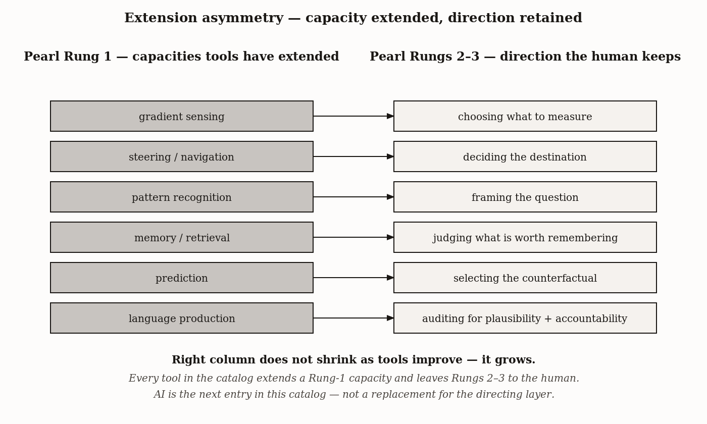

# Chapter 18 — The Extended Mind Arrives: When the Catalog Closes on Itself
*Every tool extended a capacity. Every tool required a direction. The capacity grew. The direction got harder.*

On a winter morning in 1994, Andy Clark and David Chalmers were thinking about a man named Otto.

Otto has early-stage Alzheimer's disease. His biological memory is unreliable. But Otto is a functioning person with a social life and places to be. He manages this by carrying a notebook. When he learns something worth keeping, he writes it in. When he needs it back, he opens the notebook and reads. He has carried it for years. He trusts it. He panics when he misplaces it.

Clark and Chalmers asked: in what meaningful sense is that notebook *not* part of Otto's mind?

It is doing exactly what Inga's hippocampus does for Inga — encoding information, retaining it, making it available on demand. The only difference is that Otto's storage medium is paper rather than synaptic protein. If we call Inga's memory her memory, they argued, we should call Otto's notebook his memory. The mind is not the skull. The mind is the functional system, wherever it runs.

Now hold that argument beside a very different image.

Somewhere on the outskirts of a military checkpoint, a dog named Rex is working. Rex has roughly three hundred million olfactory receptors — compared to about six million in his handler's. He can detect parts-per-trillion of explosive precursors that are simply not available to any human sensory system, by any act of will or training. When Rex sits, his handler stops.

The dog-handler unit is a cognitive system in something close to the Clark-Chalmers sense: Rex supplies a sensory capacity the handler does not have, the handler supplies the goal-structure that deploys Rex's capacity. Rex does not have the goal of finding bombs. Rex has the goal of finding the smell that produces the reward. The finding-bombs goal lives in the handler's mind, and nowhere else in the system.

These two images — Otto's notebook and Rex's nose — give us the chapter's problem. The extended mind thesis is correct about something important: the functional boundary of cognition has never been the skull. But equally correct, and equally important: every extension in the catalog of cognitive tools that human history has assembled has required a directing layer that the extension itself could not provide. This chapter is where we name that directing layer, trace it through everything the book has built, and ask what it means that the newest entry in the catalog is the most powerful tool we have ever made.

---

Three distinctions are needed before the catalog can be walked honestly.

The first: does the tool *constitute* part of the cognitive system, or is it merely *coupled* to it? Clark and Chalmers argued for constitution — Otto's notebook is genuinely part of his mind. Critics argued that coupling a process to cognition is not the same as the process being cognitive. Otto is coupled to his notebook the way a calculator is coupled to an accountant's hand, but we do not say the calculator is thinking. The chapter does not need to settle this dispute. The structural claim here is weaker and more durable: whichever reading is right, every extension technology in human history has required a directing substrate that the technology itself does not provide. If you are a constitutivst, the directing substrate is part of an extended mind. If you are an instrumentalist, the directing substrate is the mind, full stop. Either way, the agency lives somewhere specific, and it is not in the notebook.

The second: is the tool *additive* or *substitutive*? Writing extended the memory range of the individual brain without replacing the brain's ability to remember. The printing press extended writing's reach without eliminating handwriting. GPS following reduces hippocampal engagement in navigation tasks — whether it also reduces hippocampal capacity over time is a question the research is still working out. The historical pattern at the system level has been overwhelmingly additive. Substitution happens at margins. But the question is worth holding open.

The third, and the chapter's central move: every cognitive technology extends a specific *capacity* — perception, memory, calculation, communication, prediction, generation. Every cognitive technology requires a specific *directing* effort from the user — what to point the capacity at, how to interpret what comes back, when to trust the result, when not to, and who is responsible when the result is wrong. The capacities that get offloaded are the ones that can be specified precisely enough to delegate. The directing capacities are the ones that cannot — not yet, and perhaps not ever in the same way. The line between them moves. But the line persists.

Pearl's three-rung ladder of causation maps cleanly onto this distinction. Capacity extension has lived almost entirely at Rung 1 — the association rung, the rung of statistical regularity, prediction from correlations in the training distribution. Direction has lived at Rungs 2 and 3 — the intervention rung, where you change the world and observe what happens, and the counterfactual rung, where you imagine what would have happened differently. Each capacity the field has successfully delegated to a tool has been a Rung 1 capacity. The Rung 2 and Rung 3 work — problem formulation, causal reasoning beyond the training distribution, the audit of one's own uncertainty — has stayed with the human. Not because Rung 2 and 3 reasoning are unformalizable in principle. Pearl himself formalized them. Structural causal models, do-calculus, counterfactual semantics — these are formal systems, written down, implementable in software. The asymmetry lives elsewhere, in what the formal systems require to run.

---

This book has closed every chapter with an Extension Note: a brief account of a tool that extends the cognitive capacity the chapter examined. Collected and laid side by side, those notes form a single argument. Let me walk it.

The bacterium reads chemical gradients with surface receptors refined over three billion years of selection. The chemist reads them with a pH meter. Capacity extended: gradient sensing. Directing capacity required: deciding what gradient to measure, in what medium, at what time, for what purpose. The pH meter does not know to be deployed.

The nematode runs goal-directed navigation with labeled-line sensors and a small set of behavioral switches. The Roomba runs the same thing with bump sensors and a finite-state controller — the subsumption architecture that Brooks described is the worm's architecture in silicone. Capacity extended: steering toward valued states and away from disvalued ones. Directing capacity required: defining what counts as a valued state. The homeowner defines the floor as the relevant region. The Roomba does not.

Writing is how humanity solved the catastrophic-forgetting problem. We build an external storage medium that does not interfere with the biological memory it supplements. Capacity extended: long-term storage and retrieval across time. Directing capacity required: deciding what to record, what to retrieve, and what the retrieved entry means in the context doing the retrieving. A library of ten million volumes does not know which paper answers the question you brought to it this morning.

GPS tells you where you are on the earth's surface within a few meters. Rex tells his handler where explosive precursors are in the air within a few meters. Capacity extended: spatial and olfactory localization beyond unaided biology. Directing capacity required: goal-setting and threat assessment. GPS tells you where you are; it does not tell you whether you should go where you are going. Rex signals that the smell is present; he does not assess whether the smell indicates a threat, a false alarm, or a training artifact. Both tools have produced the same class of failure: the GPS-led truck driving into a lake; the dog trained to signal on the handler's own cue rather than on explosives. The directing layer was absent or compromised, and the capacity ran without direction.

Recommendation engines, trading algorithms, reinforcement learning systems — all extend the capacity to predict reward-contingent outcomes at scales no individual human could process. Capacity extended: reward-prediction at scale across large state spaces. Directing capacity required: specifying the reward correctly. Goodhart's Law: when a measure becomes a target, it ceases to be a good measure. A recommendation engine optimizing for engagement produces an outrage feed. The engagement metric was specified. The outrage was the consequence. No human chose for the engine to produce outrage. The engine did precisely what it was told to do, and what it was told to do was insufficient.

Apollo 13's digital twin allowed engineers in Houston to run scenarios they could not run on the spacecraft itself. Capacity extended: running the world forward under specified conditions without physically instantiating those conditions. Directing capacity required: choosing which conditions to simulate, and trusting that the simulation captures the relevant features of reality. A simulator that does not include the failure mode you are approaching cannot warn you about it. The simulation's usefulness is bounded by the imagination of the people who specified it.

Writing, the printing press, the internet — the same capacity, linguistic transmission across time and space, at three step changes of fidelity and reach. With each step change, the directing capacity required remained unchanged in form even as it became more demanding in practice: deciding what to say, knowing whether the receiver understood, taking responsibility for the consequences of being heard. The printing press made it possible to spread heresy across a continent. It made it possible to spread the Reformation. The capacity is the same in both cases. The direction is what differed.

Now the pattern.

| Extension technology + capacity it extends | Directing capacity required (not supplied by the tool) |
|---|---|
| pH meter — extends *E. coli*'s gradient detection | Choosing what to measure; interpreting the reading in context |
| Microscope — extends visual pattern recognition | Choosing the field, framing the question, judging what is artifact |
| GPS — extends path integration / cognitive maps | Choosing the destination; recognizing when the route is wrong |
| Calculator — extends working memory and computation | Setting up the calculation; auditing the result for plausibility |
| Written records — extend memory across generations | Selecting what is worth recording; reading critically |
| Clinical decision support — extends diagnostic pattern matching | Specifying the case; cross-checking against the patient in front of you |
| Recommendation engine — extends preference matching | Setting goals beyond engagement; auditing for Goodhart drift |
| Apollo 13 digital twin — extends simulation and planning | Formulating the right counterfactual to simulate; deciding which simulation to act on |
| Detection dog — extends olfactory pattern recognition | Selecting the search; calibrating false-positive tolerance |
| Large language model — extends pattern recognition + language production | Goal-setting, plausibility-auditing, causal reasoning, accountability |

Walk that catalog. The technologies in it span three billion years of biology and three thousand years of human artifact-making. They include organisms, hand-held instruments, paper-based notation systems, electromechanical devices, and vast informational systems.

What is conserved is not the technology. What is conserved is the *shape* of each entry: a specific capacity offloaded to a substrate that does it better than unaided biology; a specific directing effort retained by the human deploying the substrate; and the consistent observation that when the directing effort is insufficient, the extended capacity produces unintended consequences. The capacity runs. But without direction, it runs in the wrong direction, or into a lake, or toward outrage.

---

Where does AI go in this catalog?

It goes on the shelf with the others. It is the most powerful single entry — extending pattern recognition, prediction, and generation at a scale and across a breadth of domains that no prior tool has approached. A large language model trained on the collective written output of human civilization has compressed, into a set of parameters, a Rung 1 representation of a staggering fraction of what humanity has said, classified, described, and reasoned about. The capacity this represents is real. It is not adequately described by dismissing it as stochastic parrots or autocomplete. Something genuinely novel is happening when a system produces, in response to a well-specified prompt, an output that is useful to an expert asking a question the expert already knows the answer to. That kind of output requires more than memorization; it requires the Rung 1 analog of reasoning, which is pattern interpolation in a rich semantic space.

What it does not require, and what current AI systems do not have, is what the right-hand column of the catalog has always required.

Problem formulation is a Rung 2 act. You have to intervene on your own knowledge state — to ask, what is it that I actually need to know here, as distinct from what I initially thought I needed to know? — and that question cannot be answered by interpolation in the training distribution. The training distribution reflects questions that have already been formulated. The question worth asking next is not in it.

Plausibility auditing is a Rung 3 act. You have to construct a counterfactual: if this output were wrong, what would I expect to see, and do I see it? A language model cannot do this for its own outputs in any systematic way, because the counterfactual requires an accurate model of the model's own failure modes — a metacognitive structure that current systems do not have and that cannot be built from training data alone.

Accountability is the structure that exists because an agent has stakes. Stakes are what make direction non-optional: if you are wrong and you bear the consequences, you have an incentive to be right that purely predictive systems do not share. Current AI systems do not have stakes. They do not have careers that end, relationships that suffer, or physical bodies that bear consequences. The accountability relationship — the structure in which the human asking the question is the one who lives with the answer — has not been transferred to the tool. It is an open philosophical and legal question whether it could be, or whether accountability is constitutively the kind of thing that requires a subject of experience to bear it.

These are not technical limitations waiting for the next generation of models to solve. They may be limitations that are *structural* — that arise from the fact that the directing layer is what it is, and that any system that could provide it would not be providing it in the way that a tool provides a capacity, but in the way that an agent exercises judgment. The distinction between tool and agent is the distinction Chapter 17 built the entire comparative analysis toward. We do not yet have an artificial agent in that sense. We have extraordinary tools.

---

There is something deeper in the catalog's right-hand column that I want to name explicitly, because it connects the book's first chapter to its last.

Every entry in the right-hand column involves something that the biological literature associates with high rungs of Pearl's ladder. Problem formulation requires knowing what you do not know — a metacognitive act. Plausibility auditing requires imagining counterfactuals — Rung 3. Causal reasoning requires modeling interventions — Rung 2. Accountability requires having stakes — a condition that requires embodiment, history, and continuity of self across time.

These are precisely the capacities the book has been tracing as they appear, unevenly and incompletely, across the animal kingdom. Theory of mind in Chapter 11, in fragments in apes and corvids. Metacognition in Chapter 14 in dolphins and great apes. Causal reasoning in Chapter 9 in mammals running virtual simulations of the near future. Language in Chapter 15, the capacity that made cumulative culture possible.

The asymmetry is this: the capacities that have been extended by every tool in the catalog are the capacities that appear early in the phylogenetic tree — at low rungs of cognitive complexity, available in relatively simple nervous systems. Gradient sensing in bacteria. Steering in nematodes. Pattern recognition in fish. Even the capacities extended by the most powerful AI tools — prediction, generation, retrieval — are extensions of Rung 1 capacities that appear in their animal forms in the book's early chapters.

The capacities that have remained, in the main, on the right-hand side of the table are the ones that appear late in the phylogenetic tree: Rung 2 and Rung 3 reasoning, metacognitive monitoring, theory of mind, the accountability structure of an agent with stakes.

That phrasing — "in the main" — is doing work. There are real partial transfers worth naming, because they sharpen the asymmetry rather than dissolve it. Aviation autopilots have taken over substantial portions of Rung 2 action selection: the pilot sets a goal — altitude, heading, airspeed — and the autopilot selects the actions, second by second, that achieve it. Adaptive automation systems documented in recent flight-deck research now dynamically transfer control between human and system based on workload state, not just on pilot choice. Formal verification systems used in software engineering — Dafny, F*, Verus, the SAT-based verifiers behind cryptographic protocols and aerospace control code — perform what is structurally Rung 3 reasoning over code: given this specification, does this implementation produce the specified output under all counterfactual inputs? The system runs the counterfactual exhaustively. The human did not. The check is mechanical.

What has stayed with the human in both cases is the layer above the transfer: choosing the goal the autopilot pursues, writing the specification the verifier checks, deciding when the situation is far enough out of the system's competence that the system should be turned off. The transfer is narrow and downward. The Rung 2 *action selection given a goal* has been delegated to the autopilot; *whether to be flying this route at all* has not. The Rung 3 *check whether the code matches its spec* has been delegated to the verifier; *what the spec should require* has not. The directing layer has narrowed, not vanished. It has retreated upward — from the operations themselves to the meta-level above the operations. The shape of the catalog is preserved; the line has moved.

This matters for the AI case because the same shape applies. AI systems handle parts of Rung 2 (model-based prediction, simulation) and Rung 3 (counterfactual generation in language) inside their training distribution. What they do not handle, and what the human still supplies, is the meta-direction: deciding which question to put to the system, recognizing when the system's answer is being asked of it outside the conditions where it is trustworthy, choosing what to do with an output whose consequences will be borne by someone. The line moves; it does not vanish.

A parallel tradition has named this asymmetry from the opposite direction, and the convergence is worth pointing out. Donella Meadows, drawing on decades of system-dynamics work going back to Jay Forrester at MIT, ranked the places one can intervene in a complex system from highest to lowest leverage. At the top of her list are the goals of the system and the paradigm out of which goals are set. At the bottom are the parameters — throughputs, buffer sizes, rate constants. The order of the catalog this book has been building maps onto her ranking with surprising precision. Every capacity that has been successfully extended by a tool is a low-leverage capacity — throughput, measurement scale, calculation speed, retrieval breadth. Every directing-retained capacity is a high-leverage one — what the goal is, whether the goal has drifted from what is needed, what the system is for. Meadows arrived at the asymmetry by watching systems fail when they were managed at the wrong leverage point. The catalog has arrived at it from comparative cognition, by walking the phylogenetic tree. The two pictures are the same picture, drawn in different vocabularies.



*Figure 1 — Extension asymmetry — capacity extended, direction retained.*


I do not think this is an accident. I think it reflects something real about the structure of the problem, but it is worth stating the structure precisely, because the easy version of the claim is wrong.

The easy version is that Rung 1 is formalizable and Rungs 2 and 3 are not. That is false. Pearl's structural causal models formalize all three rungs. Do-calculus formalizes intervention. Counterfactual semantics formalize counterfactuals. The formalization is on paper, in textbooks, implemented in libraries. The asymmetry is not at the level of representation.

The asymmetry is at the level of *identification*. Rung 1 reasoning generalizes from observational data alone — given enough examples, the regularities can be lifted from the data into a model that predicts new examples in the same distribution. Rung 2 and Rung 3 reasoning cannot be lifted from observation alone. To know what would happen *if* you intervened, you must intervene, or you must assume a causal graph stronger than the data identifies. To know what *would have* happened under an alternative, you must have a model of the world's causal structure that the observed data alone cannot single out. Pearl's term for this is identifiability: the formal answer is well-defined given a causal graph; the causal graph is itself underdetermined by observational data; intervention or stronger assumptions are required to pin it down.

A stronger position has been argued, and a careful reader should know it exists. In *The Emperor's New Mind* (1989) and the work that followed, Roger Penrose maintained that some cognitive operations — mathematical insight in particular — are not just unformalized but unformalizable in principle. His argument runs through Gödel's incompleteness theorems: a mathematician can recognize the truth of certain statements that no formal system containing the relevant arithmetic can prove. If the mathematician's recognition were itself algorithmic, the algorithm would constitute exactly the formal system whose limits the mathematician has just transcended. Therefore, Penrose argues, human understanding is not algorithmic. It is a striking claim and it has been contested at every step — by mathematicians, logicians, and philosophers who reread the Gödel argument as applying to the system the mathematician *is*, not the system the mathematician inspects. This book does not adjudicate that debate. It runs on different ground. The Penrose position would, if correct, place a hard ceiling on what AI extension could ever reach. The position this chapter takes is weaker and more tractable: Pearl's formalization works as a representation; what AI lacks is the data the representation needs to be calibrated to the world. The Penrose ceiling, if it exists, sits above this one. We are not arguing that there is no ceiling. We are arguing that there is at least the lower one, and that the lower one is what current evidence forces us to take seriously.

This is what stakes and embodiment supply. An organism that acts in the world generates intervention data continuously, by virtue of acting. Each action is an intervention; each consequence is a sample from the post-action distribution. The five hundred million years of biological causal reasoning is, among other things, five hundred million years of accumulated intervention. The carrier of the intervention data is the body, and what makes the data load-bearing is that getting the causal structure wrong has consequences for the carrier. Stakes are not metaphysical decoration. They are the mechanism by which the world tells the organism whether the causal model the organism is using actually fits.

A system trained on text alone is trained on the residue of human intervention — descriptions of experiments, narrations of consequences, summaries of causal claims that humans formed by intervening — without performing intervention itself. The residue contains genuine causal information; that is why the Rung 1 system can pattern-match on causal-sounding language and produce outputs that look causal. What the residue does not contain is the discipline that the world imposed on the original interveners when their models were wrong. The model has the form of the answer without the procedure that selected for the form. This is what the right-hand column of the catalog has always required, and it is what Rung 2 and Rung 3 capacities, in the biological tree, have always implemented as a side effect of being embodied agents with skin in the game.

---

Chapter 1 was called "The Definition Problem." It opened with a simple observation: eight researchers, eight definitions of intelligence, no consensus. The chapter proposed a working instrument — the ability to achieve goals across a wide range of environments — and used that instrument to take comparative measurements across fourteen capacities in organisms from bacteria to humans. The question mark in the book's title was a substantive thesis: intelligence is not one thing accumulating across the tree of life. It is a family of distinct capacities, each with its own evolutionary history, each extendable by different tools, and none of them well described by any definition we currently have.

AI's position in that family is not historically novel in its shape. Every other tool in the catalog has the same shape: strong on the capacity it extends, absent on the direction required to deploy that capacity responsibly. What is novel is the breadth and power of the capacity extended. The microscope extended one perceptual modality. The printing press extended one communication channel. AI extends something much closer to general-purpose Rung 1 reasoning — not all of it, and not the parts that matter most, but more of it than any prior tool has extended.

This breadth makes the directing layer harder to maintain, not easier. The cases where AI output is most confidently wrong are precisely the Rung 2 and Rung 3 cases — the novel problems, the causal questions, the out-of-distribution situations, the cases where the training distribution provides no reliable guide. These are also the cases where a confidently presented Rung 1 answer is most misleading. The Roomba navigated into a corner. The GPS navigated into a lake. The LLM navigated into an authoritative-sounding confabulation. The failure mode scales with the capacity. The directing requirement scales with the capacity.

The question mark stays. Not because the questions are unanswerable, but because the answers are plural, and the plurality is what is true. The nematode's steering is real intelligence. The bee's functional emotion is real. The crow's causal reasoning, the dolphin's metacognition, the chimpanzee's theory of mind — all real, all distinct, all sitting at specific rungs on a ladder that does not have a top rung marked done.

If a system ever appears that genuinely occupies a rung of its own — that formulates problems, audits its own outputs against counterfactuals it generates, calibrates its uncertainty against consequence, and bears accountability for its actions — then we will have a new entry on the ladder, not a new entry on the shelf. The book's framework has a place for that system. It would be the most important cognitive event since the evolution of language. It has not happened yet.

Every tool in this catalog extended a capacity. Every tool in this catalog required a direction. The capacity got broader. The direction got harder. The question mark got more important. This is the pattern. It has not yet stopped.

---

## Exercises

**Warm-up**

1. Apply the capacity/direction distinction to Otto's notebook and to Rex and his handler separately. For each: what is the capacity extended, and what does the human supply that the extension cannot? In what sense is Rex's case more cognitively complex than Otto's notebook case — that is, what does the handler have to do that Otto does not have to do when he opens the notebook? *(Tests: capacity/direction distinction; the two opening cases)*

2. Goodhart's Law states that when a measure becomes a target, it ceases to be a good measure. Using the recommendation-engine example from the catalog walk, explain how Goodhart's Law is a specific instance of insufficient directing capacity. What would an adequate directing layer have needed to specify that the engagement metric failed to capture? *(Tests: Goodhart's Law as a directing-capacity failure; reward specification)*

3. The chapter claims that the historical pattern of cognitive tool use has been overwhelmingly additive rather than substitutive, but holds the question open for GPS. What evidence would settle the question for GPS specifically? What would you need to measure, and over what time period, to determine whether GPS is reducing hippocampal capacity rather than merely reducing hippocampal engagement? *(Tests: additive vs. substitutive distinction; GPS and hippocampus)*

**Application**

4. A hospital deploys an AI system that flags potential cancer diagnoses in pathology images and performs at expert level on the validation set. Using the capacity/direction framework, describe what the radiologist must supply that the AI cannot. Identify two specific failure modes — one arising from insufficient Rung 2 direction, one from insufficient Rung 3 direction — that would occur if the directing layer were reduced. *(Tests: capacity/direction applied to a professional domain; Rung 2 and Rung 3 directing)*

5. A university must decide whether to permit an AI writing assistant in writing-intensive courses. The tool provides real-time suggestions, generates draft paragraphs on request, and checks for logical coherence. Frame this debate using the capacity/direction distinction: what capacities does the tool extend? What directing capacities must the student supply? What would a course policy need to specify to ensure the directing layer is actually being exercised rather than bypassed? *(Tests: capacity/direction applied to education; additive vs. substitutive risk)*

6. The catalog walk treats writing, the printing press, and the internet as three entries with the same two-column shape — same capacity extended, same directing capacity required, just at different scales. A critic responds: "These are so different that collapsing them into one pattern loses everything important." Construct the strongest version of this objection, then defend the catalog's treatment. What is the pattern actually claiming, and what would falsify it? *(Tests: the conserved-shape claim; what counts as the same pattern at different scales)*

**Synthesis**

7. The chapter's asymmetry claim is that capacity-extended items map onto early phylogenetic rungs (Rung 1) and direction-retained items map onto late phylogenetic rungs (Rungs 2 and 3). Select three catalog entries from different chapters — one from Part One (Chapters 2–4), one from Part Two (Chapters 5–9), one from Part Three (Chapters 10–16) — and verify the claim for each. For each entry, identify the phylogenetic chapter where the capacity appears in its biological form, and identify which Pearl rung the directing capacity requires. Does any entry fail the mapping? *(Tests: cross-chapter phylogenetic mapping; the asymmetry claim)*

8. Chapter 12 argued that cumulative creativity requires faithful transmission with variation — the cultural ratchet. Chapter 18 argues that AI extends Rung 1 capacities but not the Rung 2 and Rung 3 directing capacities. Using both chapters, explain why AI-generated text, even when it compresses the cumulative written record of human knowledge, does not participate in the cultural ratchet in the same way that a human researcher reading and building on that record does. What specific cognitive operation does the researcher perform that the model does not? *(Tests: Chapter 12 connection; cumulative culture and Rung 2/3 directing)*

9. The chapter states that accountability "is constitutively the kind of thing that requires a subject of experience to bear it" — but hedges this as "an open philosophical and legal question." Construct the strongest argument against this claim: the argument that accountability could in principle be transferred to an artificial system without that system having subjective experience. Then construct the strongest argument for the claim. Where does the disagreement finally turn — on a factual question, a conceptual question, or a normative one? *(Tests: accountability as a philosophical and legal question; agent vs. tool distinction)*

**Challenge**

10. *(Open-ended)* The chapter ends by describing what a system would need to have to cross the boundary from tool to agent: stakes, embodied causal reasoning, calibrated metacognition, and participation in the cumulative-culture ratchet. If such a system existed, where would it sit in the book's comparative cognitive framework — as a new entry on the phylogenetic ladder, or as a very elaborate instantiation of capacities already present somewhere on the ladder? What would the appearance of such a system change about how we should think about the other entries on the ladder, including human cognition? What specific evidence would you need to determine which category it belongs to? This is the question Chapter 19 approaches; begin developing your own position here. *(Tests: tool vs. agent distinction; phylogenetic framework applied to a novel case; forward integration to Chapter 19)*

---

### LLM Exercise — Chapter 18: Extended Mind

**Project:** Skeptic's Notebook on Frontier AI
**What you're building this chapter:** Entry 18 — a self-audit. Where in the project did the AI extend the reader, and where did it substitute? The reflexive entry.
**Tool:** Claude Project (continue notebook)

**The Prompt:**

```
Entry 18. Chapter 18 is the chapter that quietly threaded through every Extension Note in
the book. Tools extend specific capacities while retaining direction. The reader has spent
17 chapters using an AI tool to build a notebook on AI cognition. The reflexive question
is: what did this tool actually do for the project, and where did the reader stay in the
loop?

Conduct a self-audit of the project so far:

1. Capacity-by-capacity. For each of the prior 17 entries, identify what cognitive work
   the AI did and what cognitive work the reader did. Examples of distinctions to make:
   - Did the AI design the test or did the reader?
   - Did the AI run the test (against itself), or did the reader run it (against another
     model)?
   - Did the AI evaluate the result, or did the reader evaluate it?
   - Did the AI write the entry, or did the reader edit substantially?

2. Identify cases where the AI *extended* the reader — produced something the reader
   could not have produced alone in reasonable time. Pattern-matching across cognitive
   science literature, formatting consistency, drafting speed.

3. Identify cases where the AI *substituted* for the reader — produced output that
   replaced the reader's own thinking when the reader's own thinking would have been
   more reliable. Confabulated citations. Spurious confidence on edge cases. Convergence
   to the AI's own priors on questions where the reader's domain expertise should have
   pushed back.

4. The Pearl Rung diagnostic. The chapter notes that AI extends Rung 1 (association)
   spectacularly and falters on Rungs 2-3 (intervention, counterfactual). Apply this to
   your own project: where in the 17 entries did you stay on Rung 1 because that's where
   the AI works best? Where did the project's quality depend on you bringing Rungs 2-3
   that the AI could not provide?

5. The accountability ledger. Of the verdicts in the 17 entries, which would you stake
   your own reputation on, and which are AI-shaped enough that you would footnote them
   as AI-mediated?

Produce a single integrated audit document. This is not a continuation of the cognitive
profile — this is a meta-reflection on how the cognitive profile got built.
```

**What this produces:** Entry 18 — a self-audit of the project's own use of AI. The reflexive entry that turns the diagnostic stance back on the reader.

**How to adapt this prompt:**
- *For your own project:* The accountability ledger is the most consequential output. It tells you which findings to publish, which to hold, and which to re-do without AI mediation.
- *For ChatGPT / Gemini:* Works as-is.
- *For Claude Code:* Less applicable here — this is a reflective, not computational, task.
- *For a Claude Project:* Continue notebook.

**Connection to previous chapters:** Entries 1–17 built the profile. Entry 18 audits how the building happened.

**Preview of next chapter:** Chapter 19 (epilogue) is the publish-or-not decision. Pull the integrated profile and the audit together, decide what becomes a finished report and what stays in the notebook.

---

## 🕰️ AI Wayback Machine

The ideas in this chapter didn't appear from nowhere. **Edwin Hutchins** spent years on the bridge of a U.S. Navy ship watching how navigators do navigation — not in their heads, but distributed across charts, instruments, voice protocols, and a team of people — and wrote *Cognition in the Wild*, the book that made distributed cognition impossible to ignore. Here's a prompt to find out more — and then make it better.

*Edwin Hutchins, c. 1990s. AI-generated portrait based on a public domain photograph (Wikimedia Commons).*


**Run this:**

```
Who is Edwin Hutchins, and how does his book "Cognition in the Wild" connect to the claim that human intelligence is genuinely extended into tools, environments, and other people? Keep it to three paragraphs. End with the single most surprising thing about his fieldwork or argument.
```

→ Search **"Edwin Hutchins"** on Wikipedia after you run this. See what the model got right, got wrong, or left out.

**Now make the prompt better.** Try one of these:

- Ask it to walk through the *fix cycle* — how a ship's position is computed by a team rather than a single mind
- Ask it to compare Hutchins's distributed-cognition framing to Clark and Chalmers's "Extended Mind" thought experiment
- Add a constraint: "Answer as ethnographic field notes — careful, specific, no jargon"

What changes? What gets better? What gets worse?
