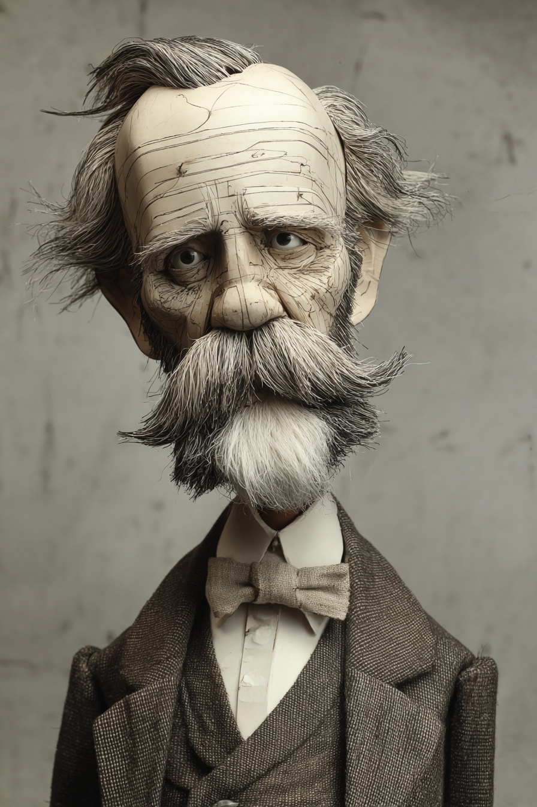
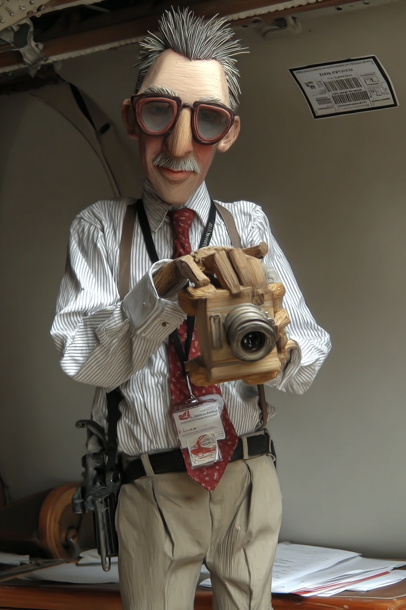
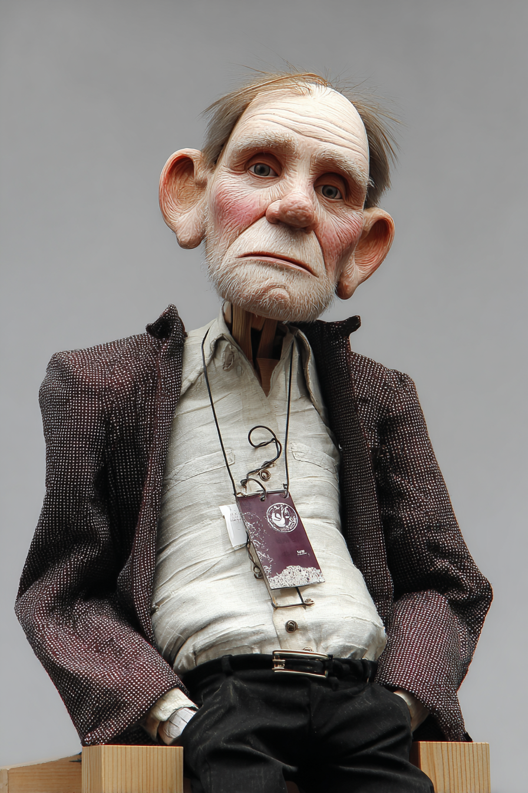

# Intelligence? — Wayback Sections

> Extracted from `chapters/`. Each entry corresponds to one chapter file.
> Sections are instructor-authored. Missing sections show a placeholder only.
> Do not edit this file directly — edit the source chapter file, then re-run extraction.

---

## Chapter 00: Intelligence?
*Source: `chapters/00-frontmatter.md`*

> **Section not yet authored.** No `## AI Wayback Machine` block found in this chapter file.
> To add this section, edit the source chapter file directly.

---

## Chapter 00: Introduction
*Source: `chapters/00-introduction.md`*

> **Section not yet authored.** No `## AI Wayback Machine` block found in this chapter file.
> To add this section, edit the source chapter file directly.

---

## Chapter 01: Chapter 1 — The Definition Problem
*Source: `chapters/01-the-definition-problem.md`*

##  AI Wayback Machine
The ideas in this chapter didn't appear from nowhere. **Lotfi Zadeh** was building a mathematical theory of vague concepts — *fuzzy sets*, where membership is a matter of degree rather than a yes/no fact — decades before "what counts as intelligence?" became a live question in AI. Here's a prompt to find out more — and then make it better.

*Lotfi A. Zadeh, c. 1965. AI-generated portrait based on a public domain photograph (Wikimedia Commons).*


**Run this:**

```
Who was Lotfi Zadeh, and how does his work on fuzzy set theory connect to the problem of defining intelligence as a graded rather than binary property? Keep it to three paragraphs. End with the single most surprising thing about his career or ideas.
```

→ Search **"Lotfi A. Zadeh"** on Wikipedia after you run this. See what the model got right, got wrong, or left out.

**Now make the prompt better.** Try one of these:

- Ask it to explain "degree of membership" in plain language, using the example of *whether a slime mold counts as intelligent*
- Ask it to compare Zadeh's framing to Wittgenstein's "family resemblance" idea from this chapter
- Add a constraint: "Answer as if you're writing a footnote in a textbook on the definition of intelligence"

What changes? What gets better? What gets worse?

---

## Chapter 02: Chapter 2 — Before Brains
*Source: `chapters/02-before-brains.md`*

##  AI Wayback Machine
The ideas in this chapter didn't appear from nowhere. **Howard Berg** was tracking individual *E. coli* under a custom-built tracking microscope in the 1970s — and proving that a bacterium navigates by *running and tumbling*, biasing its direction by the temporal derivative of attractant concentration — when most biology textbooks still treated single cells as inert. Here's a prompt to find out more — and then make it better.

*Howard Berg, c. 1980s. AI-generated portrait based on a public domain photograph (Wikimedia Commons).*


**Run this:**

```
Who was Howard Berg, and how does his work tracking individual E. coli with a custom-built microscope connect to the question of whether brainless organisms can be intelligent? Keep it to three paragraphs. End with the single most surprising thing about his experiments or his career.
```

→ Search **"Howard Berg (biophysicist)"** on Wikipedia after you run this. See what the model got right, got wrong, or left out.

**Now make the prompt better.** Try one of these:

- Ask it to explain *run-and-tumble* chemotaxis using a step-by-step worked example with concentration values
- Ask it to compare Berg's E. coli tracking to *Physarum*'s maze-solving — what computational ingredients do both have in common?
- Add a constraint: "Answer as if you're describing the experiment to a physicist who has never thought about bacteria"

What changes? What gets better? What gets worse?

---

## Chapter 03: Chapter 3 — Steering: The First Brain, and What It Was Built to Decide
*Source: `chapters/03-steering.md`*

##  AI Wayback Machine
The ideas in this chapter didn't appear from nowhere. **Valentino Braitenberg** was sketching imaginary "vehicles" — tiny robots with two sensors and two motors — and showing how minimal wiring produces behavior that looks unmistakably like *fear*, *aggression*, or *love*, decades before C. elegans got its connectome. Here's a prompt to find out more — and then make it better.

*Valentino Braitenberg, c. 1980s. AI-generated portrait based on a public domain photograph (Wikimedia Commons).*


**Run this:**

```
Who was Valentino Braitenberg, and how does his book "Vehicles: Experiments in Synthetic Psychology" connect to the problem of explaining goal-directed steering in simple animals? Keep it to three paragraphs. End with the single most surprising thing about his career.
```

→ Search **"Valentino Braitenberg"** on Wikipedia after you run this. See what the model got right, got wrong, or left out.

**Now make the prompt better.** Try one of these:

- Ask it to walk through Vehicle 2 (sensors crossed vs. uncrossed) step by step, in plain language
- Ask it to compare Braitenberg's two-sensor vehicles to the chemotaxis circuit in C. elegans
- Add a constraint: "Explain it the way Braitenberg himself would — playful, unhurried, building one vehicle at a time"

What changes? What gets better? What gets worse?

---

## Chapter 04: Chapter 4 — Learning and Memory
*Source: `chapters/04-learning-and-memory.md`*

##  AI Wayback Machine
The ideas in this chapter didn't appear from nowhere. **Brenda Milner** spent decades studying the patient known only as H.M. — a man who could not form new memories after surgery — and showed that memory is not one thing but several systems that can be selectively destroyed. Here's a prompt to find out more — and then make it better.

*Brenda Milner, c. 1960s. AI-generated portrait based on a public domain photograph (Wikimedia Commons).*


**Run this:**

```
Who is Brenda Milner, and how did her work with the patient H.M. transform our understanding of how memory is organized in the brain? Keep it to three paragraphs. End with the single most surprising thing about her career or her findings.
```

→ Search **"Brenda Milner"** on Wikipedia after you run this. See what the model got right, got wrong, or left out.

**Now make the prompt better.** Try one of these:

- Ask it to explain the distinction between *declarative* and *procedural* memory using H.M.'s mirror-tracing task
- Ask it to compare H.M.'s deficits to what associative learning looks like in *Aplysia* or *C. elegans*
- Add a constraint: "Answer as if you're writing a museum placard for the Montreal Neurological Institute"

What changes? What gets better? What gets worse?

---

## Chapter 05: Chapter 5 — Emotion
*Source: `chapters/05-emotion.md`*

##  AI Wayback Machine
The ideas in this chapter didn't appear from nowhere. **Jaak Panksepp** was mapping seven core emotional systems — SEEKING, RAGE, FEAR, LUST, CARE, PANIC, PLAY — across the brains of rats, dogs, and humans, arguing for affective continuity across the mammalian lineage long before the bee-emotion experiments forced the question downward. Here's a prompt to find out more — and then make it better.

*Jaak Panksepp, c. 1990s. AI-generated portrait based on a public domain photograph (Wikimedia Commons).*


**Run this:**

```
Who was Jaak Panksepp, and how does his "affective neuroscience" framework connect to the question of whether non-human animals experience genuine emotion? Keep it to three paragraphs. End with the single most surprising thing about his career.
```

→ Search **"Jaak Panksepp"** on Wikipedia after you run this. See what the model got right, got wrong, or left out.

**Now make the prompt better.** Try one of these:

- Ask it to explain Panksepp's discovery that rats *laugh* (ultrasonic vocalizations) when tickled, in plain language
- Ask it to compare Panksepp's seven-systems model to the bumblebee-emotion experiments from this chapter
- Add a constraint: "Answer as if you're writing the introduction to a sympathetic but rigorous biography"

What changes? What gets better? What gets worse?

---

## Chapter 06: Chapter 6 — Pattern Recognition and Perception: The Fish That Picked a Face Out of Forty-Four
*Source: `chapters/06-pattern-recognition-and-perception.md`*

##  AI Wayback Machine
The ideas in this chapter didn't appear from nowhere. **Kunihiko Fukushima** designed the *neocognitron* in 1980 — a hierarchical visual recognition network with learned feature detectors and translation invariance, the direct architectural ancestor of every convolutional network in modern computer vision. Most of the field was still arguing about symbolic AI. Here's a prompt to find out more — and then make it better.

*Kunihiko Fukushima, c. 1980s. AI-generated portrait based on a public domain photograph (Wikimedia Commons).*


**Run this:**

```
Who is Kunihiko Fukushima, and how does his neocognitron architecture connect to the way modern convolutional neural networks recognize visual patterns? Keep it to three paragraphs. End with the single most surprising thing about his work or its reception.
```

→ Search **"Kunihiko Fukushima"** on Wikipedia after you run this. See what the model got right, got wrong, or left out.

**Now make the prompt better.** Try one of these:

- Ask it to explain *translation invariance* using a concrete example — a dog at the left vs. right of an image
- Ask it to compare the neocognitron's hierarchy to Hubel and Wiesel's simple/complex cells in cat visual cortex
- Add a constraint: "Answer as a footnote in a history of deep learning that takes 1970s Japanese research seriously"

What changes? What gets better? What gets worse?

---

## Chapter 07: Chapter 7 — Navigation and Spatial Intelligence
*Source: `chapters/07-navigation-and-spatial-intelligence.md`*

##  AI Wayback Machine
The ideas in this chapter didn't appear from nowhere. **Rüdiger Wehner** spent decades watching the desert ant *Cataglyphis* march across the Sahara — and proved that this insect navigates home by integrating the path it has just walked, second by second, with no map and no landmarks. The home vector is real, computed, and updated in flight. Here's a prompt to find out more — and then make it better.

*Rüdiger Wehner, c. 1980s. AI-generated portrait based on a public domain photograph (Wikimedia Commons).*


**Run this:**

```
Who is Rüdiger Wehner, and how does his work on the desert ant Cataglyphis fortis connect to the broader question of how animals navigate without internal maps? Keep it to three paragraphs. End with the single most surprising thing about Cataglyphis navigation or about Wehner's career.
```

→ Search **"Rüdiger Wehner"** on Wikipedia after you run this. See what the model got right, got wrong, or left out.

**Now make the prompt better.** Try one of these:

- Ask it to explain *path integration* in plain language, using a worked example of a foraging trip with three turns
- Ask it to compare Wehner's *Cataglyphis* findings to grid-cell discoveries in the mammalian entorhinal cortex
- Add a constraint: "Answer as if you're field-narrating a Wehner experiment for a documentary"

What changes? What gets better? What gets worse?

---

## Chapter 08: Chapter 8 — Reinforcement and Prediction
*Source: `chapters/08-reinforcement-and-prediction.md`*

##  AI Wayback Machine
The ideas in this chapter didn't appear from nowhere. **Wolfram Schultz** recorded from dopamine neurons in monkeys for years and showed something the temporal-difference learning theorists had predicted on paper: midbrain dopamine doesn't signal reward — it signals *prediction error*, the gap between what the animal expected and what arrived. Here's a prompt to find out more — and then make it better.

*Wolfram Schultz, c. 1990s. AI-generated portrait based on a public domain photograph (Wikimedia Commons).*


**Run this:**

```
Who is Wolfram Schultz, and how do his recordings from midbrain dopamine neurons connect to the temporal-difference learning algorithm in reinforcement learning theory? Keep it to three paragraphs. End with the single most surprising thing about his findings.
```

→ Search **"Wolfram Schultz"** on Wikipedia after you run this. See what the model got right, got wrong, or left out.

**Now make the prompt better.** Try one of these:

- Ask it to explain the *unexpected reward → expected reward → omitted reward* dopamine signature in plain language
- Ask it to compare Schultz's monkey data to what TD-learning predicts about a chess engine that has just lost an unexpected piece
- Add a constraint: "Answer as a sidebar in a textbook on reinforcement learning, written for someone who has never recorded from a neuron"

What changes? What gets better? What gets worse?

---

## Chapter 09: Chapter 9 — Simulation and Planning: The Rat That Regretted
*Source: `chapters/09-simulation-and-planning.md`*

##  AI Wayback Machine
The ideas in this chapter didn't appear from nowhere. **Eleanor Maguire** scanned the brains of London taxi drivers — people who had memorized 25,000 streets to pass The Knowledge — and found that the posterior hippocampus was measurably enlarged. The simulation engine, it turned out, grows with use. Here's a prompt to find out more — and then make it better.

*Eleanor Maguire, c. 2000. AI-generated portrait based on a public domain photograph (Wikimedia Commons).*


**Run this:**

```
Who is Eleanor Maguire, and how does her research on London taxi drivers connect to the hippocampus's role in mental simulation and spatial planning? Keep it to three paragraphs. End with the single most surprising thing about the taxi-driver finding.
```

→ Search **"Eleanor Maguire"** on Wikipedia after you run this. See what the model got right, got wrong, or left out.

**Now make the prompt better.** Try one of these:

- Ask it to explain why *posterior* hippocampus grew while *anterior* hippocampus shrank, and what that suggests about specialization
- Ask it to compare the taxi-driver result to hippocampal replay during sleep in rats running mazes
- Add a constraint: "Answer as if you're explaining it to a London cabbie who has never read a neuroscience paper"

What changes? What gets better? What gets worse?

---

## Chapter 10: Chapter 10 — Social and Emotional Intelligence
*Source: `chapters/10-social-and-emotional-intelligence.md`*

##  AI Wayback Machine
The ideas in this chapter didn't appear from nowhere. **Sarah Blaffer Hrdy** argued that *cooperative breeding* — many adults caring for young that aren't theirs — was the selection pressure that built human social cognition, well before "theory of mind" became the standard lens. The other apes, she pointed out, do not share infants. Humans do. That changes everything downstream. Here's a prompt to find out more — and then make it better.

*Sarah Blaffer Hrdy, c. 1990s. AI-generated portrait based on a public domain photograph (Wikimedia Commons).*


**Run this:**

```
Who is Sarah Blaffer Hrdy, and how does her cooperative-breeding hypothesis connect to the evolution of human social and emotional intelligence? Keep it to three paragraphs. End with the single most surprising thing about her argument or her career.
```

→ Search **"Sarah Blaffer Hrdy"** on Wikipedia after you run this. See what the model got right, got wrong, or left out.

**Now make the prompt better.** Try one of these:

- Ask it to explain why cooperative breeding selects for *infant signaling* — and what that implies about human babies' faces
- Ask it to compare the cooperative-breeding account to the Machiavellian-intelligence hypothesis from primatology
- Add a constraint: "Answer as if you're writing a blurb for the back of *Mothers and Others*"

What changes? What gets better? What gets worse?

---

## Chapter 11: Chapter 11 — Theory of Mind
*Source: `chapters/11-theory-of-mind.md`*

##  AI Wayback Machine
The ideas in this chapter didn't appear from nowhere. **Alison Gopnik** spent a career arguing that small children are *little scientists* — that the four-year-old's leap to false-belief reasoning is the product of theory-revision, not maturation, and that the same machinery underlies how adults learn anything genuinely new. Here's a prompt to find out more — and then make it better.

*Alison Gopnik, c. 1990s. AI-generated portrait based on a public domain photograph (Wikimedia Commons).*


*Puppet Art by [Nik Bear Brown](https://www.nikbearbrown.com/).*

**Run this:**

```
Who is Alison Gopnik, and how does her "theory theory" account of child cognitive development connect to the way children acquire theory of mind? Keep it to three paragraphs. End with the single most surprising thing about her account.
```

→ Search **"Alison Gopnik"** on Wikipedia after you run this. See what the model got right, got wrong, or left out.

**Now make the prompt better.** Try one of these:

- Ask it to explain the *blicket detector* experiment and what it shows about causal inference in toddlers
- Ask it to compare Gopnik's "child as scientist" framing to the Bayesian-mind account of theory of mind referenced in this chapter
- Add a constraint: "Answer as if you're writing for parents who are skeptical of academic developmental psychology"

What changes? What gets better? What gets worse?

---

## Chapter 12: Chapter 12 — Creativity: Where the Evidence Gets Thin
*Source: `chapters/12-creativity.md`*

##  AI Wayback Machine
The ideas in this chapter didn't appear from nowhere. **Margaret Boden** spent decades arguing that creativity is not magic — it is *combinatorial*, *exploratory*, and *transformational* search through structured conceptual spaces, and that distinguishing the three is what separates a slogan from a research program. She was making the case for computational creativity when most philosophers thought the phrase was an oxymoron. Here's a prompt to find out more — and then make it better.

*Margaret Boden, c. 1990s. AI-generated portrait based on a public domain photograph (Wikimedia Commons).*


*Puppet Art by [Nik Bear Brown](https://www.nikbearbrown.com/).*

**Run this:**

```
Who is Margaret Boden, and how do her three types of creativity — combinatorial, exploratory, and transformational — connect to the question of whether AI systems can be genuinely creative? Keep it to three paragraphs. End with the single most surprising thing about her career.
```

→ Search **"Margaret Boden"** on Wikipedia after you run this. See what the model got right, got wrong, or left out.

**Now make the prompt better.** Try one of these:

- Ask it to explain *transformational* creativity using a specific example — Cubism, or non-Euclidean geometry
- Ask it to compare Boden's framework to what an octopus does when it improvises camouflage in real time
- Add a constraint: "Answer as a panel discussion between Boden and a skeptical practicing artist"

What changes? What gets better? What gets worse?

---

## Chapter 13: Chapter 13 — Self-Awareness
*Source: `chapters/13-self-awareness.md`*

##  AI Wayback Machine
The ideas in this chapter didn't appear from nowhere. **William James** drew the line carefully in *The Principles of Psychology* (1890), distinguishing the *material self* (the body), the *social self* (recognition by others), and the *spiritual self* (the introspecting "I") — the three-part division that this chapter's three subsystems trace directly to. The mirror test had not yet been invented. The distinctions had. Here's a prompt to find out more — and then make it better.

*William James, c. 1890. AI-generated portrait based on a public domain photograph (Wikimedia Commons).*




*Puppet Art by [Nik Bear Brown](https://www.nikbearbrown.com/).*

**Run this:**

```
Who was William James, and how does his treatment of the self in The Principles of Psychology (1890) connect to modern empirical work on body-self, social-self, and narrative-self in animals and humans? Keep it to three paragraphs. End with the single most surprising thing about his account.
```

→ Search **"William James"** on Wikipedia after you run this. See what the model got right, got wrong, or left out.

**Now make the prompt better.** Try one of these:

- Ask it to explain James's distinction between the *I* (knower) and the *me* (known) in plain language
- Ask it to compare James's three-part self to what the mirror test, mark test, and theory-of-mind tasks each measure
- Add a constraint: "Answer as if you're writing the introduction to a 21st-century neuroscientific reading of James"

What changes? What gets better? What gets worse?

---

## Chapter 14: Chapter 14 — Metacognition
*Source: `chapters/14-metacognition.md`*

##  AI Wayback Machine
The ideas in this chapter didn't appear from nowhere. **Asher Koriat** built the experimental program around *judgments of learning* — the moment-by-moment confidence ratings people make about whether they will remember something — and showed that those ratings are reconstructed from cues, not read from a memory monitor. The introspection was less direct than people thought. Here's a prompt to find out more — and then make it better.

*Asher Koriat, c. 1990s. AI-generated portrait based on a public domain photograph (Wikimedia Commons).*


**Run this:**

```
Who is Asher Koriat, and how does his work on judgments of learning connect to how minds monitor their own knowledge — and why those monitors can be systematically wrong? Keep it to three paragraphs. End with the single most surprising thing about his findings.
```

→ Search **"Asher Koriat"** on Wikipedia after you run this. See what the model got right, got wrong, or left out.

**Now make the prompt better.** Try one of these:

- Ask it to explain the *cue-utilization* framework using a concrete study-strategy example
- Ask it to compare Koriat's reconstructive view of metacognition to claims that LLMs "know what they don't know"
- Add a constraint: "Answer as if you're writing study-skills advice for first-year medical students"

What changes? What gets better? What gets worse?

---

## Chapter 15: Chapter 15 — Language: What the Pointing Finger Reveals
*Source: `chapters/15-language.md`*

##  AI Wayback Machine
The ideas in this chapter didn't appear from nowhere. **Ursula Bellugi** ran the first rigorous neuroscience program on American Sign Language — showing that sign is processed in the same left-hemisphere language regions as speech, and that the *modality* (mouth or hand) is downstream of the language faculty. Her later work on Williams syndrome dissociated language from general cognition in a way no theory had predicted. Here's a prompt to find out more — and then make it better.

*Ursula Bellugi, c. 1980s. AI-generated portrait based on a public domain photograph (Wikimedia Commons).*


**Run this:**

```
Who was Ursula Bellugi, and how does her research on American Sign Language and on Williams syndrome connect to questions about what is — and isn't — distinctive about human language? Keep it to three paragraphs. End with the single most surprising thing about her findings.
```

→ Search **"Ursula Bellugi"** on Wikipedia after you run this. See what the model got right, got wrong, or left out.

**Now make the prompt better.** Try one of these:

- Ask it to explain why ASL processing in left-hemisphere regions matters for the modality-independence claim
- Ask it to compare Williams-syndrome language profiles to the Kanzi and Chaser case studies from this chapter
- Add a constraint: "Answer as if you're explaining it to a Deaf reader who is skeptical of hearing scientists writing about sign"

What changes? What gets better? What gets worse?

---

## Chapter 16: Chapter 16 — Collective Intelligence
*Source: `chapters/16-collective-intelligence.md`*

##  AI Wayback Machine
The ideas in this chapter didn't appear from nowhere. **Deborah Gordon** has spent her career watching harvester ant colonies in the Arizona desert and showing that colony-level decisions — when to forage, how aggressively to defend territory — emerge from local interaction rates, with no central control and no instructions handed down. The colony computes; no individual ant does. Here's a prompt to find out more — and then make it better.

*Deborah M. Gordon, c. 1990s. AI-generated portrait based on a public domain photograph (Wikimedia Commons).*


**Run this:**

```
Who is Deborah Gordon, and how does her research on harvester ant colonies connect to the broader question of how collective intelligence emerges without centralized control? Keep it to three paragraphs. End with the single most surprising thing about her findings.
```

→ Search **"Deborah M. Gordon"** on Wikipedia after you run this. See what the model got right, got wrong, or left out.

**Now make the prompt better.** Try one of these:

- Ask it to explain the *interaction-rate* mechanism using foraging-decision rules in plain language
- Ask it to compare ant-colony computation to honeybee swarm decision-making (Seeley's quorum-sensing work)
- Add a constraint: "Answer as if you're narrating a desert-ecology documentary"

What changes? What gets better? What gets worse?

---

## Chapter 17: Chapter 17 — AI as Data Point
*Source: `chapters/17-ai-as-data-point.md`*

##  AI Wayback Machine
The ideas in this chapter didn't appear from nowhere. **Seppo Linnainmaa** worked out reverse-mode automatic differentiation — the algorithm that became *backpropagation* — in his 1970 Finnish master's thesis, fifteen years before Rumelhart, Hinton, and Williams made it famous. The mathematical machinery underneath every neural network in this chapter was first written down in Helsinki, in a thesis few people read. Here's a prompt to find out more — and then make it better.

*Seppo Linnainmaa, c. 1970. AI-generated portrait based on a public domain photograph (Wikimedia Commons).*


**Run this:**

```
Who is Seppo Linnainmaa, and how does his 1970 thesis on reverse-mode automatic differentiation connect to the backpropagation algorithm that powers modern deep learning? Keep it to three paragraphs. End with the single most surprising thing about his contribution and its reception.
```

→ Search **"Seppo Linnainmaa"** on Wikipedia after you run this. See what the model got right, got wrong, or left out.

**Now make the prompt better.** Try one of these:

- Ask it to explain *reverse-mode* vs. *forward-mode* automatic differentiation using a small example
- Ask it to compare the way credit-assignment works in backpropagation to how reward-prediction error works in dopamine neurons (Chapter 8)
- Add a constraint: "Answer as a rigorous footnote in a history of deep learning that gives proper credit to non-Anglophone work"

What changes? What gets better? What gets worse?

---

## Chapter 18: Chapter 18 — The Extended Mind Arrives: When the Catalog Closes on Itself
*Source: `chapters/18-extended-mind.md`*

##  AI Wayback Machine
The ideas in this chapter didn't appear from nowhere. **Edwin Hutchins** spent years on the bridge of a U.S. Navy ship watching how navigators do navigation — not in their heads, but distributed across charts, instruments, voice protocols, and a team of people — and wrote *Cognition in the Wild*, the book that made distributed cognition impossible to ignore. Here's a prompt to find out more — and then make it better.

*Edwin Hutchins, c. 1990s. AI-generated portrait based on a public domain photograph (Wikimedia Commons).*




*Puppet Art by [Nik Bear Brown](https://www.nikbearbrown.com/).*

**Run this:**

```
Who is Edwin Hutchins, and how does his book "Cognition in the Wild" connect to the claim that human intelligence is genuinely extended into tools, environments, and other people? Keep it to three paragraphs. End with the single most surprising thing about his fieldwork or argument.
```

→ Search **"Edwin Hutchins"** on Wikipedia after you run this. See what the model got right, got wrong, or left out.

**Now make the prompt better.** Try one of these:

- Ask it to walk through the *fix cycle* — how a ship's position is computed by a team rather than a single mind
- Ask it to compare Hutchins's distributed-cognition framing to Clark and Chalmers's "Extended Mind" thought experiment
- Add a constraint: "Answer as ethnographic field notes — careful, specific, no jargon"

What changes? What gets better? What gets worse?

---

## Chapter 19: Epilogue — What the Nematode Knows
*Source: `chapters/19-epilogue-what-the-nematode-knows.md`*

##  AI Wayback Machine
The ideas in this chapter didn't appear from nowhere. **Sydney Brenner** was working on the choice of *C. elegans* as a model organism — and the project that sequenced every cell, every neuron, every connection decades before most people had heard of the worm at the bottom of the cognitive ladder. Here's a prompt to find out more — and then make it better.



*Puppet Art by [Nik Bear Brown](https://www.nikbearbrown.com/).*

**Run this:**

```
Who was Sydney Brenner, and how does their work on *C. elegans* as the foundational case for studying cognition from the simplest neural architecture connect to what 302 neurons can and cannot do? Keep it to three paragraphs. End with the single most surprising thing about their career or ideas.
```

→ Search **"Sydney Brenner"** on Wikipedia after you run this. See what the model got right, got wrong, or left out.

**Now make the prompt better.** Try one of these:

- Ask it to explain why Brenner picked *C. elegans* — what he believed it would tell us that more complex organisms could not
- Ask: "Brenner once said 'progress in science depends on new techniques, new discoveries, and new ideas — probably in that order.' What new techniques did *C. elegans* unlock?"
- Add the framing: "Answer as if Brenner himself were dictating the answer, in the voice of his famous Loose Ends columns in *Current Biology*"

What changes? What gets better? What gets worse?

---

## Chapter 99: 99 Back Matter
*Source: `chapters/99-back-matter.md`*

> **Section not yet authored.** No `## AI Wayback Machine` block found in this chapter file.
> To add this section, edit the source chapter file directly.

---
